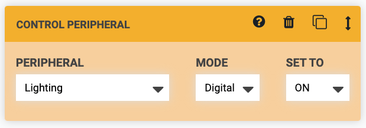
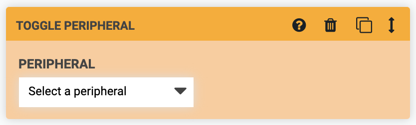
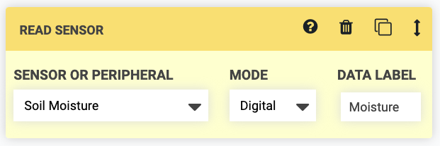

# Control peripheral

The Control Peripheral command allows you to control **peripherals** such as the vacuum pump, solenoid valve, and lights. To use this command, first select a peripheral from the **PERIPHERAL** dropdown. Options include:

  * All of the peripherals you have defined in the [peripherals section of the controls panel](../../controls/peripherals.md)
  * The Box LEDs, if you have any included with your FarmBot version

Next, select the **MODE** which you would like to control the peripheral with. You can choose either `Digital` or `Analog`.

Last, specify what value you would like the peripheral to be **SET TO**. The digital mode allows for turning the peripheral **ON** and **OFF**, while the analog mode allows for controlling the peripheral with PWM (pulse width modulation) to any value between `0` and `255`.

## Advanced options

In the **sequence editor options menu** ( icon next to the copy sequence button), there is an option to **SHOW PINS**. Enabling this setting will show additional options in the **PERIPHERAL** dropdown for all of the Arduino's raw **pins**. If you have hooked up custom peripherals to any of the Digital Out or Analog Out pins on your electronics board, this is one way you can control them from a sequence like any other peripheral.



# Toggle peripheral



The Toggle Peripheral command allows you to toggle the state of a **digital peripheral**. For example, if a peripheral is currently ON, and then FarmBot _toggles_ that peripheral, it will get turned OFF.

To use this command, select a peripheral from the **PERIPHERAL** dropdown. Options include:

  * All of the peripherals you have defined in the [peripherals section of the controls panel](../../controls/peripherals.md)
  * The Box LEDs, if you have any included with your FarmBot version

# Read sensor

The Read Sensor command instructs FarmBot to read the value of a **sensor**. For example, you would use this command to measure the soil moisture content with the soil moisture sensor. To use this command, first select a sensor from the **SENSOR** dropdown. Options include:

  * All of the sensors you have defined in the [sensors panel](../../sensors.md)
  * All of the peripherals you have defined in the [peripherals section of the controls panel](../../controls/peripherals.md)

Next, select the **MODE** which you would like to read the sensor with. You can choose either `Digital` or `Analog`. Use digital for a `0` (LOW) or `1` (HIGH) response, and analog for a reading between `0` and `1023` for 0-5V.

Last, optionally provide a **DATA LABEL** to allow your recorded sensor reading to be more searchable at a later date.

## Advanced options

In the **sequence editor options menu** ( icon next to the copy sequence button), there is an option to **SHOW PINS**. Enabling this setting will show additional options in the **SENSOR OR PERIPHERAL** dropdown for all of the Arduino's raw **pins**. If you have hooked up custom sensors to any of the Digital In or Analog In pins on your electronics board, this is one way you can read them from a sequence like any other sensor.



# What's next?

 * [Image Processing Commands](image-processing.md)
 * [Building a Sequence](../building-a-sequence.md)
