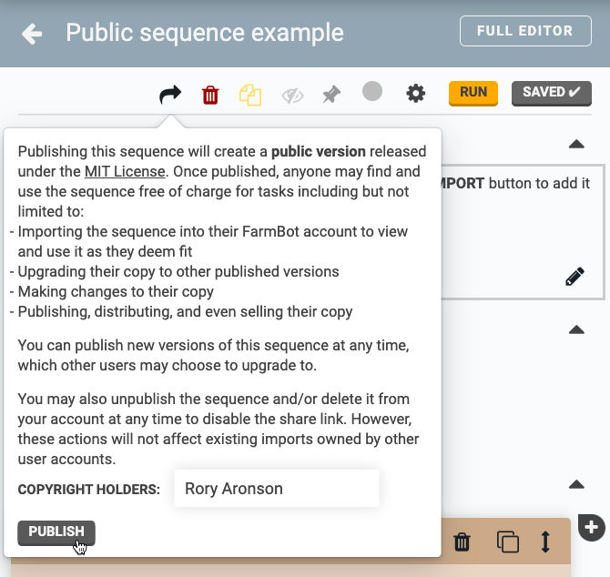
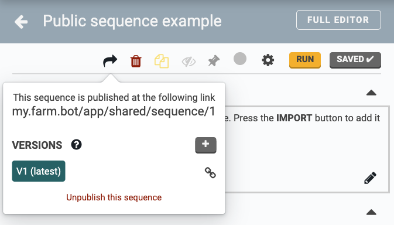
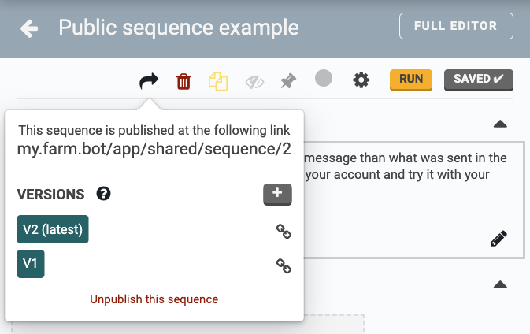
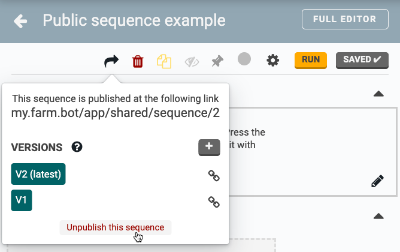
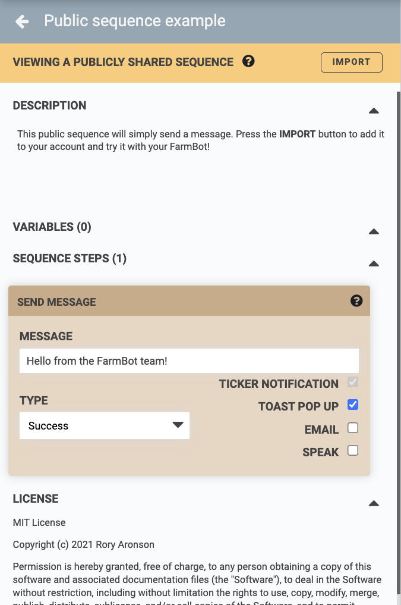
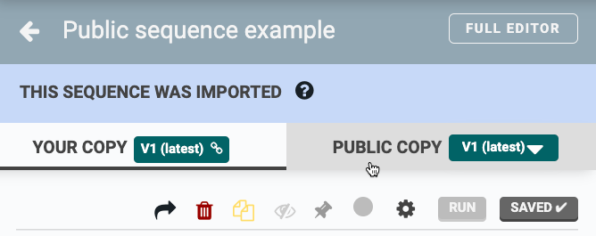
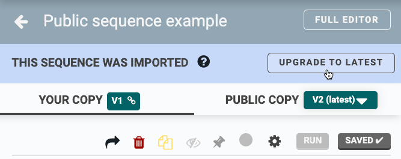
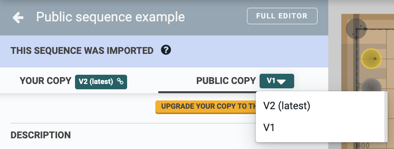

* toc
{:toc}



Publishing a sequence will create a **public version** released under the [MIT License](https://choosealicense.com/licenses/mit/). Once published, anyone may find and use the sequence free of charge for tasks including but not limited to:

- Importing the sequence into their FarmBot account to view and use it as they deem fit
- Upgrading their copy to other published versions
- Making changes to their copy
- Publishing, distributing, and even selling their copy

# Publishing

To publish a sequence, click the <i class='fa fa-share'></i> share icon in the edit sequence panel, enter the name(s) you wish to include as **COPYRIGHT HOLDERS**, and click PUBLISH.



Once the sequence has been published, copy the share link (example: [my.farm.bot/app/shared/sequence/1](https://my.farm.bot/app/shared/sequence/1)) and post it on the forum, in a message to your colleagues, or in your classroom’s content management system!

## Current limitations

- You cannot publish sequences with commands or variables that reference account-specific resources such as plants or tools because the account that imports the sequence will not have access to those resources. We understand that this is a big limitation and are brainstorming ways to allow an importer to “fill in the blanks” when necessary. Stay tuned!
- Only approved people can currently publish sequences with Lua code. Over the coming months we will investigate implementing a review process and/or other measures so that anyone may publish Lua in a safe and secure way.

## Publishing new versions

If you make edits to the sequence and would like to share those with the community as well, simply click the <i class='fa fa-plus'></i> button to publish a new version. Whenever a new version is published, you will get a new shareable link to the latest version. Links to older versions will still work and can be found by clicking the link icon <i class='fa fa-link'></i> next to each version.



## Unpublishing

You may unpublish a sequence and/or delete it from your account at any time to disable the share link. However, these actions will not affect existing imports owned by other user accounts. To unpublish a sequence, click "Unpublish this sequence" at the bottom of the share popup.

# Importing

When opening up a sequence share link, you will be shown a read-only preview so that you may evaluate if you would like to use it or not with your FarmBot. If you would like to use it, press the IMPORT button to add the sequence to your account. Your FarmBot will sync the sequence just like any other and can run it right away.

Once you have imported a sequence into your account, you can make copies of it, edits, or delete it just like any other sequence. Plus, you can quickly switch between viewing/editing **YOUR COPY** and viewing the **PUBLIC COPY**.

## Upgrading

If the original author publishes a new version of the sequence, you will see an UPGRADE TO LATEST button, allowing you to replace the contents of your copy with the contents of the latest version of the public copy.



If you would like to revert to using an older version, you can select an older version from the version picker dropdown and then click UPGRADE YOUR COPY TO THIS VERSION.

# What's next?

 * [Regimens](../regimens.md)
 * [Events](../events.md)
