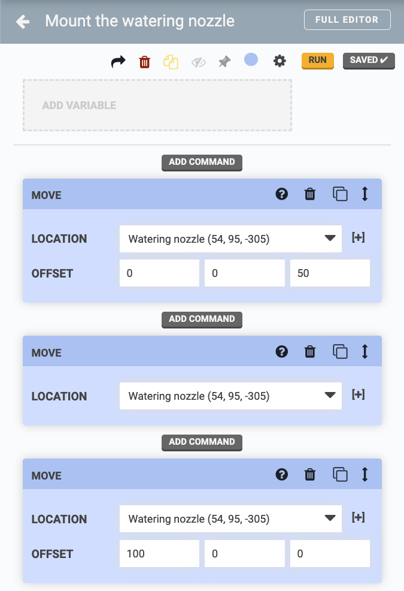
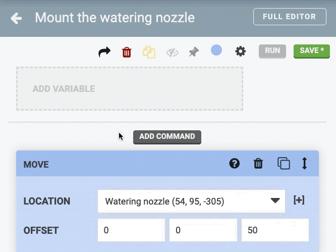
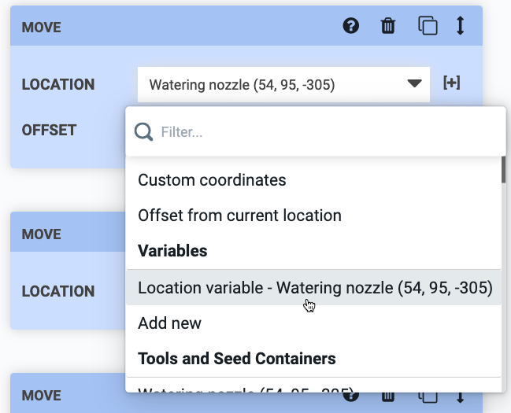
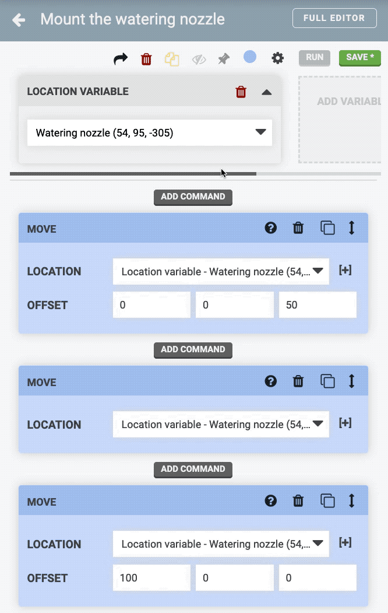
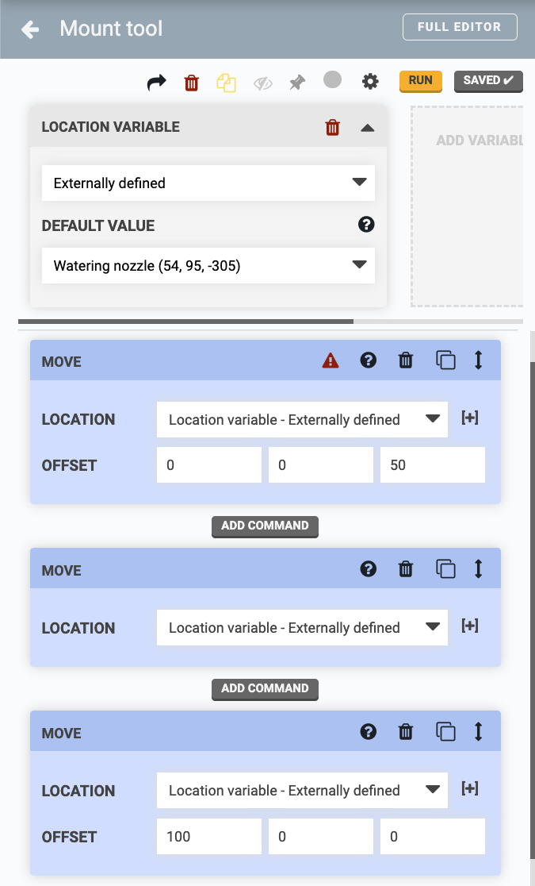

* toc
{:toc}

**Variables** allow you to create *dynamic* sequences that execute differently depending on the **variable value** provided. This allows one sequence to be used more generally (in multiple ways), rather than for one specific purpose. To see how variables are used, let's go through a practical example.

# Start with a static sequence

We'll start with a *static* sequence (a sequence without any variables). Static sequences are executed the same way every time and can only be used for one specific purpose. For example, the sequence below can only be used to mount the watering nozzle tool because the **LOCATION** inputs in the Move commands are set to one location: the watering nozzle.

If you wanted to mount the seeder tool, you would need to make a second sequence with all of the **LOCATION** inputs set to the seeder tool. However, creating a bunch of copies of basically the same sequence would be tedious and cumbersome. Let's see how variables can help.

# Add a variable

To add a variable, click ADD VARIABLE in the sequence header. Then select the `Watering nozzle` for the new variable's value.

Now that the **LOCATION VARIABLE** has been added to the sequence, you can use it as the **LOCATION** input in all of the Move commands. Simply open up the **LOCATION** dropdowns and select `Location variable - Watering nozzle (x, y, z)`.

Notice that if you change the **variable value** (in the sequence header) to a different tool, all of the **LOCATION** inputs in the Move commands that use the variable will update to the new variable value.

At this point the sequence can be quickly changed to mount any of the tools (assuming they all need to be mounted using the same general method). However, because the location variable can only be set to one specific value for the sequence to be saved, it is still considered _static_, and we would still be stuck making copies of the sequence - one for each the tools. Let's see how externally defined variables can help.

# Externally define the variable

To make the example sequence *dynamic* and truly reusable for all of the tools, the variable must be **externally defined**. This will allow the variable value to be provided from another sequence, a regimen, or an event, which will dictate how the sequence is run each time.

To do this, change the variable value (in the sequence header) to `Externally defined`. This selection will then get reflected in all of the **LOCATION** inputs in the Move commands as they update to Location variable - Externally defined <i class='fa fa-caret-down'></i>.



Now the sequence is built in a generic way that will allow it to mount any tool, depending on what value is provided for the location variable! In the next page we'll look at all the ways in which you can provide this value.

# What's next?

 * [Externally Defined Variables](externally-defined-variables.md)
