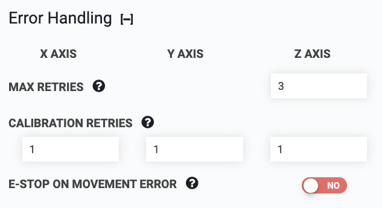

* toc
{:toc}

# Max retries

The number of times that FarmBot will try to move to a position before stopping and reporting that the movement has failed.

# Calibration retries

Number of times to retry calibration.

# E-stop on movement error

Emergency stop if movement is not complete after the maximum number of retries. If enabled and the retries are exhausted, you will need to unlock the device by pressing the UNLOCK button in the main navbar.

# Advanced settings



## Timeout after

This is the amount of time in seconds that the firmware will wait until a movement command times out, or stops executing. The default value for each axis is 120 seconds.



## Calibration retry reset distance

Distance in millimeters to group calibration retries. If the distance travelled while detecting the axis end location exceeds this value, the calibration retry counter is reset.
