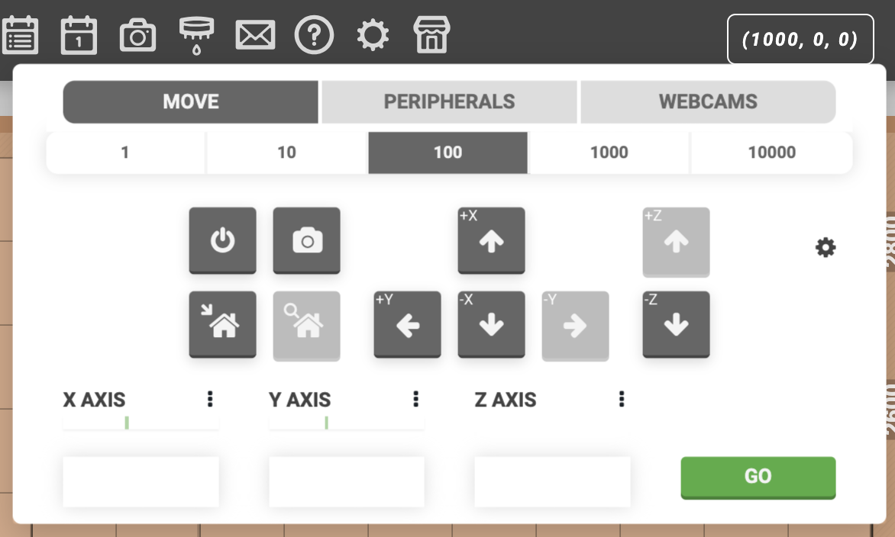

You generally will not need to manually control FarmBot, but in case you want to show off to your friends, you can do so from the **controls** popup. Here, you'll find three tabs:

1. **[MOVE](controls/move.md)** has buttons and fields for moving FarmBot to a new location, plots for monitoring the position and motor load, and options for taking photos and powering down.
2. **[PERIPHERALS](controls/peripherals.md)** features a virtual representation of the electronics box buttons as well as toggles and sliders for all of the peripherals.
3. **[WEBCAMS](controls/webcam-feeds.md)** allows you to add and view a livestream of your FarmBot using a 3rd party webcam or security camera.

# What's next?

 * [Move](controls/move.md)
 * [Peripherals](controls/peripherals.md)
 * [Webcam Feeds](controls/webcam-feeds.md)
