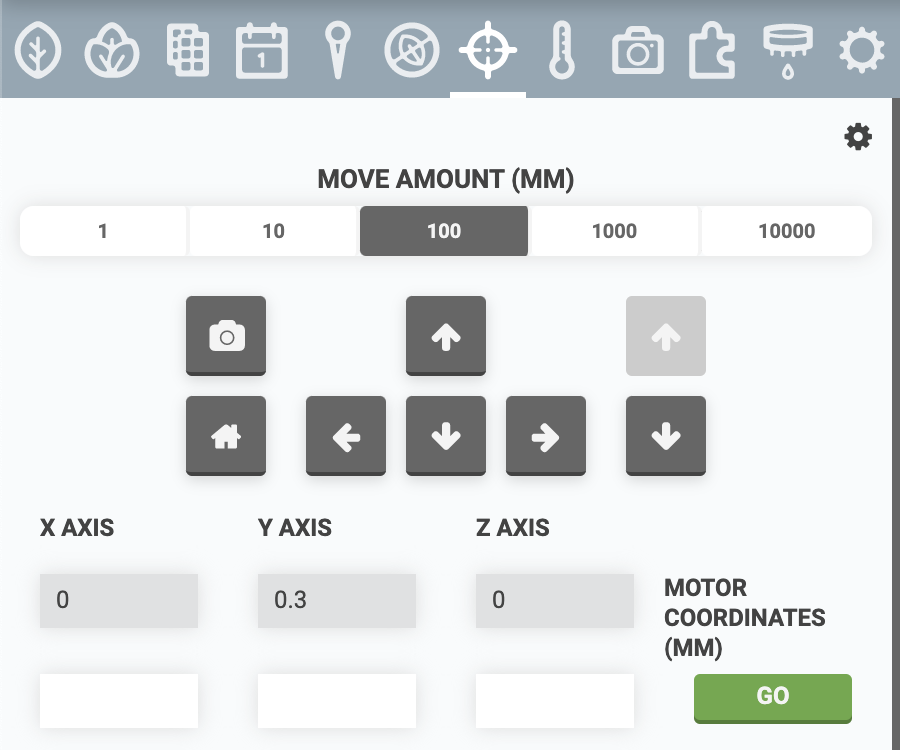
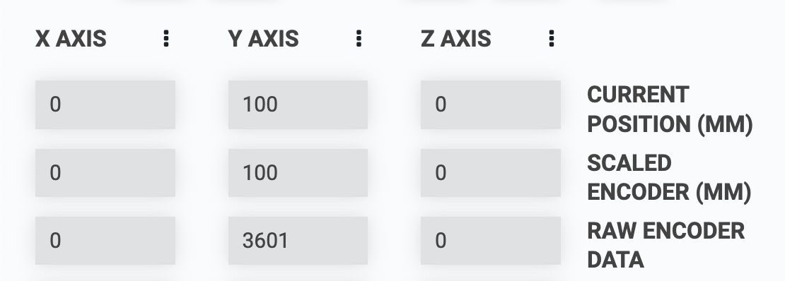
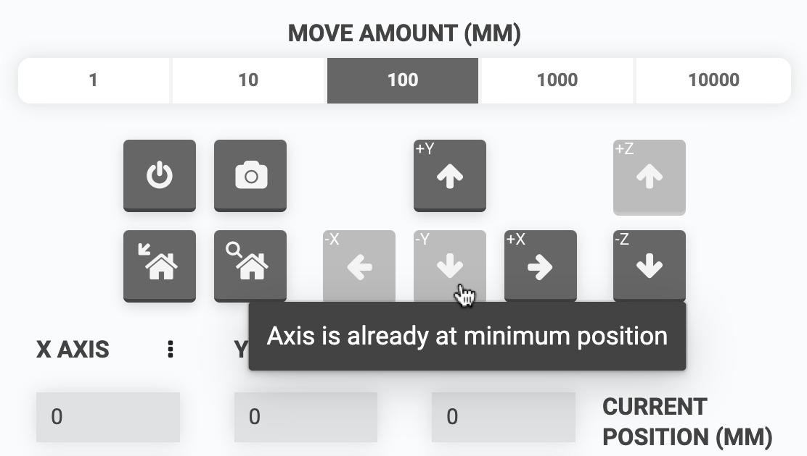
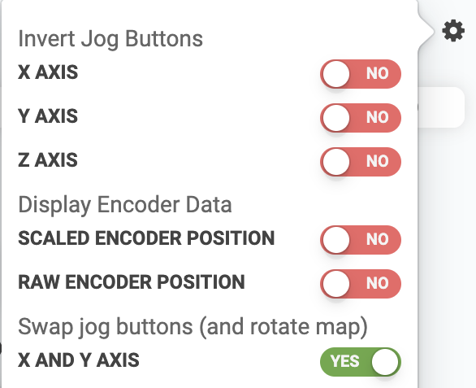
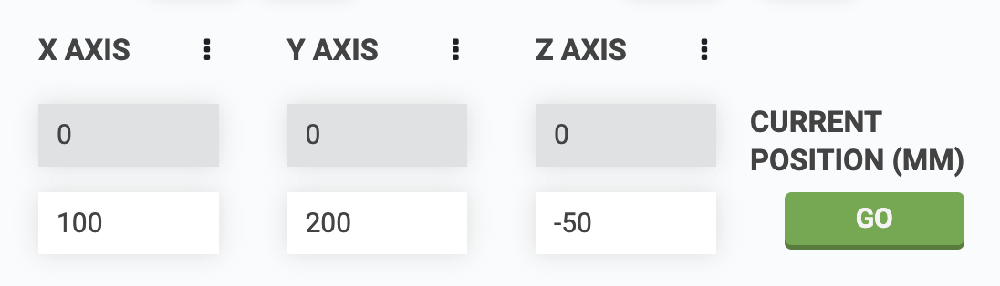
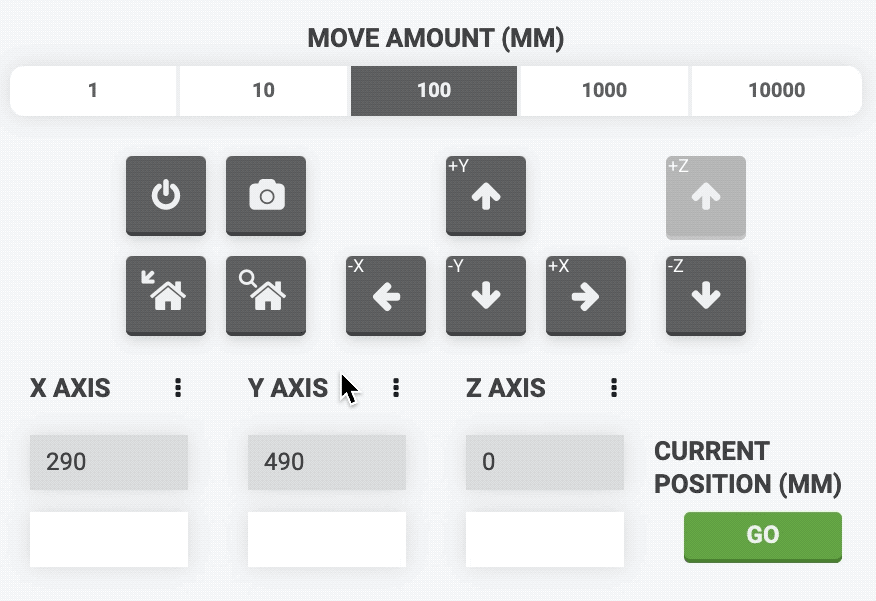
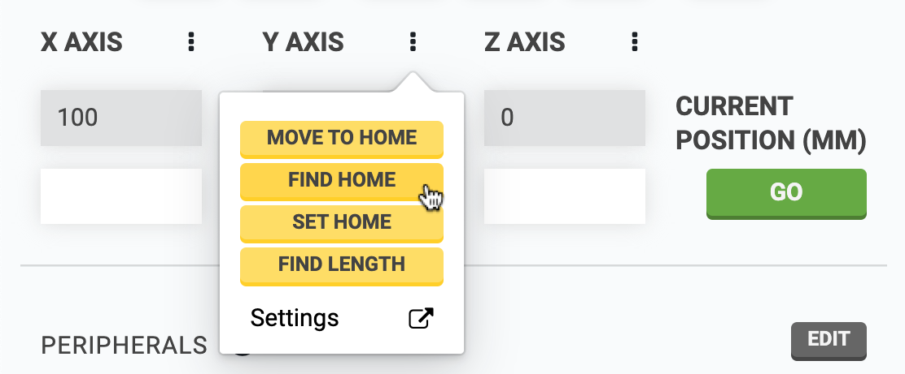
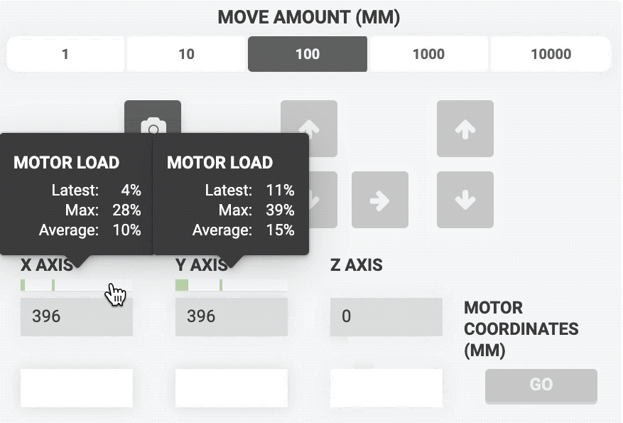
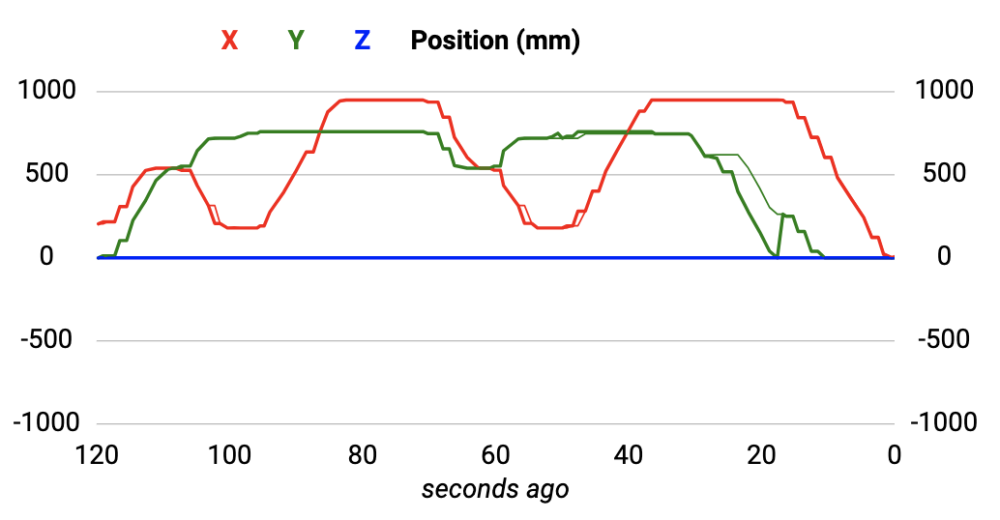
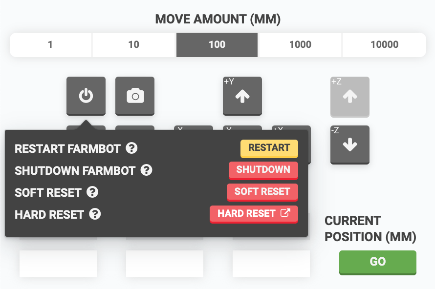

The controls at the top of the panel allow you to view FarmBot's current position, manually move it in real-time, take photos, go to home or find home, and shutdown or reboot FarmBot.

# Viewing the current position

The **CURRENT POSITION (MM)** of your FarmBot is shown in the gray fields directly below the **X AXIS**, **Y AXIS**, and **Z AXIS** labels. This information is updated in real-time.

If your FarmBot has encoders (Genesis kits only), you can also view **SCALED ENCODER (MM)** data, as well as **RAW ENCODER DATA** for each axis. Toggle the display of this additional information from the (cog) menu in the top right of the panel.

# Movements

There are four types of movements you can perform in this panel: **relative movements**, **absolute movements**, **finding home**, and **going to home**.

## Relative movements

Move FarmBot a **relative distance** from the current location in any direction by using the <i class='fa fa-arrow-left'></i> <i class='fa fa-arrow-down'></i> <i class='fa fa-arrow-up'></i> <i class='fa fa-arrow-right'></i> arrow buttons. The default **MOVE AMOUNT (MM)** is `100`, though you can also select `1`, `10`, `1000`, and `10000` amounts.

Depending on your [hardware settings](../settings.md), you may not be able to move beyond an axis minimum or maximum. When this is true, some arrow buttons may be disabled.

In the example below, because FarmBot is at the home position `(0, 0, 0)`, half of the arrow buttons are disabled to allow only movements *away* from the home position and not *through* it. Clicking a disabled button displays a popup indicating why the button is disabled.

### Matching the virtual controls to your real-life perspective

Depending on how you usually view your FarmBot, you may need to change which direction each arrow button sends your FarmBot so that the virtual controls match your real-life perspective. For example, if you usually view your FarmBot from the front (looking at the FarmBot logo on the tool head), you would want the <i class='fa fa-arrow-left'></i> button to send FarmBot in the `negative Y` direction. If you usually view your FarmBot from the side with the electronics box, you would want the <i class='fa fa-arrow-left'></i> button to send FarmBot in the `negative X` direction.

You can change the direction along each axis that the arrow buttons send your FarmBot by using the Invert Jog Button toggles in the (cog) menu in the top right of the panel. You can also swap the X and Y axis buttons, which will also rotate the map in the farm designer by 90 degrees.

## Absolute movements

Move FarmBot to an **absolute position** by typing in new coordinates to the white input fields for the **X AXIS**, **Y AXIS**, and **Z AXIS** and then pressing GO.



If you do not type in a new value for any of the axes, then FarmBot will maintain its current position along that axis and only move the needed axis or axes.

## Finding home

The <i class='fa fa-home'></i> button with a <i class='fa fa-search'></i> icon will instruct FarmBot to **find the home position** for all axes in the order Z, Y, X.



## Going to home

The <i class='fa fa-home'></i> button with a <i class='fa fa-arrow-left'></i> icon will instruct FarmBot to **go to the home position** for all axes as though you had typed in `(0, 0, 0)` to the move absolute input fields. Note that the _go to home_ behavior will move all three axes at once.

# Taking photos

The <i class='fa fa-camera'></i> button will take a photo at FarmBot's current location and provide progress updates of the capture and upload process in realtime. Photos can be viewed in the [photos panel](../photos.md).

# Other axis controls

In addition to the axis input fields, there are controls to MOVE TO HOME, FIND HOME, SET HOME, and FIND LENGTH for an individual axis located in the <i class='fa fa-ellipsis-v'></i> popups.

# Motor load

View the latest, recent maximum, and recent average **MOTOR LOAD** for each each axis by clicking the load indicator bars below each axis label.



# Motor position plot

To view a graph of motor positions over time, toggle ON the motor position plot in the (cog) menu of the panel.

# Power button

The <i class='fa fa-power-off'></i> button shows a popup with options to RESTART, SHUTDOWN, SOFT RESET, and HARD RESET FarmBot.

## Restart FarmBot

This will restart FarmBot's Raspberry Pi and FarmBot OS.

## Shutdown FarmBot

This will shutdown FarmBot's Raspberry Pi. To turn it back on, unplug FarmBot and plug it back in.

## Soft reset

Soft resetting your FarmBot will revoke your FarmBot's ability to connect to your web app account and your home WiFi network. **This is useful before moving FarmBot to a new location with a different WiFi network, or when switching FarmBot from one web app account to another.**

Upon soft resetting, you will need to [reconfigure FarmBot](http://configure.farm.bot) to connect it to internet and your web app account.





## Hard reset

Hard resetting your FarmBot will erase all data from the device, allowing you to start from a clean slate. **This is recommended if you are experiencing problems with your setup.**

Perform a hard reset by [reflashing the latest version of FarmBot OS onto the microSD card](../../farmbot-os/intro.md). Upon hard resetting, you will need to [reconfigure FarmBot](http://configure.farm.bot) to connect it to internet and your web app account.



# What's next?

 * [Peripherals](peripherals.md)
