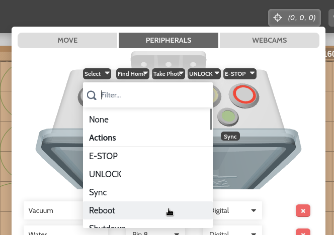

The **PERIPHERALS** tab of the controls popup allows you to manage FarmBot's peripherals and control them in real-time with toggle switches and sliders. Here you can also manage the actions associated with the electronics box push buttons, and interact with a virtual representation of the buttons and LED indicators.

# Editing peripherals

To create a new peripheral, press EDIT, and then the <i class='fa fa-plus'></i> button. Provide a Name, Select a pin <i class='fa fa-caret-down'></i>, and choose `Digital` or `Analog` to define the peripheral. Pressing <i class='fa fa-plus'></i> STOCK will add all of the standard peripherals included with your FarmBot kit.



To delete a peripheral, press the peripheral's <i class='fa fa-times'></i> button. You cannot delete a peripheral that is in-use by a sequence.

When finished editing, press SAVE.

# Controlling peripherals

You can press a toggle switch to manually control digital peripherals when FarmBot is connected and idle. If FarmBot is disconnected or busy, pressing a toggle switch will have no effect. Refer to the table below for all possible states of the toggle switches.

|When a toggle is                                                  |The peripheral's state is     |Clicking the toggle will      |
|------------------------------------------------------------------|------------------------------|------------------------------|
|ON                          |**ON** |Turn the peripheral **OFF**
|OFF                        |**OFF**|Turn the peripheral **ON**
|                       |Unknown|Turn the peripheral **OFF**
|ON   |**ON** |Not have any effect (FarmBot is busy)
|OFF |**OFF**|Not have any effect (FarmBot is busy)
||Unknown|Not have any effect (FarmBot is not connected)

Analog peripherals can be controlled with the sliders when FarmBot is connected and idle.

# Push buttons

To change a push button's behavior, press EDIT, and then select a new **Action** or **Sequence** in the push button's dropdown. When finished editing, press BACK.

Once synced, you can press the physical push button on top of the FarmBot electronics box or click the virtual button in the app to activate the chosen action or sequence.

# What's next?

 * [Webcam Feeds](webcam-feeds.md)
