**Curves** are plots of data that define how a property such as a plant's water needs change over time. The app currently supports three curve types:

|<i></i>                    |Description                                    |Units|
|---------------------------|-----------------------------------------------|-----|
|:droplet: **Water**        |How much water a plant should receive each day |Milliliters (mL)
|:straight_ruler: **Spread**|Expected diameter of a plant as it grows       |Millimeters (mm)
|:seedling: **Height**      |Expected height of a plant as it grows         |Millimeters (mm)

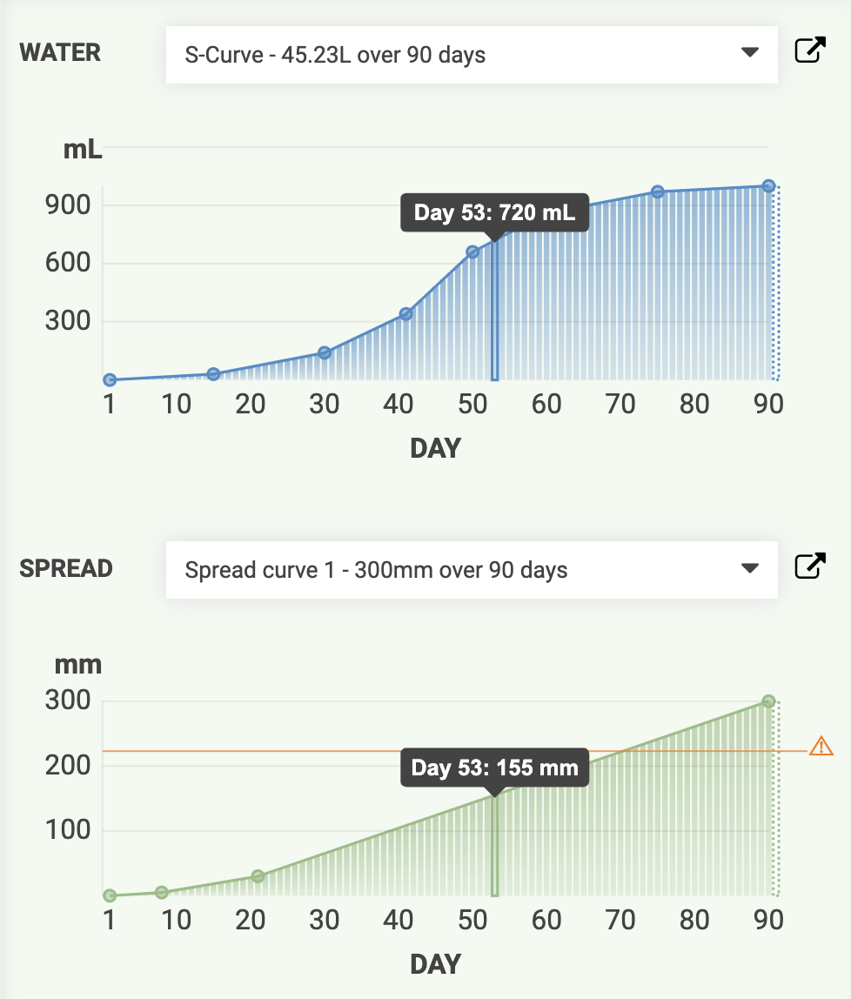

# Creating a curve

To create a new curve, click the <i class='fa fa-plus'></i> button for the curve type you wish to add.

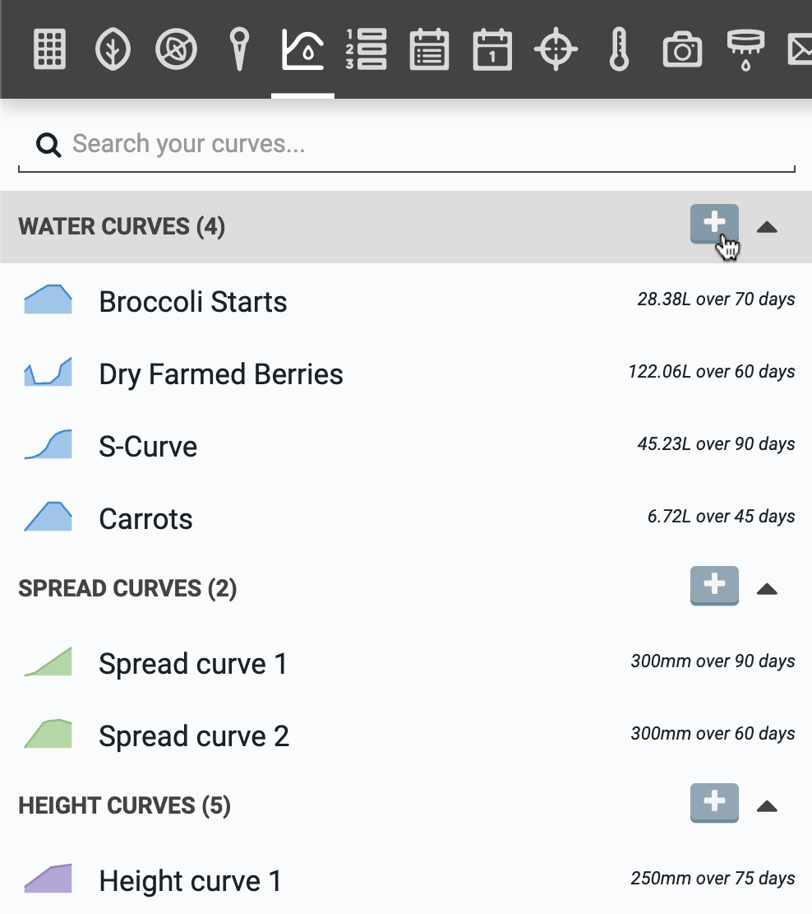

This will open up the edit curve panel where you can edit the curve's name and overall shape, length, and magnitude using up to 10 **control points**. Control points are **days** with an explicitly defined **value** such as _Day 30: 140mL_.

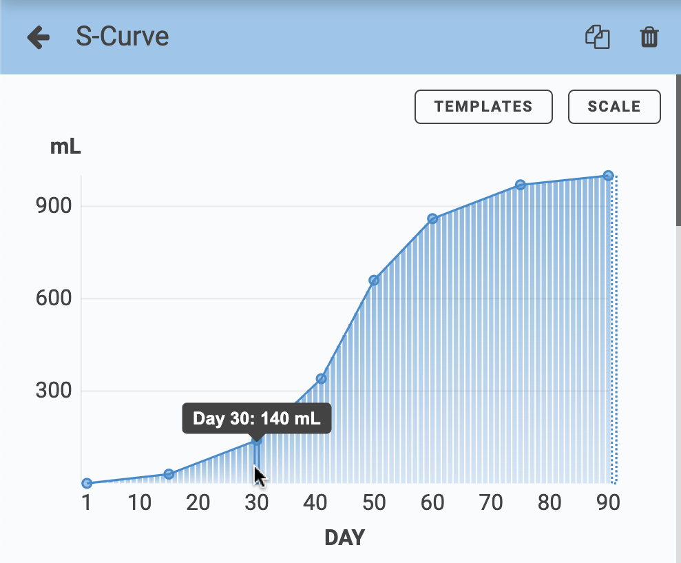

Curve values for days in-between control points are automatically interpolated using straight lines. The final control point will determine the value of the curve for all subsequent days, for example _Day 91+: 1000mL_.

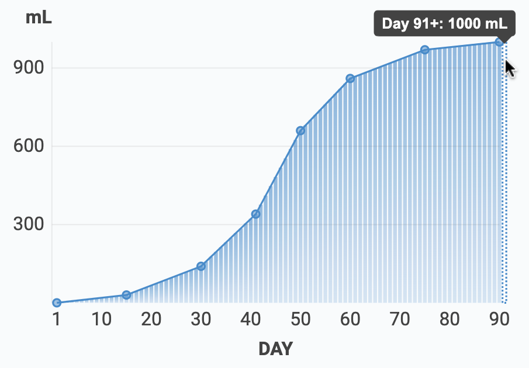

# Templates

When editing a new curve, open up the **TEMPLATES** popup and select the **SHAPE** that most closely matches your desired curve. Options include Linear Ramp, Table, S-Curve, and Constant Value. You'll also need to define the **MAX VALUE** and the length of the curve in **DAYS**.

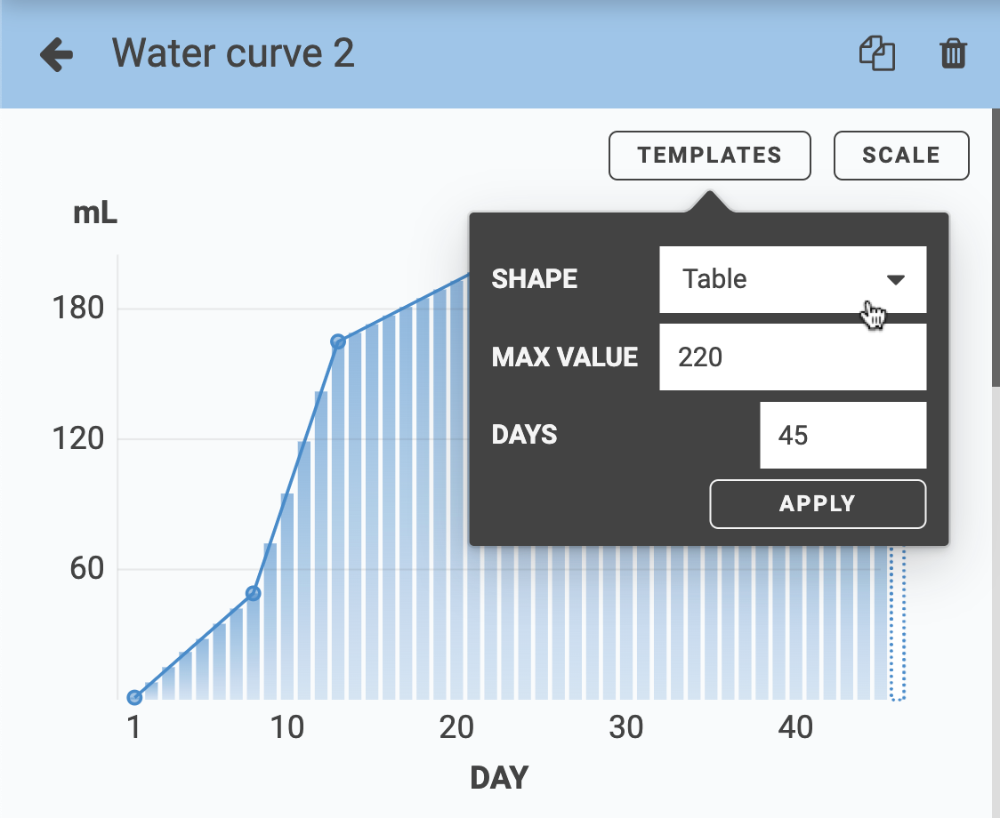

# Editing control points

After starting from a template, add additional control points by hovering over the curve line and clicking the <i class='fa fa-plus'></i> button. Edit the value of a control point by dragging it up or down.

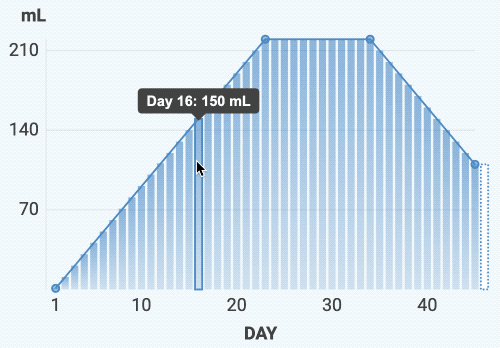

You may also add, edit, and remove control points using the table at the bottom of the panel. Add and remove control points by clicking the :radio_button: icons and edit the values using the corresponding table cells.

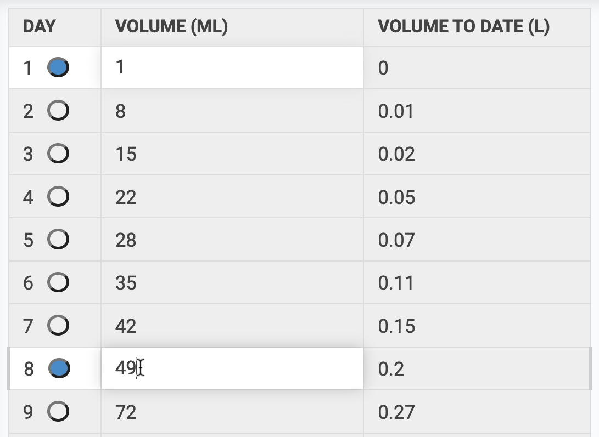

# Scaling

If you need to adjust the length or magnitude of the curve while preserving the overall shape, open up the **SCALE** popup and enter a new **MAX VALUE** and **DAYS** for the curve. The control points and interpolated values will be automatically adjusted to best-fit the original curve within the new size constraints.

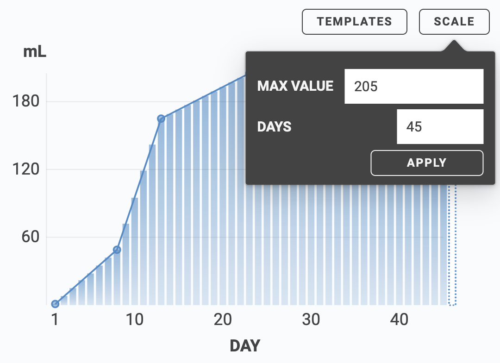

# Using curves

Once you've created curves, you can apply them to any of your plants. To do so, open up the plant details panel and select the curves you wish to use with that plant. You may also apply the same curve to multiple plants from the [multi-select panel](../app/farm-designer.md#select-mode).



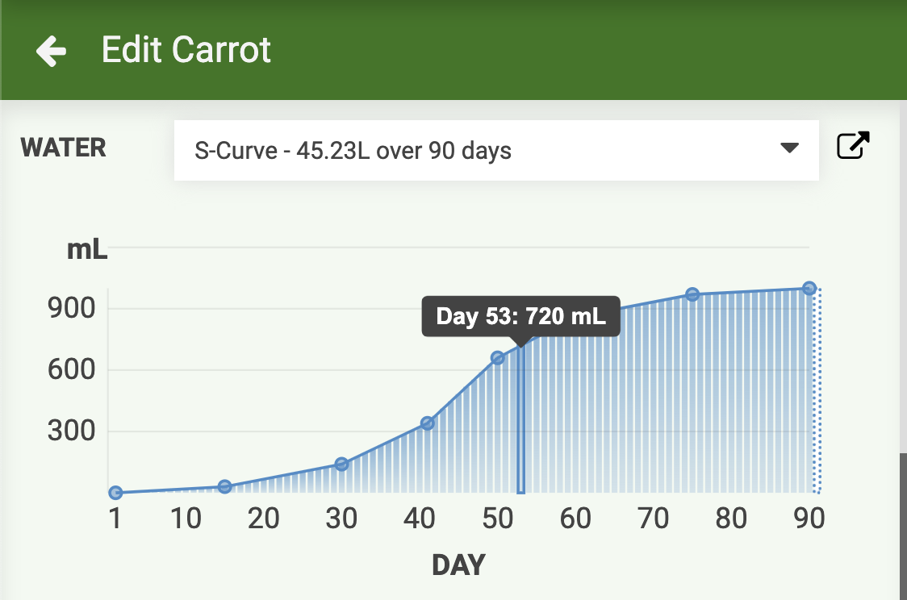

# Curve warnings

Based on the selected spread curve and the plant's location in your garden bed, you may see warning lines on the spread curve plot indicating when the plant may bleed over the edge of the raised bed. Hovering over the plot will show a visualization of the plant's spread in the map so that you may make adjustments to the plant's location if needed.

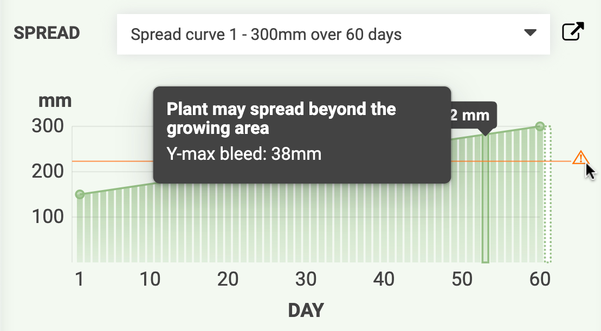

Based on the selected height curve and the height of your FarmBot's gantry above the soil, you may see warning lines on the height curve plot indicating that the plant may grow tall enough to interfere with the gantry or the tool head.

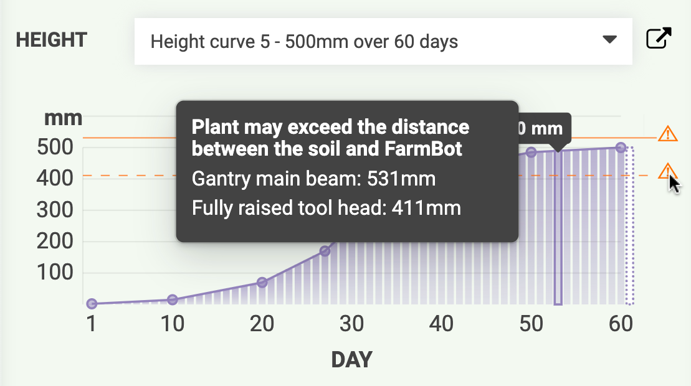

# What's next?

* [Groups](groups.md)
