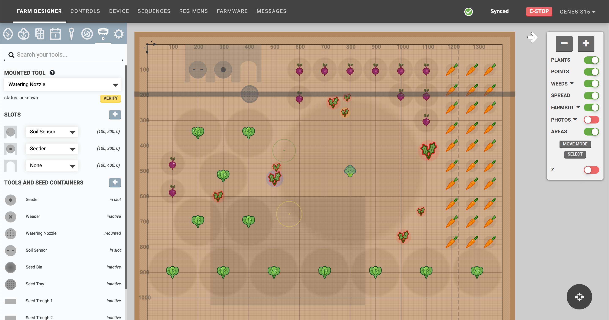
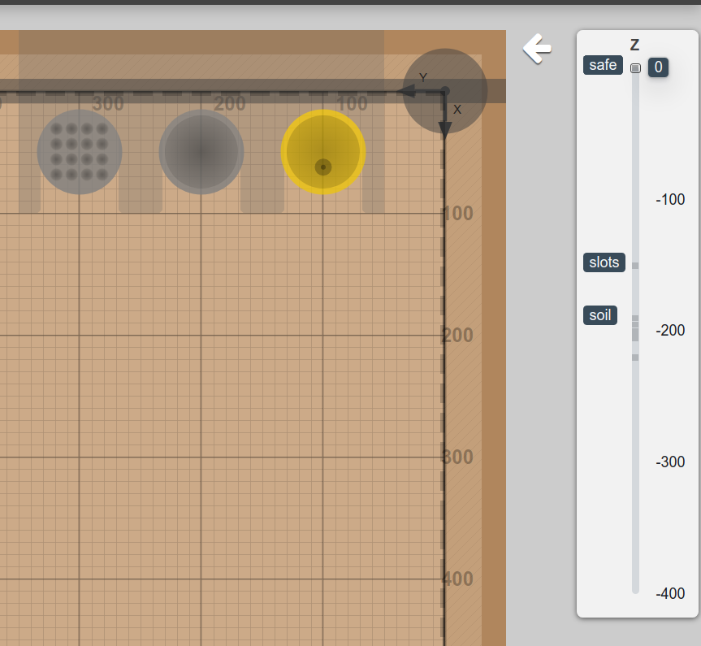
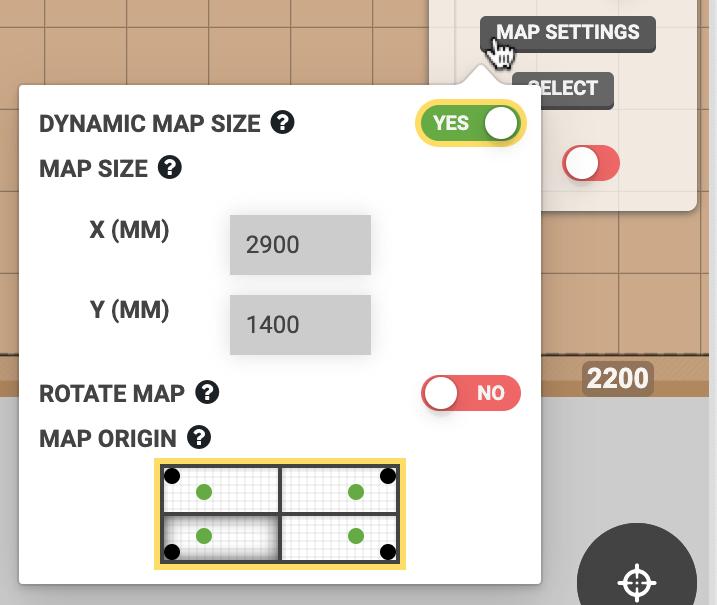
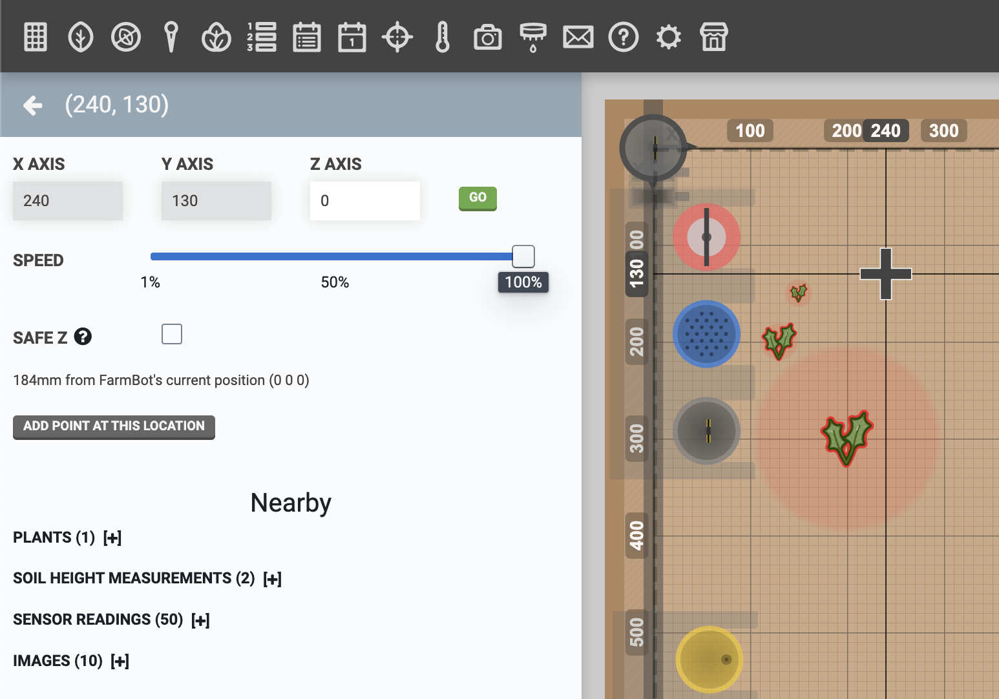
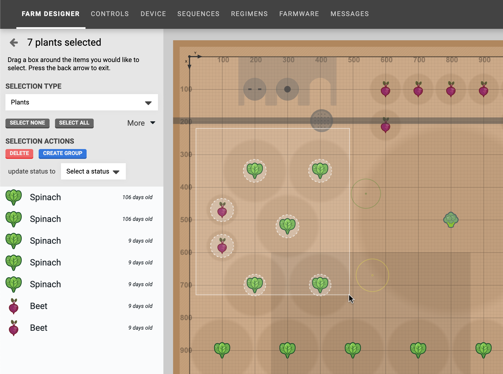
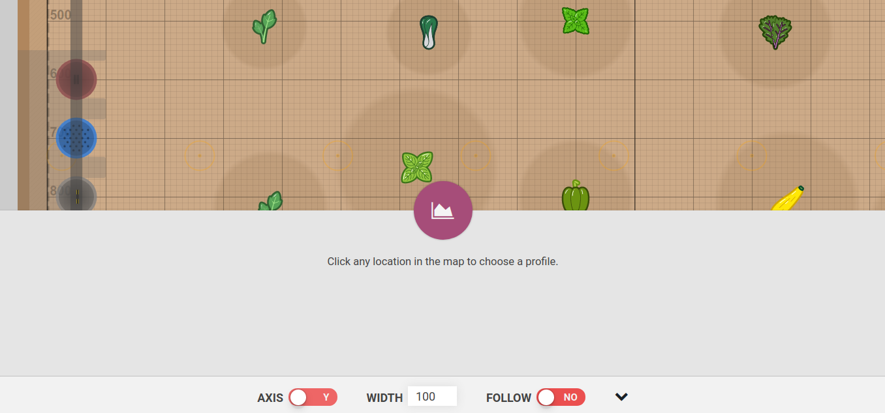
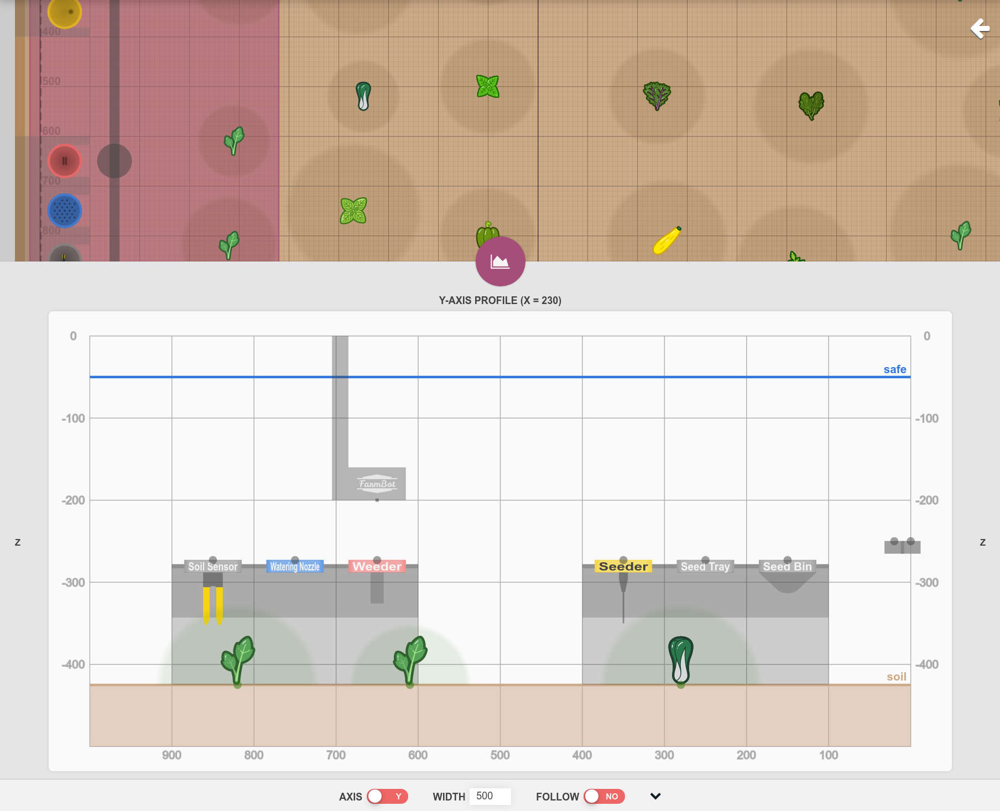
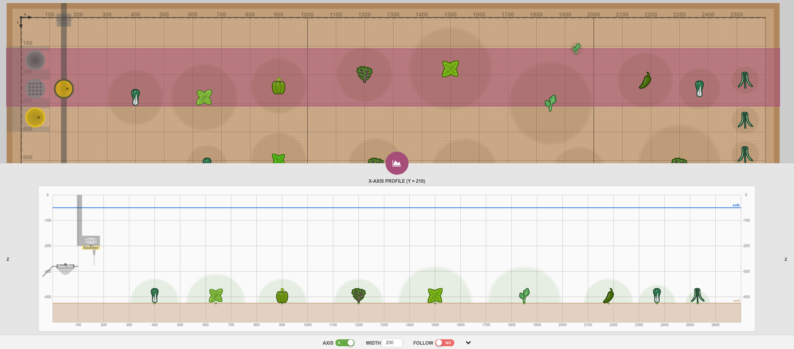

The **farm designer** allows you to graphically design the layout of your garden, monitor your FarmBot's position, and visualize data such as photos, plant spread, and points.



# Map menu

Click the white <i class='fa fa-arrow-left'></i> button in the top right of the map to open up the **map menu**. Here you will find <i class='fa fa-minus'></i> and <i class='fa fa-plus'></i> buttons to zoom in and out of the map, as well as a toggles to turn on and off map layers. Some map layers have <i class='fa fa-caret-down'></i> submenus with additional options.

|Layer/Submenu item            |Description                   |
|------------------------------|------------------------------|
|**PLANTS**                    |Display plant icons (not including weeds or spread).
|Plant animations              |Enable or disable plant animations in the garden map. This may be useful to turn off when using the app on a lower powered device such as a smartphone or chromebook.
|Confirm plant deletion        |Show a confirmation dialog when deleting a plant.
|**POINTS**                    |Display points created in the [points panel](points.md)
|**SOIL**                      |Display an interpolated map of soil levels based on soil height measurements.
|**WEEDS**                     |Display weed icons and their spread.
|Show removed                  |Display weeds with a status of `Removed`.
|**SPREAD**                    |Display the spread of plants and weeds.
|**FARMBOT**                   |Display the FarmBot gantry, UTM or tool head, slots, tools, seed containers, peripheral state visualizations, and axis limit lines.
|Trail                         |Display a virtual trail for FarmBot in the garden map to show movement and watering history while the map is open. Toggling this setting will clear data for the current trail.
|FarmBot motor load            |Display high motor load warning indicators in the map. Requires **TRAIL** and **STALL DETECTION** to be enabled.
|**PHOTOS**                    |Photos taken by FarmBot's onboard camera. See [camera calibration](photos/camera-calibration.md) if photos are not positioned, scaled, or rotated correctly.
|Newer than/Older than         |Filter the display of photos by date and time.
|Crop map images               |Crop images displayed in the garden map to align rotation-corrected image edges with the coordinate system. Crop amount determined by **CAMERA ROTATION** value.
|Clip photos out of bounds     |Remove portions of images that extend beyond the garden map boundaries.
|Camera view                   |Display the camera's field of view in the garden map. This is useful when manually positioning the FarmBot's camera directly over an object for photographing.
|Uncropped camera view         |Display the camera's uncropped and unrotated field of view in the garden map when **CROP MAP IMAGES** is enabled.
|**AREAS**                     |Display areas defined by [group filters](groups.md#filtering-by-location).
|**READINGS**                  |Display sensor readings.
|**MOISTURE**                  |Display an interpolated map of soil moisture based on recent soil moisture readings.
|**Z**                         |Graphical display of FarmBot's current z-axis position and relevant garden levels.

# Map settings

## Dynamic map size

Set the garden map size based on the **AXIS LENGTH** values. A value must be input in **AXIS LENGTH** and **STOP AT MAX** must be enabled.





## Map size

Specify custom map dimensions (in millimeters). These values set the size of the virtual garden map unless **DYNAMIC MAP SIZE** is enabled.



## Rotate map

Swap map X and Y axes, making the Y axis horizontal and X axis vertical. This setting will also swap the X and Y jog control buttons <i class='fa fa-arrow-left'></i> <i class='fa fa-arrow-down'></i> <i class='fa fa-arrow-up'></i> <i class='fa fa-arrow-right'></i>.



## Map origin

Select a map origin by clicking on one of the four quadrants to adjust the virtual garden map to your viewing angle.



# Move mode

Click anywhere within the map grid to mark the location with crosshairs and open up the location panel for the selected coordinates. Then press GO to send FarmBot to the selected position. Before moving to the new location, you may optionally enter a new coordinate for the **Z AXIS**, adjust the **SPEED**, or toggle on **SAFE Z** option.

# Select mode

To select multiple plants, click anywhere in the map and drag the mouse cursor to create a **box selection**. All plants located within the box will be displayed in the **select** panel. Alternatively, you may press the SELECT button located in the map menu, and then use the box-selection technique.

Once the select panel is open, you can click-to-add additional plants to the selection, or click an already selected plant to remove it from the selection. Once you are satisfied with your selection, use one of the **SELECTION ACTIONS**.

You may also change the **SELECTION TYPE** to allow for selecting other objects in the map, such as weeds or points.

# Profile viewer

Press the <i class='fa fa-area-chart'></i> icon at the bottom of the screen to open the profile viewer.

Click anywhere in the farm designer map to view a profile of that location.
A shaded area will appear across the map to indicate the region the profile represents: any items within the region will appear in the profile.

The selected **SAFE HEIGHT** (from [axis settings](settings/axes.md#safe-height)) is shown as a horizontal blue line, and the selected **SOIL HEIGHT** is shown as a horizontal brown line.
Points and soil height points are shown as dots with lines connecting them according to their color.

Use the **AXIS** toggle to switch between X and Y axis profiles.
Input a different **WIDTH** to narrow or broaden the profile search area.
Enable **FOLLOW** to use FarmBot's current location as the profile position.
Click the <i class='fa fa-chevron-up'></i> icon to switch between quick and full profile views.

# What's next?

 * [Plants](plants.md)
 * [Groups](groups.md)
 * [Events](events.md)
 * [Points](points.md)
 * [Weeds](weeds.md)
 * [Controls](controls.md)
 * [Sensors](sensors.md)
 * [Photos](photos.md)
 * [Tools](tools.md)
 * [Settings](settings.md)
