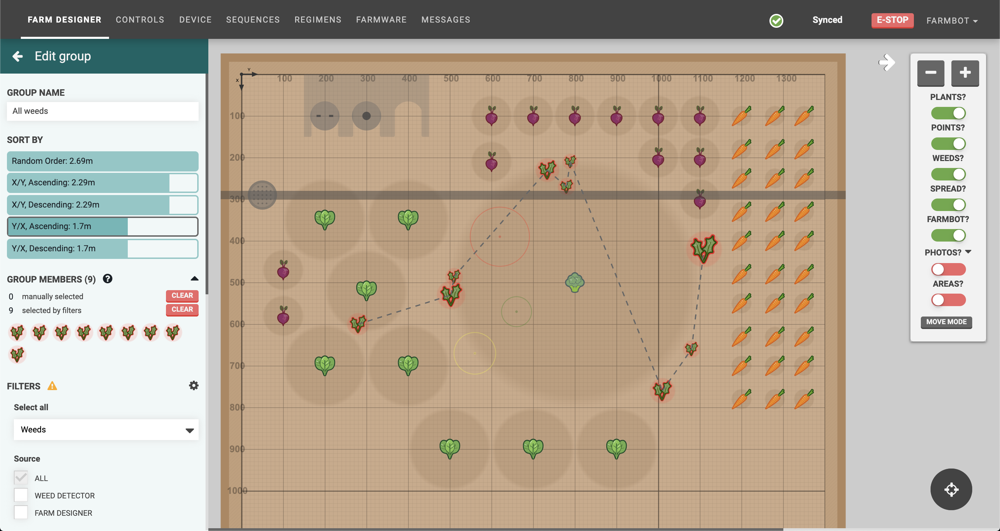

* toc
{:toc}

**Groups** allow you to group plants, weeds, or points in your garden so you can easily run sequences on all members of the group. For example, with a group of all your plants, you could instruct FarmBot to run a watering sequence on all of them.

# Creating a group

To create a group, click the <i class='fa fa-plus'></i> button in the **PLANT GROUPS**, **WEED GROUPS**, or **POINT GROUPS** section of the plants, weeds, or points panels. This will open the **edit group** panel with your new _Untitled Group_ loaded, and all of the plants, weeds, or points selected.

Alternatively you can use the [multi-select mode](farm-designer.md#select-mode) in the farm designer and then click CREATE GROUP to create a new group with your selection.

# Editing a group

From the edit group panel, you can change the **GROUP NAME**, **SORT BY** order, add **FILTERS** to narrow down your selection, and manually add additional members. When you are finished editing, press the <i class='fa fa-arrow-left'></i> to save the group and go back to the plants, weeds, or points panel.

The **SORT BY** method will change the ordering that FarmBot uses when traveling to each group member when the group is used in a sequence. A dashed line will be shown in the map visualizing the chosen path. We encourage you to play around with this option to find the most efficient path FarmBot can take.



# Using filters

**FILTERS** allow you to narrow down which members are in the group based on the filtering options selected. For plant groups, you may filter by **Stage**, **Type**, **Age**, and **Location**. In the example below we've selected Broccoli and Spinach as the allowed **Types**. You may mix and match as many filter options as needed to create dynamic groups for all kinds of purposes.

As your garden changes over time (new weeds discovered, crops get harvested, etc), FarmBot will use the filters to always calculate the current group members. For example, without changing the group at all, if additional plants are added to the garden that match the group's filters, they will automatically become group members.

The example weeds group below selects all of the weeds in the garden (no additional filters applied). As weeds are removed and new ones discovered, the group members list will always stay updated without any action required.

## Filtering by location

The **Location** filter allows you to select items that are within certain areas of the garden. For example, if you would like to select plants that are in one corner of your garden, you can add two coordinate boundaries.

If you would like to select plants that are within a box in the middle of the garden, you can add four coordinate boundaries.

Toggling the **EDIT IN MAP** setting to **ON** will allow you to click and drag a rectangle in the farm designer map rather than manually typing in coordinate boundaries. It is recommended to toggle this **OFF** when not in use.

# Manual additions

To manually add additional group members that aren't already selected by filters, click items in the farm designer map. Note that each group can only have members of one type (plants, weeds, points, or slots), so if you already have plants in the group, only plants will be clickable in the map.

To remove manually added group members, click their icon again in the farm designer map or in the **GROUP MEMBERS** list. When mousing over icons in the list, the corresponding icon in the map will be highlighted, allowing you to ensure you're removing the correct item. To remove all manually added group members at once, click the CLEAR button next to "manually selected".

# Using groups

Once you're happy with your group, try it in a sequence! Simply create a sequence with an [externally defined location variable](sequences/externally-defined-variables.md):

Then use the TEST button, making sure to select your group:

Once you've verified that FarmBot is operating how you intend, you can run this sequence over your group of plants with an EXECUTE SEQUENCE command in another sequence, or in a regimen, or an event!

# Deleting a group

To delete a group, click the DELETE GROUP button. Note that you cannot delete a group that is in-use by a sequence, regimen, or event.

# What's next?

 * [Sequences](sequences.md)
