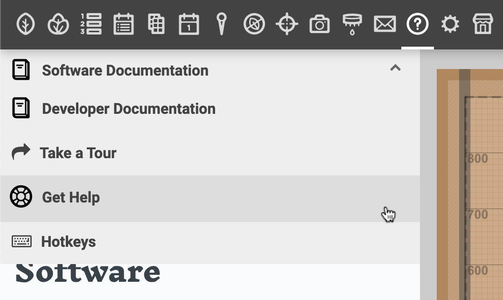
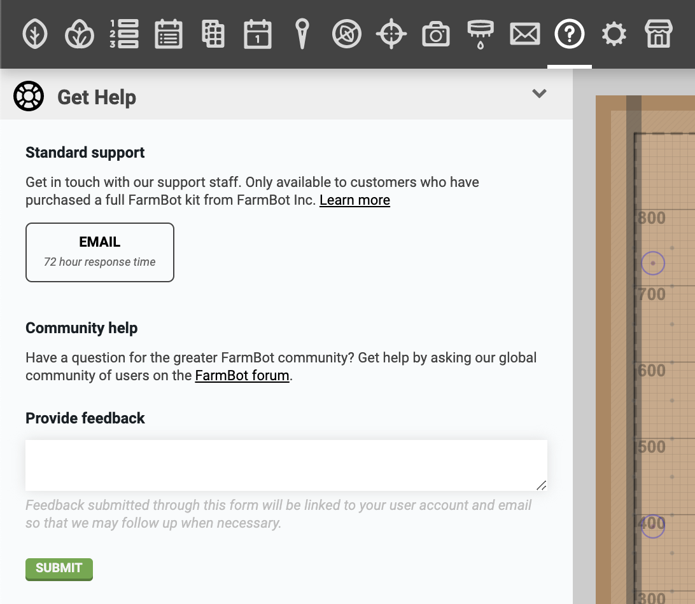
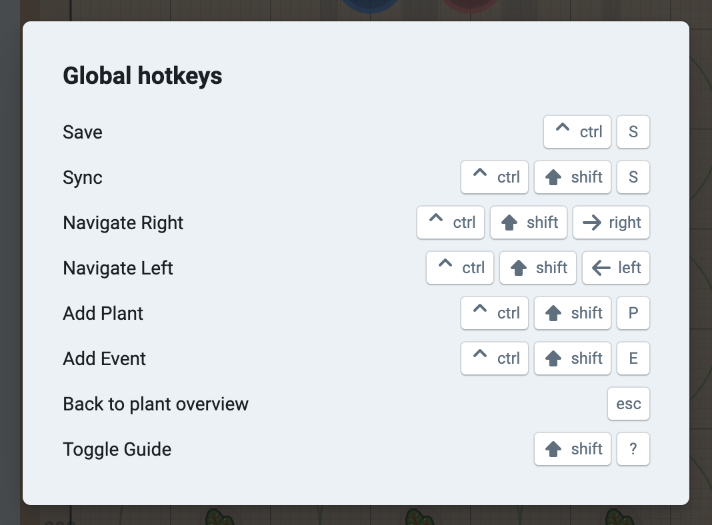

* toc
{:toc}

The **help panel** is full of resources for you to learn how to use the web app, troubleshoot issues with your FarmBot, and get help. To navigate between the various resources, click the dropdown menu at the top of the panel.

# Documentation

All of our documentation hubs are available in the help panel for quick in-app reference. If you would like to read through the documentation independently from the app, simply open up a new browser tab to [docs.farm.bot](https://docs.farm.bot) and choose the hub you wish to view.

# Tours

Select **take a tour** to view and launch the available guided tours. This is a great way for new users to become familiar with the app, or to brush up on how to do things if you haven't logged in since the last growing season.

# Get help

If you're having problems with your FarmBot or the web app, we're here to help. Simply open up the **get help** panel to email us, submit product feedback right from the app, or navigate to the community forum.



# Hotkeys

Opens the **hotkeys** guide.

