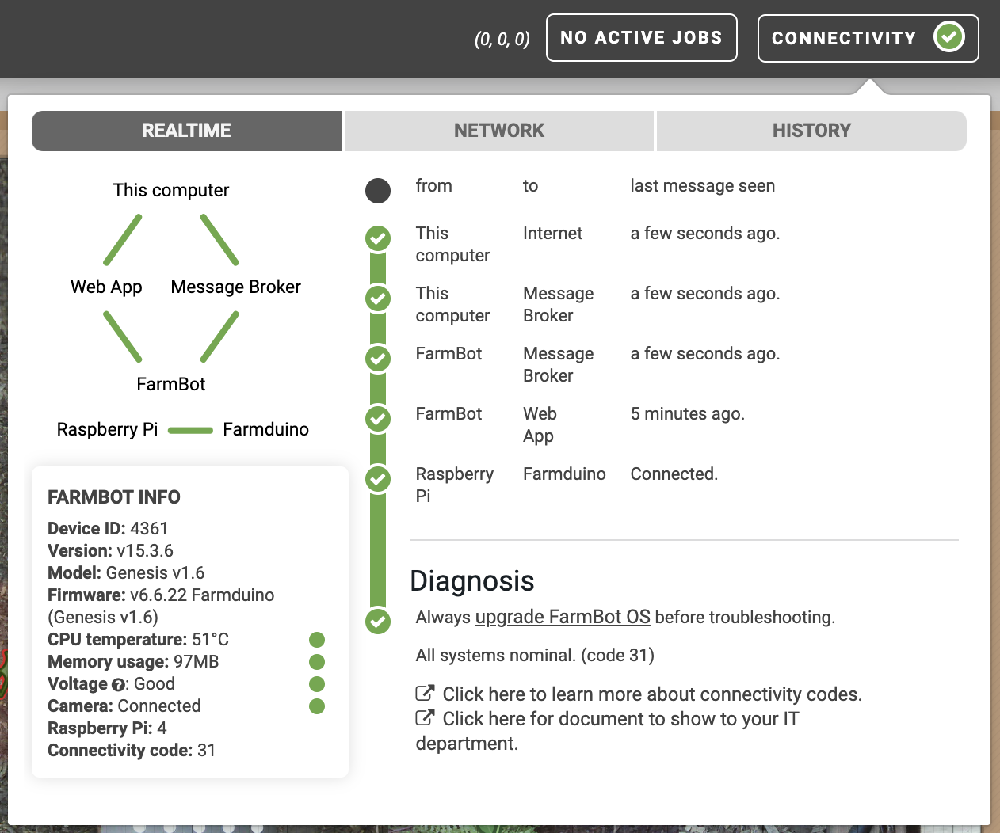

The **connectivity popup** in the main nav bar of the app has two tabs chock full of information about your FarmBot. When FarmBot and the web app are fully connected, you will see a green <i class='fa fa-check-circle-o'></i> next to **CONNECTIVITY**.

If there are connectivity issues, you will see a red <i class='fa fa-times-circle-o'></i> and may need to [troubleshoot your connection](../../docs/troubleshooting.md).



# Realtime tab

The **realtime** tab shows information about your computer's and FarmBot's current connection to the web app and message broker, as well as vital health metrics such as the WiFi signal strength, CPU temperature, and network quality.

If everything is operating properly, you should see all green checkmarks and other green indicators. Additionally, the **diagnosis** should say `All systems nominal. (code 31)`.

If you see some yellow or red indicators and are experiencing issues with your FarmBot, you may need to improve the WiFi connection to your bot, talk to your network administrator to ensure FarmBot is allowed to use your school or work network, or perform other [troubleshooting](../../docs/troubleshooting.md).

# History tab

The **history** tab shows 24 hours of historical health metric data. Data points are collected every 5 minutes and include the **time**, FarmBot OS **version**, **uptime** (how long it has been since FarmBot booted), **CPU** use, **disk** use, **memory** use, **temperature** of the Raspberry Pi's CPU, system **voltage**, and **WiFi** signal strength.

This data is most useful for troubleshooting issues that may occur sporadically or after a change to your hardware or software. If everything is operating properly, you do not need to check the history tab regularly.

The image below shows a healthy FarmBot that rebooted about 14 hours ago.

# What's next?

 * [Logs](logs.md)