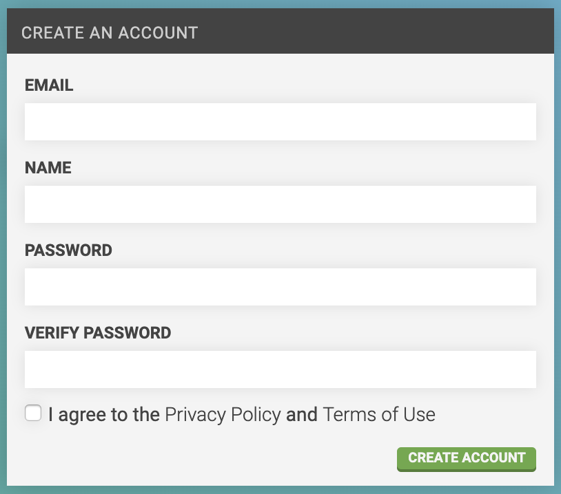
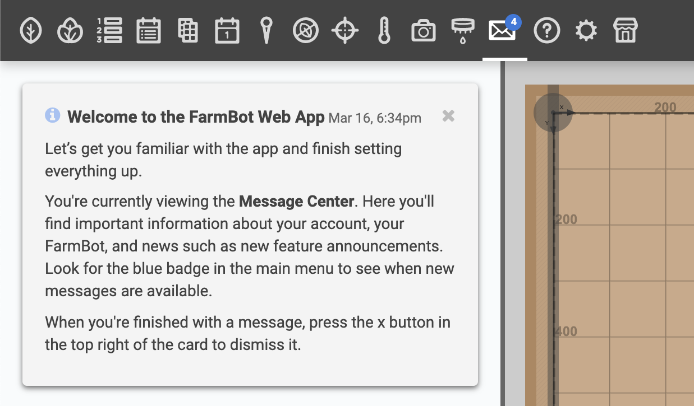

1. Go to [my.farm.bot](https://my.farm.bot)

2. Enter an Email, Name, and Password in the **CREATE AN ACCOUNT** widget

3. Check that you agree to our [privacy policy](http://privacy.farm.bot) and [terms of use](http://tos.farm.bot)

4. Click Create account

5. Check your email and click the link to confirm your account

# Complete setup

Clicking the email verification link will log you into the app and take you to the [message center](../intro/message-center.md). Here, you'll see a few messages to help you become familiar with the app, as well as one to [complete setup](../../docs/getting-started.md#step-2-complete-setup).

# Connect FarmBot to your account

1. [Install FarmBot OS](../../farmbot-os/intro.md)
2. [Configure FarmBot](../../farmbot-os/intro/configurator.md) with the same email and password you used to create your web app account
3. Login to [my.farm.bot](https://my.farm.bot)



# What's next?

 * [Connectivity](connectivity.md)