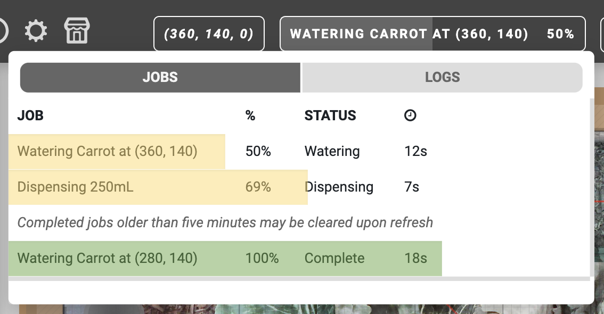
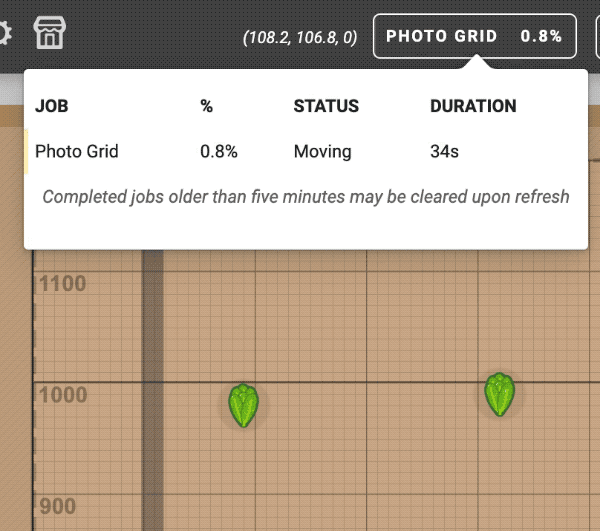
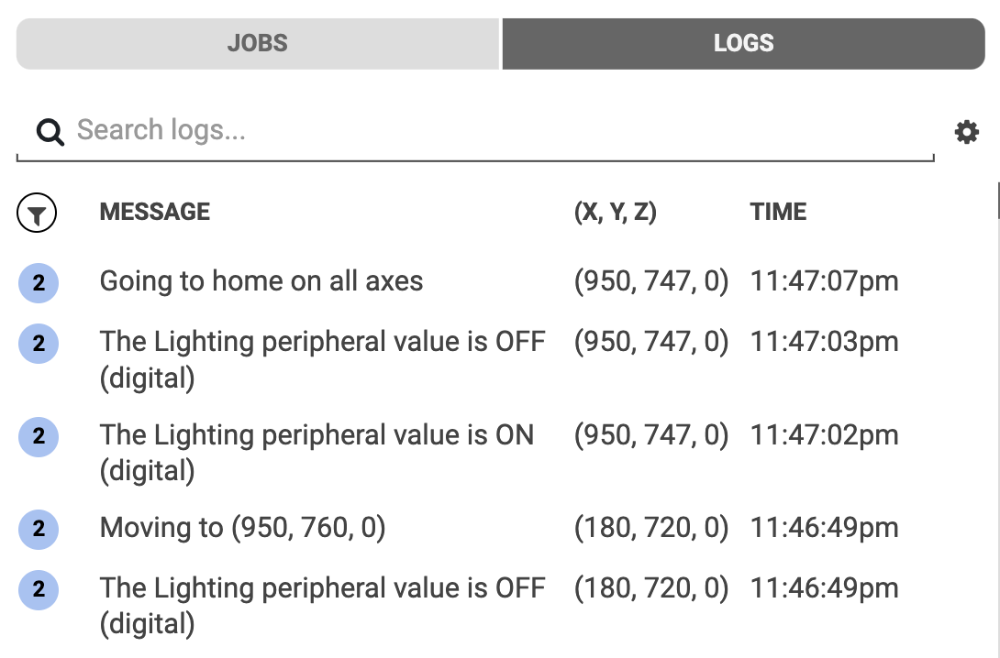
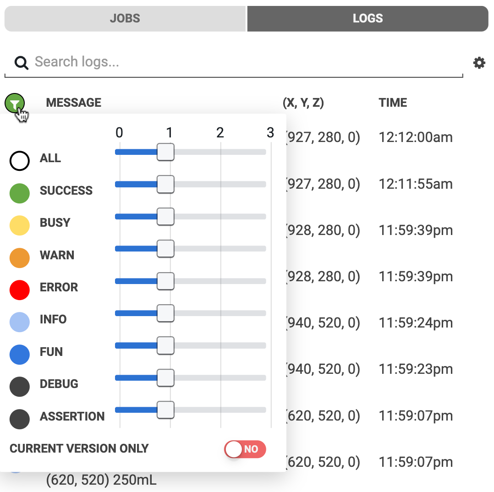
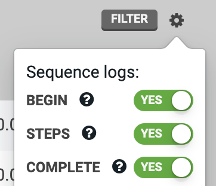

The **jobs and logs popup** in the main nav bar of the app features two tabs allowing you to keep track of FarmBot's progress while it is performing long-running jobs as well as audit the detailed logs of each individual operation.

# Jobs tab

When FarmBot is executing long-running sequences or tasks such as watering the whole garden or taking photos, you can keep track of the high-level progress from the **jobs tab** of the popup.

The jobs table shows the **JOB** name, **%** completion, current **STATUS**, and the **DURATION** of time <i class='fa fa-clock-o'></i> that the job has been executing for. Completed jobs are shown at the bottom of the table and may be cleared after 5 minutes upon refreshing the browser tab.



# Logs tab

The **logs tab** shows a low-level view of each individual operation that FarmBot has performed. Logs can be useful for debugging sequences and diagnosing issues with FarmBot, but are generally not needed during normal operation.

## Log types

There are several **log types**, each with their own color, that indicate the type of message being sent.

||Type|Meaning|
|:--------------------------------------------:|----|-------|
||**SUCCESS**|FarmBot has successfully completed a task. **Example:** *Synced*
||**BUSY**|FarmBot is busy working on a task. **Example:** *Syncing*
||**WARN**|A situation may require your attention or make FarmBot unresponsive. **Example:** *Emergency locking and powering down*
||**ERROR**|An error or emergency stop has occurred. **Example:** *Movement failed*
||**INFO**|General information about what FarmBot is doing. **Example:** *Starting Water All Plants Sequence*
||**FUN**|Logs that are just for fun :rabbit:
||**DEBUG**|Verbose information relevant to software development and troubleshooting. **Example:** *Network interface needs configuration: wlan0*
||**ASSERTION**|Results of ASSERTION commands. (advanced)

## Verbosity and filtering

FarmBot sends logs for nearly every action it takes. Sometimes seeing all of the logs can be helpful, for example when trying out new features or when debugging your system. Other times seeing only logs of a certain type or detail level is desirable, such as when you leave your FarmBot to work for a few weeks and you just periodically check in.

Every log that FarmBot sends has a **verbosity** of `1`, `2`, or `3`, which can be loosely associated with how important the log is and the level of detail that it reveals about how your FarmBot is operating. A more verbose log (verbosity `3`) is usually "lower level" and less important. A less verbose log (verbosity `1`) is usually "higher level" and more important.

You can filter logs by using the search bar or by clicking the filter <i class='fa fa-filter'></i> icon. The verbosity sliders allow you to choose to see more verbose or less verbose logs of each type, or turn them off completely.

## Logs settings menu

You can customize whether or not FarmBot sends some types of logs or not by using the options in the (cog) menu. Each option is described in the tooltip shown when the (?) icon is clicked.

## Log limits

In order to provide the best possible web application experience to all users, we have implemented the following limitations to the number of logs a FarmBot can store to the web app within a given time period.

Time Period | Max Number of Logs
--- | ---
1 minute | 250
1 hour | 5,000
1 day | 25,000

If a log limit is reached, a **cooldown period** will begin where log storage and display is suspended until the next time period. For example, if the 1 minute limit is reached, logs will be suspended until the next minute. A warning log and toast notification will be displayed, indicating the suspension:



Once the cooldown period has ended, logs will resume being stored and displayed in the web application. An informational log and toast notification will indicate this:



# What's next?

 * [Message Center](message-center.md)