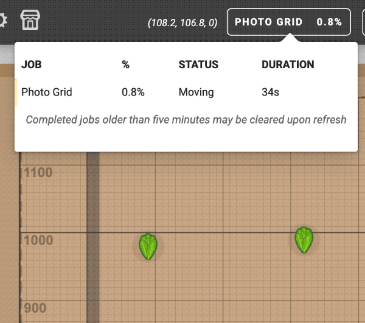

When FarmBot is executing long-running sequences, keep track of the overall progress from the **jobs popup** in the main navbar of the app. The jobs popup shows the **JOB**, **%** completion, **STATUS**, and **DURATION** of time that the job has been executing for.

Completed jobs are shown at the bottom of the popup and may be cleared after 5 minutes upon refreshing the browser tab.

# Use job progress tracking

To implement job progress tracking in your own sequences, see the [Lua developer documentation](http://lua.farm.bot) for `set_job_progress()` and `get_job_progress()`.
