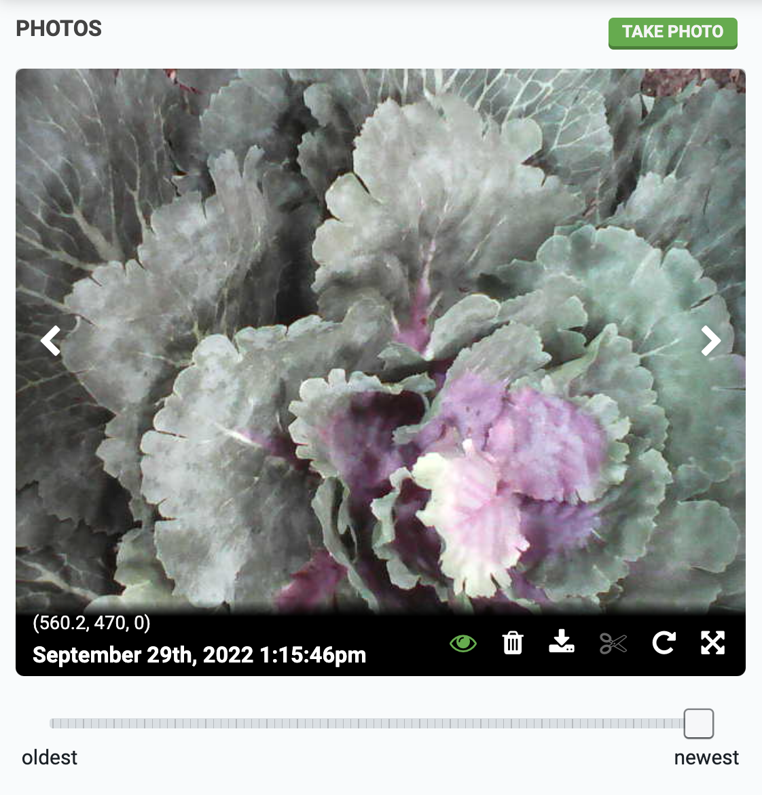

The **photos panel** offers a carousel for you to view all of the photos you've taken with your FarmBot, as well as controls and settings for taking photos, deleting photos, calibrating the camera, measuring soil height, and performing weed detection.

Photos in the carousel are displayed in reverse chronological order, so the most recent photo you've taken always shows up first.

To take a photo, press the take photo button. Once FarmBot takes the photo, it will upload it to the web app along with the coordinates of where the photo was taken, as well as the date and time.

Once you have taken multiple photos, use the <i class='fa fa-chevron-left'></i> and <i class='fa fa-chevron-right'></i> buttons to navigate through your images. At the bottom of the carousel are additional icon buttons:

|Icon|Description|
|:--:|-----------|
|<i class='fa fa-eye'></i>|Indicates whether or not the photo is displayed in the map. Press the icon to open the **SHOWN IN MAP** pop-up to see the reasons why the photo is or isn't displayed. Press HIDE to temporarily hide the photo from the map.
|<i class='fa fa-trash'></i>|Deletes the photo.|
|<i class='fa fa-download'></i>|Opens up the unrotated and uncropped photo in a new tab for saving to your computer.|
|<i class='fa fa-scissors'></i>|Toggles photo cropping.|
|<i class='fa fa-repeat'></i>|Toggles photo cropping and rotation. When enabled, the photo will appear as it does in the map. When disabled, the photo will appear as it was taken by the camera without any adjustments applied.|
|<i class='fa fa-arrows-alt'></i>|Opens the full screen image viewer.|

# What's next?

 * [Filter Map Photos](photos/filter-map-photos.md)
 * [Camera Settings](photos/camera-settings.md)
 * [Camera Calibration](photos/camera-calibration.md)
 * [Weed Detection](photos/weed-detection.md)
 * [Measure Soil Height](photos/measure-soil-height.md)
 * [Camera Troubleshooting](photos/camera-troubleshooting.md)
 * [Plug and Play Cameras](photos/plug-and-play-cameras.md)
