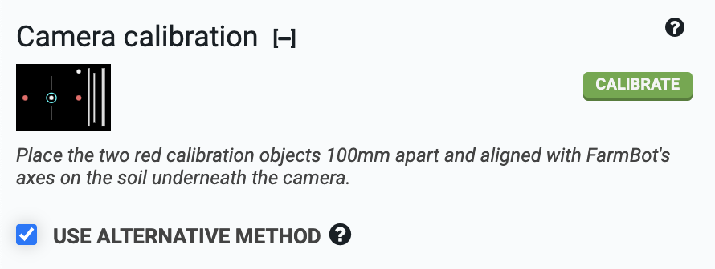
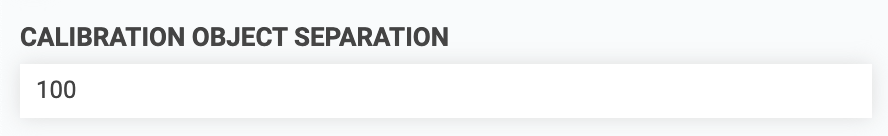
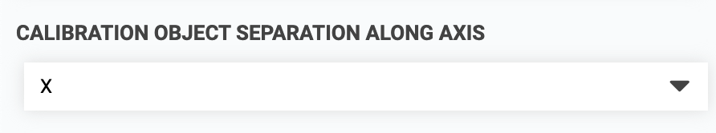
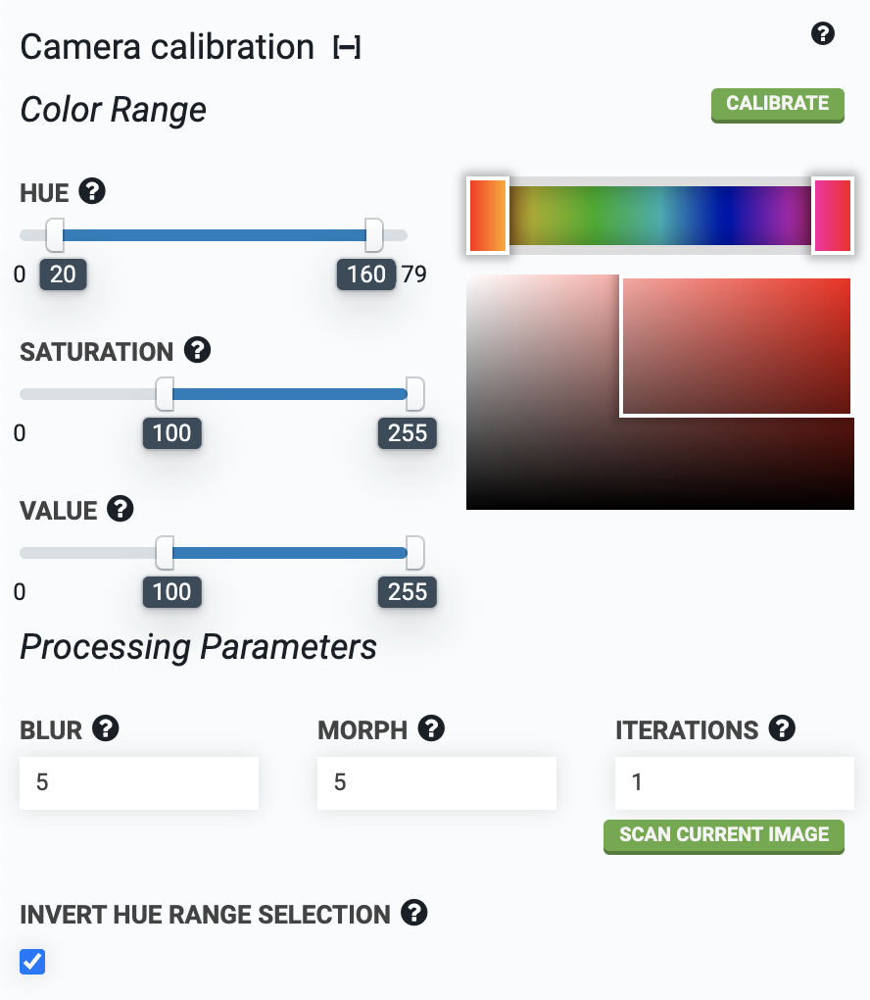

* toc
{:toc}



To use this method, check **USE ALTERNATIVE METHOD** in the camera calibration panel.

## Step 1: Place the calibration objects in the bed

Place two red calibration objects on the surface of the soil in your garden bed. The objects should be bright red, and preferably round. FarmBot kits over the years have included different calibration objects according to the table below:

|Kit                           |Calibration Object            |
|------------------------------|------------------------------|
|Genesis v1.2                  |[Red rubber caps](https://genesis.farm.bot/v1.2/extras/bom/miscellaneous#red-markers)
|Genesis v1.3                  |[Red rubber caps](https://genesis.farm.bot/v1.3/extras/bom/miscellaneous#red-markers)
|Genesis v1.4                  |[Red plastic golf tees](https://genesis.farm.bot/v1.4/extras/bom/miscellaneous#red-markers)
|Genesis v1.5 and Express v1.0 |[Calibration card with red dots](https://genesis.farm.bot/v1.5/extras/bom/electronics-and-wiring#camera-calibration-card)

The objects can be placed anywhere in the bed, but they need to be placed *square* with FarmBot's coordinate system and in a location where FarmBot's camera can be moved directly overhead. The objects should be separated about 100mm or more apart, but they must both be within the field of view of the camera.

## Step 2: Enter distance and orientation

Measure the distance from the center of one calibration object to the center of the next and input this distance in millimeters into the **CALIBRATION OBJECT SEPARATION** field.



Select the axis along which the calibration objects are placed. If you placed them in the direction of the tracks, select `X` in the **CALIBRATION OBJECT SEPARATION ALONG AXIS** drop down menu. If you placed them in the direction of the gantry, select `Y`.

For the **ORIGIN LOCATION IN IMAGE** setting, look at a photo you have taken with FarmBot's camera (take one using the take photo button if you haven't already). Determine which direction home is in the image, and select the corner of the image that corresponds to that direction. It can help to view a photo taken when FarmBot was at home `(0, 0, 0)`. If a corner of the image does not correspond to the origin, try rotating the camera until one does.

## Step 3: Select color range

For FarmBot to find the red calibration objects, it needs to know which shades of red to look for. The **HUE** color range slider should be set to approximately `20` to `160`, with the **INVERT HUE RANGE SELECTION** checkbox marked. This will select a hue range that includes various shades of red.

## Step 4: Calibrate

Move FarmBot directly over the calibration objects and raise the z-axis as high as it will go. Press the calibrate button and watch the status ticker. Once calibration is finished, FarmBot will upload the resulting image as well as calculated values for **PIXEL COORDINATE SCALE** and **CAMERA ROTATION**.

If more than the two red objects are detected in the image, adjust the **HUE**, **SATURATION**, and **VALUE** parameters until the two red objects are the only objects detected in the image. Detected regions of the image are outlined in green and circled in blue. Each new calibration will replace the previous calibration values.

The scan current image button can be used to run camera calibration on an image already taken instead of taking a new photo.

## Step 5: Check results

After camera calibration, photos taken of the garden should line up with the grid when shown in the farm designer. If locations such as plants appear offset in photos when compared to the corresponding map locations, **CAMERA OFFSET X** and **CAMERA OFFSET Y** can be adjusted until they match.



# What's next?

 * [Weed Detection](weed-detection.md)
 * [Scan the Garden for Weeds](../../docs/how-to-guides/scan-the-garden-for-weeds.md)
