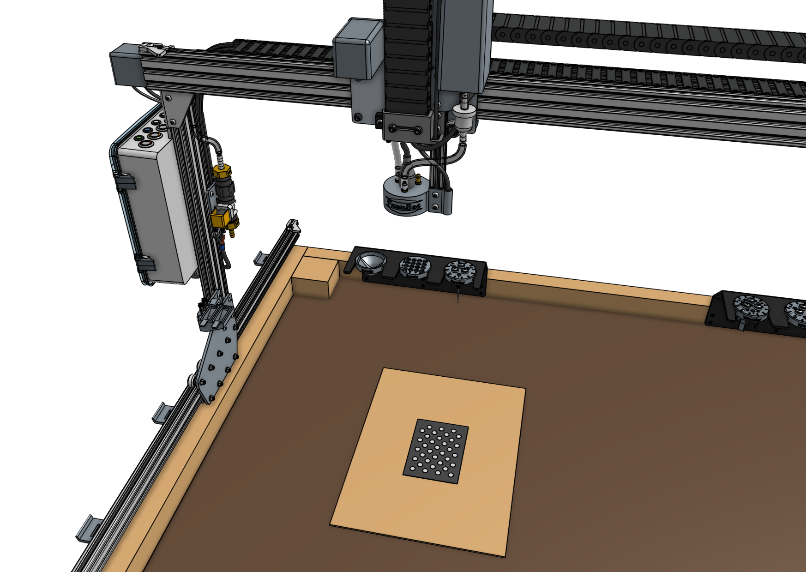
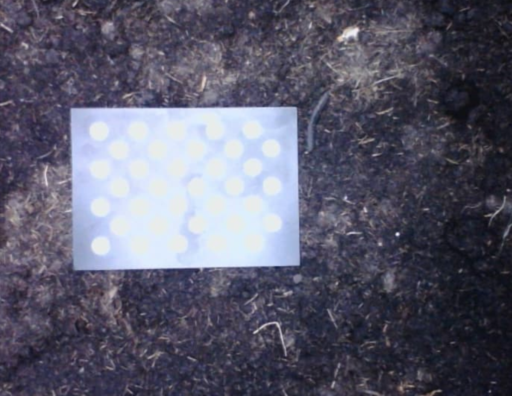

FarmBot's camera must be **calibrated** so that images can be **scaled**, **rotated**, and **positioned** such that the pixels in the images match up with the FarmBot coordinate system. This allows images to be displayed in the farm designer map with the correct location, size, and rotation. Calibration also allows FarmBot to detect and locate objects in the garden, such as weeds.

Genesis v1.5+ and Express v1.0+ kits include a **camera calibration card** (show below) which is used for the preferred camera calibration process outlined on this page. If this card was not included with your kit (Genesis v1.2, v1.3, or v1.4) you can use the [alternative camera calibration method](../photos/alternative-camera-calibration-method.md).

# Step 1: Place the card in the bed

Place a thin, large, and solid-colored surface (such as a piece of cardboard or cloth) on top of the soil away from the edges of the FarmBot bed. Then place the **camera calibration card** in the center of the solid-colored surface with the **dot grid** facing up. Orient the card square with FarmBot's axes and ensure that it is flat and facing perpendicular to the camera.

# Step 2: Calibrate

From the [controls panel](../controls/move.md), move FarmBot so that the camera is positioned directly over the camera calibration card and raise the z-axis as high as it will go. Now open the [photos panel](https://my.farm.bot/app/designer/photos) and scroll down to the **camera calibration** section. Expand the section and press the calibrate button. FarmBot will take a photo, then move 50mm in the +Y direction, take another photo, move 50mm in the +X direction, take a 3rd photo, and then move back to where it started.



Once calibration is finished, FarmBot will upload the resulting calibrated image as well as calculated values for **ORIGIN LOCATION IN IMAGE**, **PIXEL COORDINATE SCALE**, and **CAMERA ROTATION**.

If FarmBot is unable to detect the dot grid in any of the images, it will upload the problematic image and then move back to where it started. Inspect the image and make adjustments before retrying calibration. There are several common reasons FarmBot will not find the dot grid:

## Outside the field of view

If the camera calibration card was outside of the camera's field of view, or too far from the center of any of the images, then FarmBot may not detect it. Try moving the card a small amount (25mm) towards the center of the camera's field of view and retrying calibration. Also ensure the card is not obstructed or bent. The entire pattern of white dots and black background should be clearly visible to the camera.

## Poor lighting

There must be good contrast between the white dot pattern and black calibration card background for calibration to complete successfully. If the lighting in the image is too bright, too dim, or nearby trees are casting shadows in some areas of the card but not others, then FarmBot will have trouble detecting the dot grid.

To increase lighting, try toggling ON FarmBot's LED light strip or waiting for another time of the day to try calibration.

To decrease lighting and ensure there are no interrupting shadows, try waiting until another time of the day when the garden is fully shaded. You may also try in a different location in the garden bed.

If the image appears overexposed like in the example below, try adding a sheet of white printer paper next to the calibration card. This will allow the camera to automatically adjust its exposure settings to better expose the calibration card.

## Damaged calibration card

If the calibration card is bent or has a crease in it, has been damaged by water, or is otherwise in poor condition then calibration may not complete successfully. If your calibration card is damaged you may:

* Try printing out the [calibration card pattern](camera_calibration_card.pdf) on a sheet of paper (note that it must be printed the exact scale as the original).
* Try the [alternative camera calibration method](../photos/alternative-camera-calibration-method.md).
* Purchase a replacement [camera calibration card](https://farm.bot/products/camera-calibration-card).

# Step 3: Check results

After camera calibration, photos taken of the garden should line up with the grid when shown in the farm designer. If locations such as plants appear offset in photos when compared to the corresponding map locations, **CAMERA OFFSET X** and **CAMERA OFFSET Y** can be adjusted until they match.



# Camera calibration limitations

It is important to understand that even a perfectly calibrated camera will not produce perfect results in all situations due to the effect of [**parallax**](https://en.wikipedia.org/wiki/Parallax).

The calibration of the camera can only match image pixels to FarmBot coordinates for objects at the **same Z height** that the camera calibration card was at when the camera was calibrated.

Objects that are lower in height, such as a depressed area of the soil, will appear smaller and not match up perfectly with the map. Objects that are higher in height, such as the tools, toolbays, plants, and even parts of the raised bed will appear larger and will not match up perfectly with the map either.

**There can only be one Z plane of perfect calibration and it should be at the height of the soil.** Thus, focus your calibration efforts and fine tuning on the soil surface and do not worry about discrepancies with the tools or toolbays.

Capturing a photo grid of your soil and very small plants should look close to perfect. However, as your plants grow, you will likely see mismatched seams between images when viewing the full mosaic of a photo grid in the farm designer. This is due to the parallax effect and the fact that the camera may not have been directly above the plant when capturing an image. This is not a problem with the camera calibration, but rather a limitation of the camera's field of view and the parallax effect.

If you need to image your plants without seams, then you must position the camera directly above the plant rather than hoping it is does not fall on a seam in a photo grid.

# What's next?

 * [Weed Detection](weed-detection.md)
 * [Scan the Garden for Weeds](../../docs/how-to-guides/scan-the-garden-for-weeds.md)
