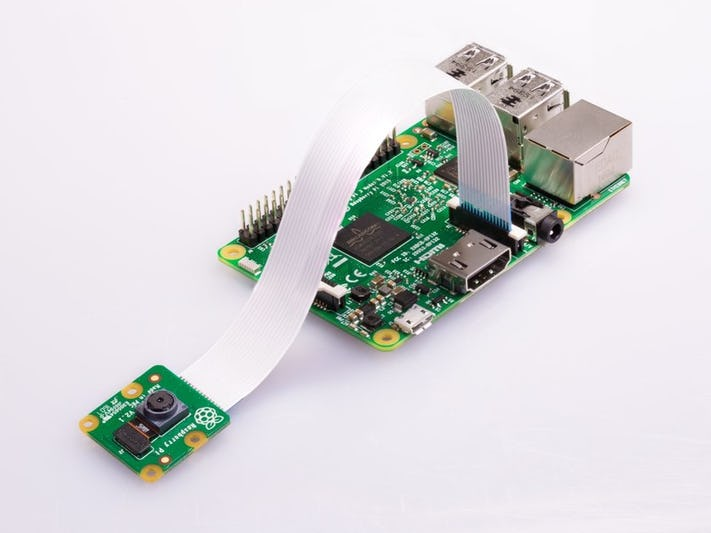

* toc
{:toc}

FarmBot OS only supports **plug-and-play USB cameras** and the official **Raspberry Pi camera**. If you would like to use a 3rd party plug-and-play USB camera, simply plug it into a spare USB port on the Raspberry Pi. If you would like to use the Raspberry Pi camera, plug the ribbon cable into the Pi's `CAMERA` CSI port.

# My camera requires a special software driver

Although FarmBot runs on a Linux-powered Raspberry Pi, it is **not possible** to add and remove special software drivers needed for some cameras like you would on a desktop computer. If your 3rd party camera does not work right away with FarmBot, we will not be able to add the special drivers or troubleshoot the setup for you.

The only way to use a camera with special software requirements is to create a "sidecar" module for your FarmBot. A sidecar module is a separate computer that you can configure as needed with any required software drivers for your camera. Additionally, you will need to configure the sidecar to communicate with your FarmBot, which will require more advanced programming expertise. This option is intended for advanced users only. Please refer to our developer documentation for a brief [guide on how to set up a sidecar](https://developer.farm.bot/docs/sidecar-hardware).
