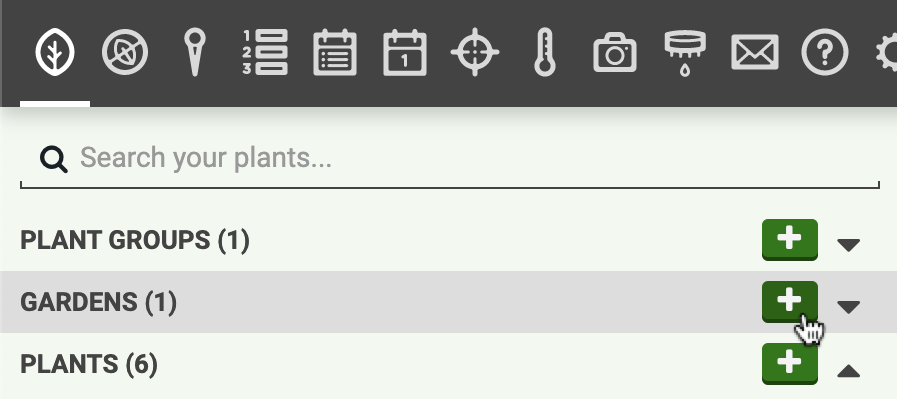
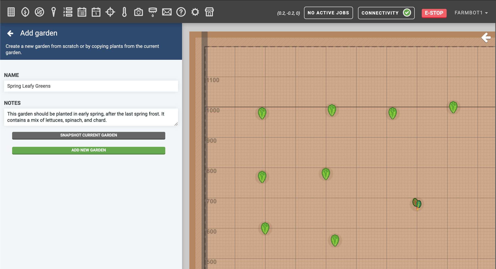
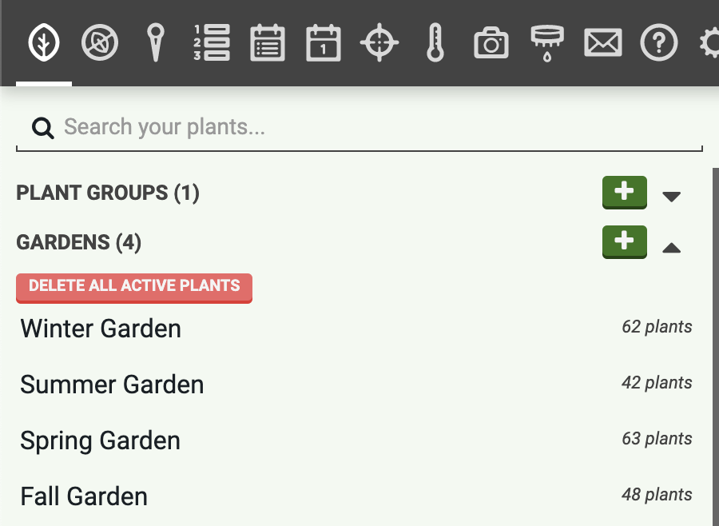
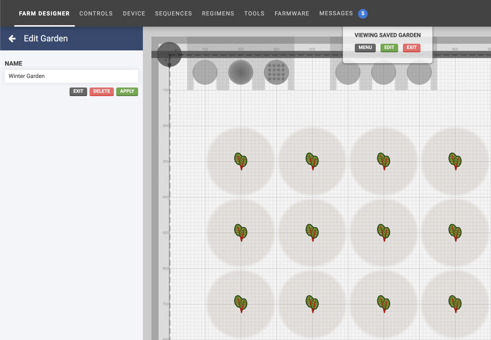

The **gardens** feature allows you to save a garden (all of the plants and their locations) for re-use at a later time. This can be especially useful if you want to have different gardens for each season.

# Save a garden

To save the current garden, click the <i class='fa fa-plus'></i> button in the **GARDENS** section of the plants panel.

Enter a **NAME** and optional **NOTES** about the garden. Then click Snapshot current garden. A copy of the garden will then be saved and shown in the list of gardens.



# View and edit gardens

From the plants panel, expand the **GARDENS** section to view all your saved gardens.

Selecting a garden will load it into the map allowing you to view it, as well as add, re-locate, and delete plants from the saved garden. The map background will be displayed gray to indicate a saved garden (rather than the current garden) is being displayed and edited.

Once you are finished viewing and editing, click the Exit button located in the saved gardens panel, or the Exit button located in the **VIEWING SAVED GARDEN** menu at the top of the map area.

# Applying a garden

If you are ready to use one of your gardens, you must **apply** it to an empty map. First, delete all plants from the current garden (the one that is shown when you load the app). You can do this quickly by using the Delete all active plants button at the top of the gardens section.

Once the current map is empty, select a garden and click Apply.


