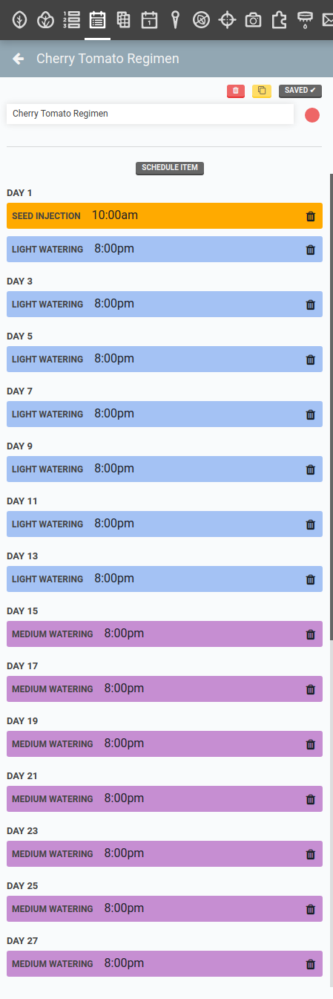
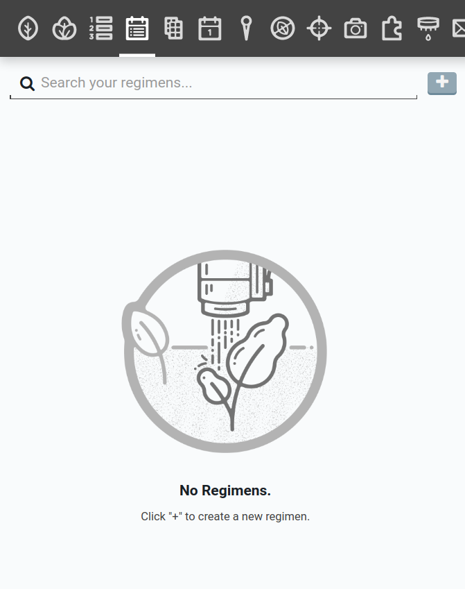
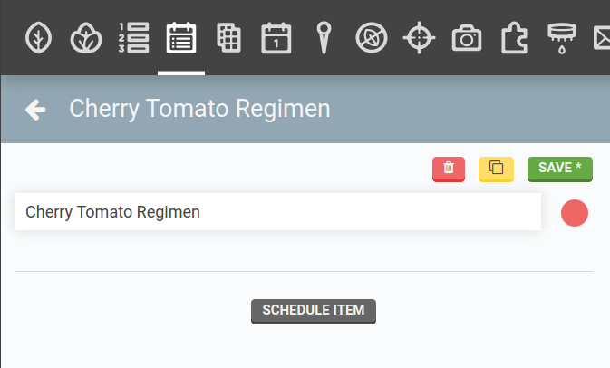
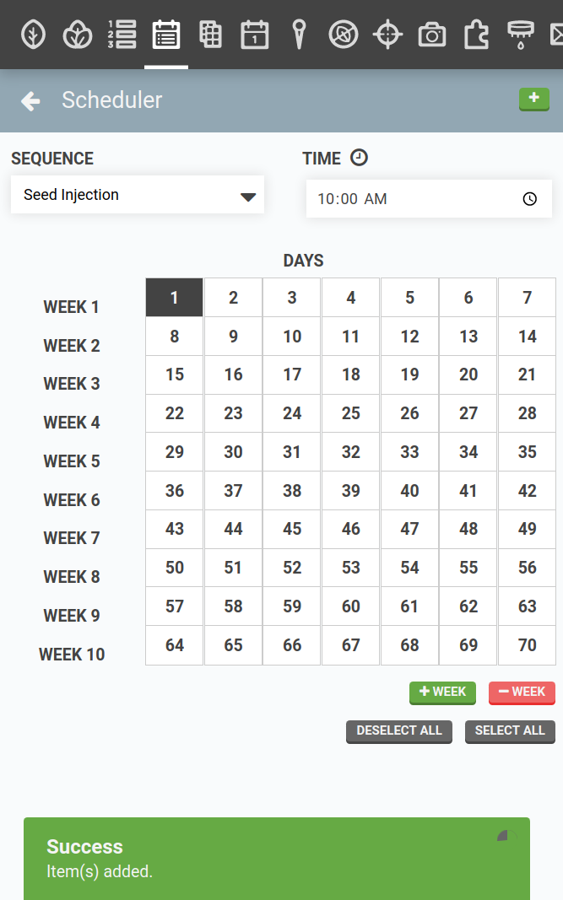
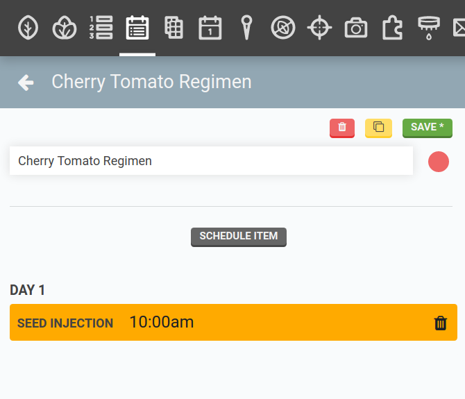
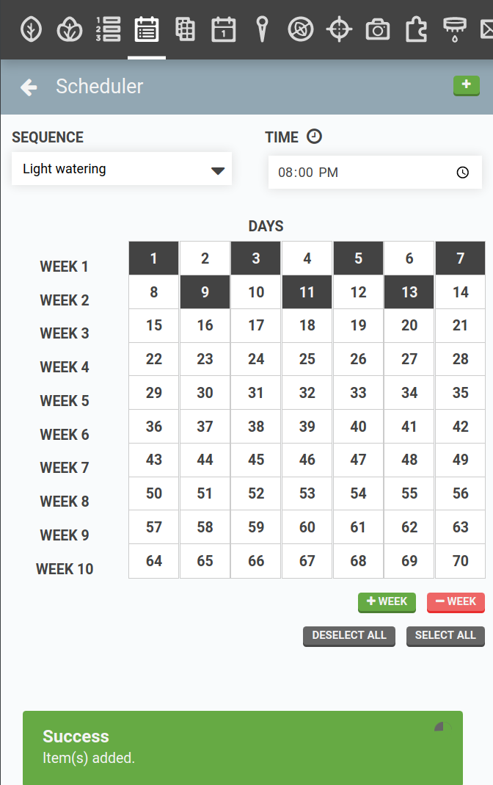
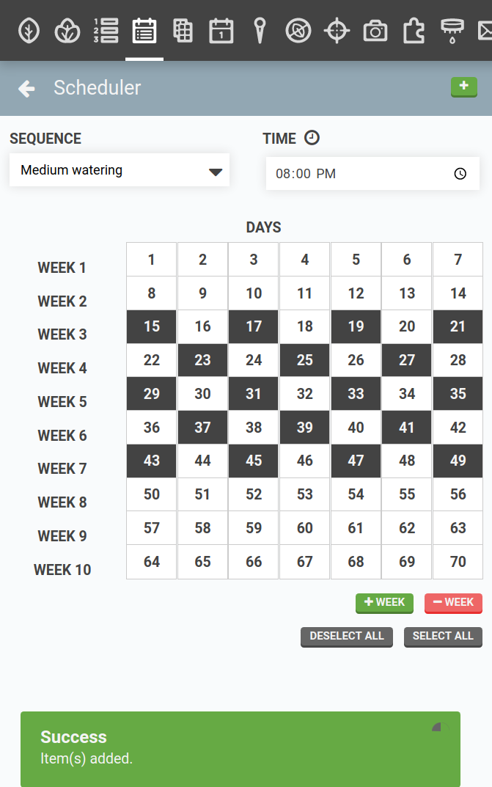
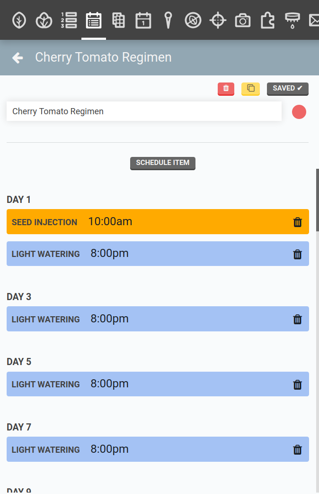



**Regimens** allow you to easily take care of a plant throughout its entire life and re-use each "recipe" season after season. To explain the utility of regimens, let's go through a practical example. Imagine you create three sequences for growing Cherry Tomatoes:
1. `Seed Injection`
2. `Light Watering`
3. `Medium Watering`

You decide to grow 10 tomato plants with these sequences starting on **March 1st**. To do this using the [event scheduler](events.md), you might create three events:
1. `Seed Injection` to run on **March 1st**
2. `Light Watering` to run every other day from **March 1st to March 13th**
3. `Medium Watering` to run every other day from **March 15th to April 22nd**

Now imagine you want to grow 10 more tomato plants starting March 9th, and 10 more plants starting March 25th, and 10 more on April 19th. Using the event scheduler, you would need to tediously calculate the timings for each sequence and schedule them three more times each. In total, you will have to make 12 events. **This is what regimens can streamline.**

While the event scheduler works by scheduling an event on a *specific calendar day* such as **March 1st**, regimens work by scheduling events on a *relative day* such as **Day 22** from when the regimen is started. Regimens are therefore a way to bulk re-schedule a set of events starting at any time. Usually the start time coincides with when a plant is started (either sown or transplanted into your garden) though this is not required.

Let's look at our tomatoes example again, this time using a regimen to reach the same outcome. First, we'll make a regimen:
1. `Seed Injection` will run on **Day 1**
2. `Light Watering` will run every other day from **Day 2 to 13**
3. `Medium Watering` will run every other day from **Day 15 to 49**

We can then use events to schedule this regimen to start on March 1st, March 9th, March 25th, and April 19th. Using this method, we created one regimen and four events, instead of the 12 events from before. Plus, we can continue to re-use the regimen each time we want to re-plant tomatoes to save even more time. We can also make changes to the regimen and all of the scheduled instances will be updated automatically.

# Creating a regimen

In the **Regimens** panel, press the <i class='fa fa-plus'></i> button to create a new regimen. The new regimen will be loaded into the panel. Give your regimen a descriptive name and optionally assign it a color.

To add a sequence to the regimen, press the SCHEDULE ITEM button then select the **SEQUENCE** you wish to add to the regimen. Pick a **TIME** and the **DAYS** for it to run. For this example, we will run the `Seed Injection` sequence at `10am` on `Day 1`. Press the <i class='fa fa-plus'></i> button to add the sequence to the regimen.

To view the added items, click <i class='fa fa-arrow-left'></i> to leave the scheduler. If you make a mistake, remove items from the regimen by clicking the <i class='fa fa-trash'></i> icon next to the item you wish to remove. If you need to edit or review a sequence, click the <i class='fa fa-external-link'></i> icon to navigate to that sequence.

Next we'll add a `Light Watering` sequence to the regimen to run at `8PM` every other day for the first two weeks, and last we'll add a `Medium Watering` sequence to run at `8PM` every other day for weeks 3 through 7. Clicking <i class='fa fa-arrow-left'></i> will leave the scheduler so we can review the added items. Press SAVE to save the regimen.



# Running a regimen

A regimen on its own will not execute because the regimen only has enough information to run sequences at a day and time _relative_ from a start date. Thus, to run a regimen, you will have to schedule it using an [event](events.md).

# What's next?

 * [Events](events.md)
