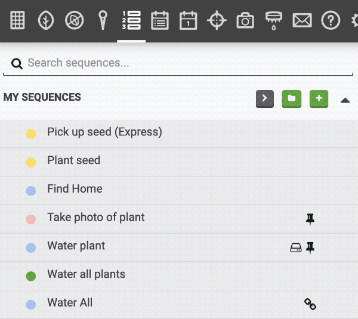
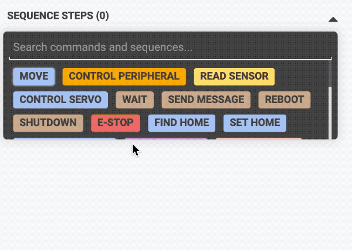
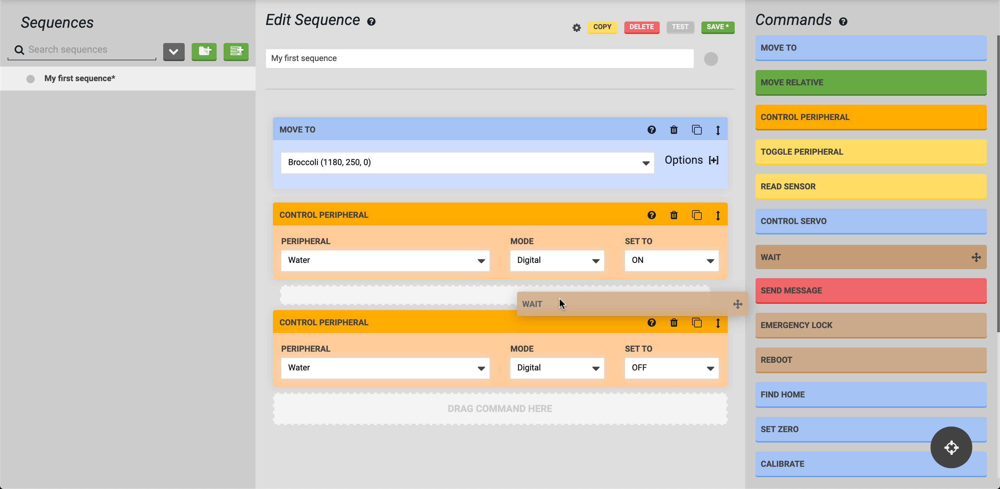
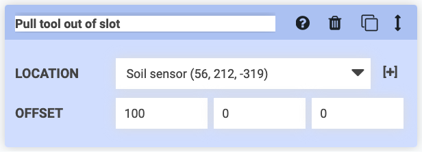

# Step 1: Create or select a sequence

In the **sequences** panel, click the <i class='fa fa-server'></i> button to create a new sequence. Or, select an existing sequence if you would like to edit it. If you have many sequences, use the search box to find one more quickly.

Once a sequence has been created or selected, it will be loaded into the **edit sequence** panel. Enter a unique Sequence name and optionally assign it a color . The color will not affect FarmBot's execution of the sequence, it is only for helping you organize and recognize your own sequences.

# Step 2: Add commands

Add commands to your sequence by clicking the add command button. This will bring up the **add command** panel, where you can then click the command you would like to add at that location in the sequence. If you change your mind, click the <i class='fa fa-arrow-left'></i> button to go back to the editor.

On large screens, you may press the full editor button, allowing for a full-screen sequence editing experience. From the full editor you may add commands by dragging and dropping them from the **commands** panel into the **edit sequence** panel. When dragging and dropping, you can add the new command anywhere in the sequence (at the top, bottom, or somewhere in the middle). Alternatively, you can click a command and it will be added to the bottom of the sequence.



# Step 3: Define step parameters

For each step (command) in the sequence, enter in your desired parameter values. Some parameters such as **SPEED** will have default values and do not need to be entered in every time. Other parameters require a value to be added or chosen every time.



# Step 4: Use the step control icons

Each step in a sequence has a cluster of control icons in the top right:

|Icon|Function|
|----|--------|
|<i class='fa fa-question-circle'></i>|Clicking or hovering will bring up a tooltip with information about how to use the command.
|<i class='fa fa-trash'></i>|Clicking will delete the step from the sequence.
|<i class='fa fa-clone'></i>|Clicking will duplicate the step and all of its parameter values. The copy will be inserted directly below the original.
|<i class='fa fa-arrows-v'></i>|Clicking and dragging will allow you to drag and drop the step to another location in the sequence. Just clicking will show a popup with <i class='fa fa-arrow-circle-up'></i> and <i class='fa fa-arrow-circle-down'></i> icons. Clicking one of these will move the step up or down one position in the sequence. These controls are especially useful when using a touchscreen that doesn't work with drag-and-drop functionality.
|<i class='fa fa-external-link'></i>|Clicking will open the linked sequence used in an Execute command.
|<i class='fa fa-thumb-tack'></i>|Clicking toggles between a simplified and full view of a pinned sequence added as a step.
|<i class='fa fa-font'></i>|Clicking toggles between the fancy and basic text editors in a Lua command.
|<i class='fa fa-code'></i>|Clicking toggles between the default view of the command and the raw code version of the command. Only available if the **VIEW CELERSCRIPT** sequence editor option is set to YES.
|<i class='fa fa-exclamation-triangle'></i>|Clicking will show any warnings or problems with the currently configured step.

# Step 5: Name each step

You can rename each sequence step by clicking on its name and typing in something new. While this is optional, naming each step with some descriptive text can allow you to easily remember what each step is for when you look at the sequence again tomorrow, or in a few months. It might also be useful if multiple people use the same FarmBot account, such as in a school setting, so everyone can understand what each sequence does.

# Step 6: Save

Whenever a sequence has unsaved changes, an asterisk (**\***) will be shown next to the sequence name in the sequence list, and in the Save \* button. When you are finished editing, click Save \* to save the sequence. Once saving is complete, the button will show as Saved <i class='fa fa-check'></i>.

# What's next?

 * [Example Sequences](example-sequences.md)
