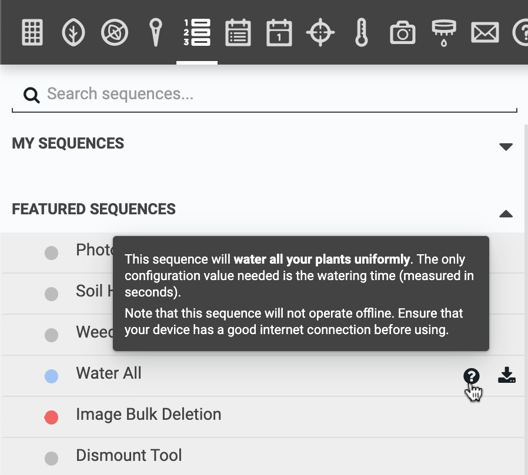

At the bottom of the sequences panel is the **FEATURED SEQUENCES** section. Within this section are publicly available sequences that have been created and curated by FarmBot Inc. To see if you would like to use one of these sequences with your FarmBot, you can hover over the sequence and click the <i class='fa fa-question-circle'></i> to view a preview of the sequence's description.

If you would like to use the sequence immediately, click the <i class='fa fa-download'></i> icon to import the sequence to your account and sync it with your FarmBot. Alternatively you can click into the sequence to view it's full contents in detail.

Once imported, you can find your copy of the sequence in the **MY SEQUENCES** section of the panel. You can either use the sequence as-is, or make your own modifications. Note that some featured sequences may require some configuration. Make sure to read any instructions in the description!

{%
include callout.html
type="star"
title="Want to get your sequence featured?"
content="Send us an email at [contact@farm.bot](mailto:contact@farm.bot) with a link to your [publicly shared sequence](../sequences/shared-sequences.md#publishing) and a brief description of why you think your sequence should be featured. We'll review the contents of the sequence and let you know if we've decided to feature it!

The best candidates are sequences that provide value to a broad set of FarmBot users, are easy to understand and use, and give FarmBot new capabilities that most users aren't likely benefitting from otherwise."
%}

# What's next?

 * [Regimens](../regimens.md)
 * [Events](../events.md)
