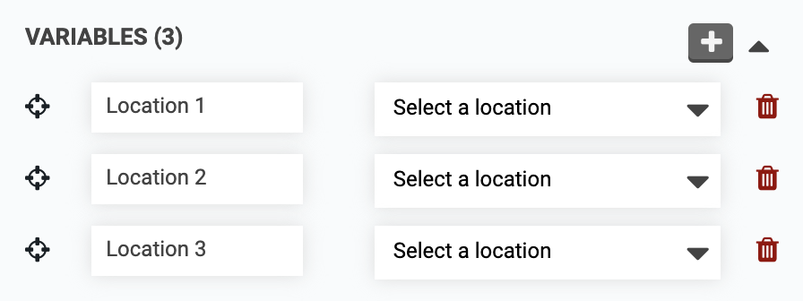
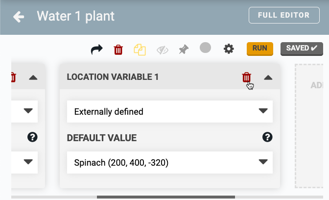
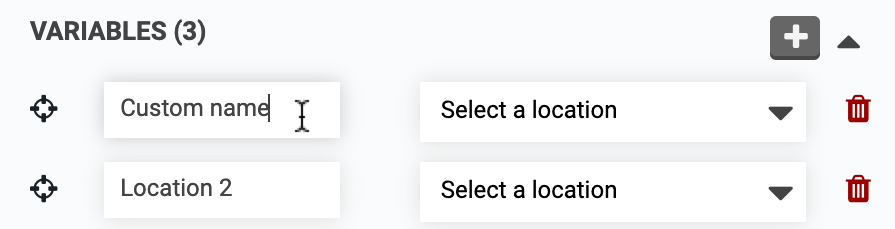
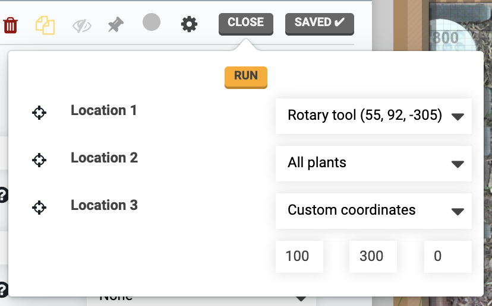

# Adding multiple variables

Sequences are not limited to a single variable. To add additional variables click the <i class='fa fa-plus'></i> button in the **VARIABLES** section of the sequence editor, followed by the variable type desired or select `Add new` in a sequence step dropdown.

{%
include callout.html
type="info"
content='When adding new externally defined variables to a sequence you have been using in other sequences, regimens, or events, it is highly recommended to add **DEFAULT VALUES** for the new variables. This will allow FarmBot to run the sequence in the existing sequences, regimens, and/or events using the default values.

If you opt to not provide a default value (selecting "None"), then you will need to explicitly define the variable in all other sequences, regimens, and/or events where the sequence is already being used. If you do not provide a value then the sequence will fail when it runs.'
%}

# Removing variables

To remove a variable, click the <i class='fa fa-trash'></i> icon.



# Renaming variables

To keep track of what each variable is used for, click the variable's title to add a custom name.



# Multiple externally defined variables

All `Externally defined` variables will be displayed in the run button popup, execute steps, and all other places where you can provide a value for an [externally defined variable](externally-defined-variables.md).



# What's next?

 * [Variable Types](variable-types.md)
