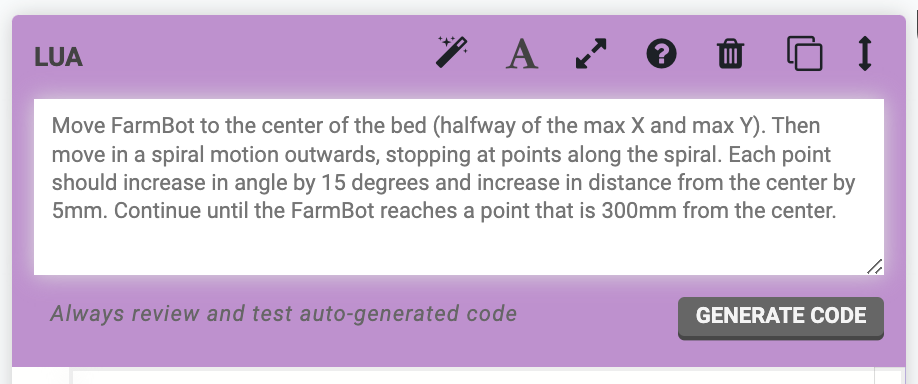
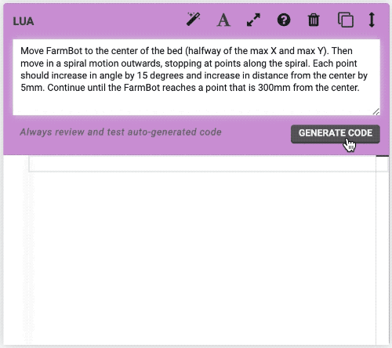
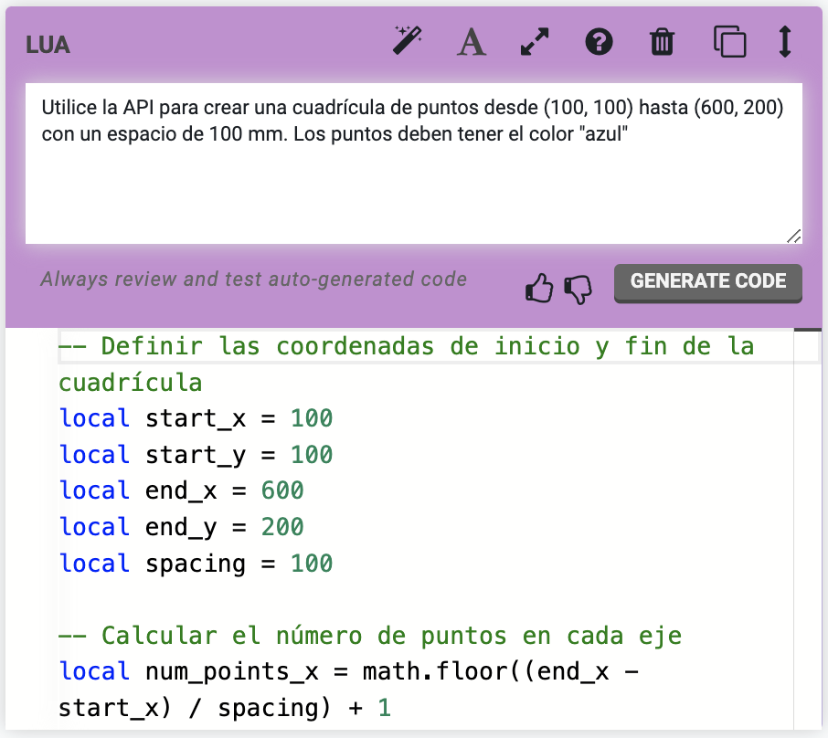



# Assertion

The Assertion command allows FarmBot to test if a condition is true or false for automated testing purposes. For example, you could set up a FarmBot to move back and forth repeatedly along an axis, and check the position after each movement. This type of test is useful for high-cycle hardware testing, and for continuous integration testing of software changes.

Assertions must be written in **Lua**, and will be evaluated against a Lua 5.2 interpreter. See the [developer documentation](http://lua.farm.bot) for a list of available Lua functions.

In the event that a **TEST FAILS**, FarmBot can either `Continue` execution, `Recover and continue`, `Abort and recover`, or just `Abort` execution altogether. The **RECOVERY SEQUENCE** allows you to reset FarmBot to a known state after a failure, send a message, or perform any other desired operations.

Pressing the <i class='fa fa-font'></i> icon will toggle between a Monaco text editor with syntax highlighting and a basic text field.

# Lua

The Lua command allows FarmBot to execute **Lua code**, which will be evaluated against a Lua 5.2 interpreter.



Pressing the <i class='fa fa-font'></i> icon will toggle between a Monaco text editor with syntax highlighting and a basic text field. Pressing the <i class='fa fa-expand'></i> icon will toggle between an expanded view and a collapsed view.

## AI Lua generation

Pressing the <i class='fa fa-magic'></i> icon will open a prompt field for automatically generating Lua code with **AI**. Simply describe what you would like the code to do in plain language (or use one of the example prompts), and then click GENERATE CODE.

Behind the scenes we’ll query a large language model API with:

* Your prompt
* Our entire written Lua developer documentation
* Names and pin numbers of all your peripherals, sensors, and tools
* Some extra prompt engineering

Within seconds you’ll see commented Lua code streaming into the code field.

Once the generation is complete, you can review the code and make any necessary modifications, rate the generation, save the sequence, and try it out. If you don’t like the first generation, you can always tweak your prompt and try again.



Code comments will be written in the language set by the **[LANGUAGE](../../settings/account-settings.md#language)** field in your account settings. By default this is set to English, but our international users are welcome to use their preferred language for more easily understanding the generations. You can also write prompts in your preferred language.

# What's next?

 * [Building a Sequence](../building-a-sequence.md)
