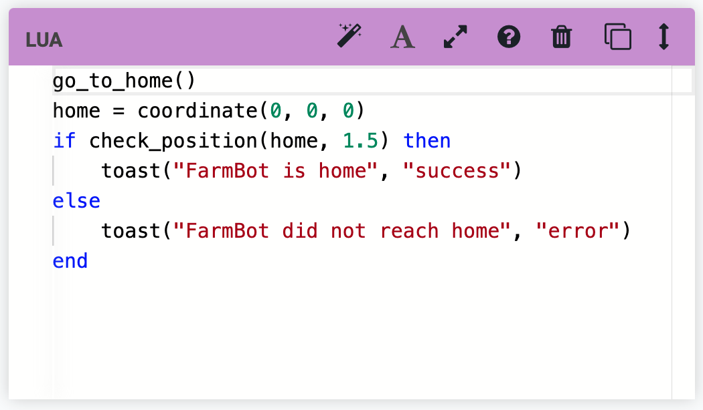



# Assertion

The Assertion command allows FarmBot to test if a condition is true or false for automated testing purposes. For example, you could set up a FarmBot to move back and forth repeatedly along an axis, and check the position after each movement. This type of test is useful for high-cycle hardware testing, and for continuous integration testing of software changes.

Assertions must be written in **Lua**, and will be evaluated against a Lua 5.2 interpreter. See the [developer documentation](http://lua.farm.bot) for a list of available Lua functions.

In the event that a **TEST FAILS**, FarmBot can either `Continue` execution, `Recover and continue`, `Abort and recover`, or just `Abort` execution altogether. The **RECOVERY SEQUENCE** allows you to reset FarmBot to a known state after a failure, send a message, or perform any other desired operations.

Pressing the <i class='fa fa-font'></i> icon will toggle between a Monaco text editor with syntax highlighting and a basic text field.

# Lua

The Lua command allows FarmBot to execute **Lua code fragments**, which will be evaluated against a Lua 5.2 interpreter. See the [developer documentation](http://lua.farm.bot) for a list of available Lua functions.

Pressing the <i class='fa fa-font'></i> icon will toggle between a Monaco text editor with syntax highlighting and a basic text field.

# What's next?

 * [Building a Sequence](../building-a-sequence.md)
