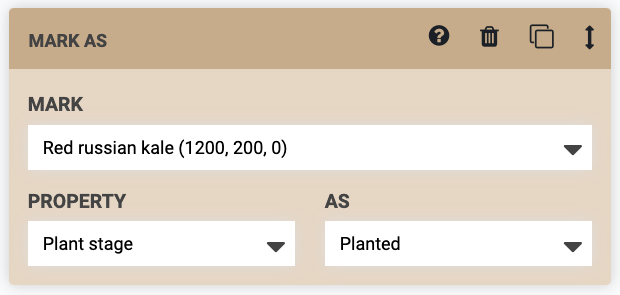
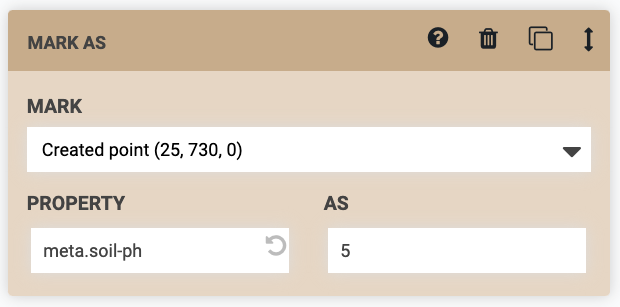
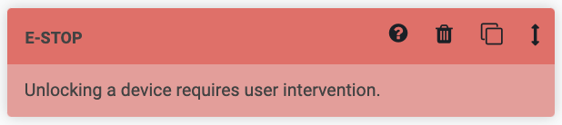
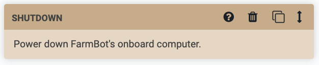

# Wait

The Wait command causes a delay before executing the next step in the sequence. This could be used to hold the solenoid valve open for FarmBot to water a plant for `2000` milliseconds (2 seconds), for example.

The maximum time allowed is 3 minutes (`180,000` milliseconds). If you need to have FarmBot wait for longer, use multiple steps.

# If statement

The If Statement command allows FarmBot to check if a condition is true or false and take an action based on the results. This allows for smarter, condition based farming, and for gracefully handling errors and failures.

If the condition that FarmBot checks is true, you can instruct FarmBot to execute another sequence or do nothing, in which case FarmBot will continue to the next step in the current sequence. If the condition that FarmBot checks is false, you can also instruct FarmBot to execute another sequence or do nothing.

In the example below, FarmBot will check **_IF..._** the **VARIABLE** (`Soil moisture`) `is less than` the **VALUE** (`500`). If that condition is true, **_THEN..._** FarmBot will execute a sequence to `Water the plant`. **_ELSE..._** (if the condition is not true), FarmBot will do nothing (ie: continue to the next step in the current sequence).

# Execute

The Execute command uses *existing sequences* as *steps* in a *new, larger sequence*. This allows you to re-use smaller, simpler sequences in different combinations to create far more complex sequences that are easier to modify, manage, and mashup later because of their modularity.

For example, you could make a sequence to `Mount the watering nozzle`, another sequence to `Water the plant`, and a third sequence to `Unmount the watering nozzle`. Then, in a new sequence, you could use three Execute commands (one for each of the smaller sequences) to execute all the steps needed to water the plant.



# Mark as

The Mark as command instructs FarmBot to **MARK** an item's **PROPERTY**  **AS** the value of your choice. For example, you could mark a Spinach plant's `Plant stage` property as `Planted`. Using this command allows FarmBot to systematically update an item's properties as it works with that item. This step also accepts a Location Variable as an input, which can be used when running a sequence over a group of items.

While a variety of properties are available for each item type such as `X`, `Y`, `Z`, `Radius`, and `Color`, you can also set custom properties in the format `meta.custom-property`. These properties can then be viewed on the item's details panel in the farm designer, and you can also select items with these properties using advanced groups filters.

# Send message

The Send Message command instructs FarmBot to send a message. This is useful for error and success notifications and debugging. To use this command, simply type in the **MESSAGE** you would like FarmBot to send, choose a **TYPE**, and select the channels you would like the message to be sent to.

`{{ x }}` can be used as a text variable for FarmBot's current x-axis position (`y` and `z` can also be used). `{{ pin13 }}` can be used to write the current value of pin 13 (pins 0 through 69 can also be used).

# E-stop

The E-stop command instructs FarmBot to stop operations (halt motor movements and turn off peripherals). To continue operations, you will need to manually unlock the device.

# Reboot

The Reboot command instructs FarmBot to power cycle the onboard computer.

# Shutdown

The Shutdown command instructs FarmBot to shut down the onboard computer. To turn it back on, unplug FarmBot and plug it back in.

# What's next?

 * [Advanced Sequence Commands](advanced.md)
 * [Building a Sequence](../building-a-sequence.md)
