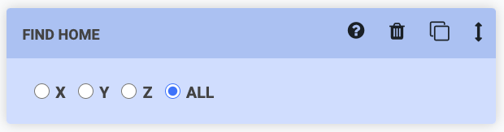

# Move

The Move command instructs FarmBot to move to a new location. To use this command, first choose a **LOCATION**  from the dropdown. Options include:

  * Custom coordinates
  * Offset from current location
  * Location variables
  * Tool and seed container locations
  * Plant locations
  * Map points
  * Weed locations

## Custom coordinates

When choosing the **custom coordinates** option, three input fields will be revealed allowing you to specify the exact **X, Y, Z** coordinates you want FarmBot to move to.

## Offset from current location

When choosing the **offset from current location** option, three input fields will be revealed allowing you to specify the **OFFSET** amount you want FarmBot to move to.

## Location variables

When choosing **variable - add new**, a variable form will be added to the sequence header. Upon selecting a variable value in the sequence header, the dropdown selections in all Move steps set to that variable will be updated. See the [variables](../variables.md) documentation for more information.

## Other locations

When choosing a **tool or seed container location**, a **plant location**, a **map point**, or a **weed location**, those resources will then become _in-use_, meaning that they cannot be deleted until you remove them from your sequence. If you update their coordinates, your sequence steps will be automatically updated.

{%
include callout.html
type="warning"
title="Be careful when moving to tools or seed containers"
content="Under most circumstances you will need to mount a tool or pick up a seed from a seed container in **multiple steps**. First, you should move to the tool or seed container with a **positive z-axis offset**. This will allow FarmBot to then descend onto the tool or into the seed container from above in a second step (with no z-offset).

If you try to move to a location to mount a tool or pick up a seed in one step, you risk the z-axis traveling too low too quickly and the FarmBot crashing into the tool and/or bending a seed injection needle."
%}

## Advanced options

Within the **[+]** dropdown, you will find several options to modify the base **LOCATION** and several options for changing how FarmBot performs the movement. By default, the app will only load the **[+]** options in an open state if you've changed any of options from the default values. If you would like the **[+]** options to always load in an open state, set **OPEN OPTIONS BY DEFAULT** to YES from the <i class='fa fa-gear'></i> menu in the sequence header.

### Override

**OVERRIDE** allows you to override the X, Y, and/or Z values from the **LOCATION** field with new values. You may type in a custom coordinate, a formula, or disable an axis entirely. The Z axis override dropdown also includes special **[Safe height](../../settings/axes.md#safe-height)** and [Soil height](../../settings/axes.md#fallback-soil-height) options.



### Offset

**OFFSET** allows you to add positive or negative offsets to the base **LOCATION**. This is useful when pulling tools out of slots, or when watering around or above a plant.

### Variance

**VARIANCE** allows you to add randomness to a movement, in case you want to perform an action repeatedly (such as suppressing a weed) but with small variations between repetitions. In the example below FarmBot will move to 288 +/- a random variance between 0 and 4 on the X axis. Thus, the final X location will be a random value between 284 and 292.

### Speed

**SPEED (%)** allows you to slow down movement along an axis for greater precision, for example when mounting and dismounting tools. Speed is a percentage of the **MAX SPEED** for each axis.

### Safe Z

**SAFE Z** allows you to instruct FarmBot to perform a MOVE command as three distinct movements:

  1. Move Z to the [Safe Z height](../../settings/axes.md#safe-height)
  2. Move X and Y to the new location
  3. Move Z to the new location

This is useful when you need FarmBot to move across the garden but want to ensure it does not run into any plants or other objects.

# Find home

The Find Home command instructs FarmBot to automatically find the home position for the chosen axis. If you choose **ALL**, FarmBot will find home for each axis one at a time in the order: z-axis, y-axis, x-axis.



# Set home

The Set home command instructs FarmBot to set the current location along an axis to `0`, also known as the `Home` position for that axis. If you choose **ALL**, FarmBot will set all axes to zero.

# Find axis length

The FIND AXIS LENGTH command instructs FarmBot to automatically find the length of the chosen axis. If you choose **ALL**, FarmBot will find the length of each axis one at a time in the order: z-axis, y-axis, x-axis.



# Control servo

The Control servo command instructs FarmBot to move a servo to the provided **ANGLE**.



# What's next?

 * [Peripheral and Sensor Commands](peripherals-and-sensors.md)
 * [Building a Sequence](../building-a-sequence.md)
