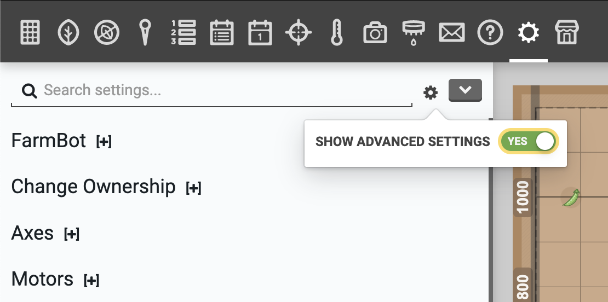

The settings panel contains a bunch of settings that determine how FarmBot moves, syncs, updates, and more. All of the settings on this panel are stored in your web app account and then get synchronized to the FarmBot. This means that if you ever need to reset your FarmBot, your settings will not be lost.

# Show advanced settings



Some settings are not shown by default because they are only useful in very special circumstances and can cause problems for non-advanced users. To show advanced settings, turn ON the **SHOW ADVANCED SETTINGS** toggle located in the (cog) menu of the settings panel.

# What's next?

 * [Account Settings](settings/account-settings.md)
 * [FarmBot Settings](settings/farmbot-settings.md)
 * [Axes](settings/axes.md)
 * [Motors](settings/motors.md)
 * [Encoders](settings/encoders.md)
 * [Stall Detection](settings/stall-detection.md)
 * [Limit Switches](settings/limit-switches.md)
 * [Error Handling](settings/error-handling.md)
 * [Pin Bindings](settings/pin-bindings.md)
 * [Pin Guard](settings/pin-guard.md)
 * [Parameter Management](settings/parameter-management.md)
 * [Custom Settings](settings/custom-settings.md)
