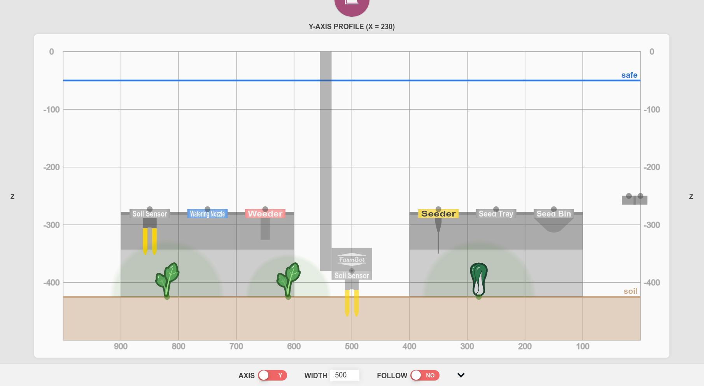

# Find home

Finding home instructs FarmBot to find the home (minimum) position by moving towards home until a rotary encoder, stepper driver, or limit switch signals that the end of the axis has been reached. Note that **ENCODERS**, **STALL DETECTION**, or **LIMIT SWITCHES** must be ON for FarmBot to automatically find home.

To find home for an axis, click the FIND HOME X, FIND HOME Y, or FIND HOME Z buttons. To home all three axes, you can use the <i class='fa fa-home'></i> button in the controls panel (assuming that that button is set to its default behavior).



# Set home

Pressing the SET HOME X, SET HOME Y, and SET HOME Z buttons allows you to *manually* set FarmBot's current location as the home position for that axis. This is used for *manually* setting the Home position when **ENCODERS**, **STALL DETECTION**, or **LIMIT SWITCHES** are OFF.

However, because stock FarmBots have encoders and stall detecting, it is recommended to instead use the [find home](#find-home) function for *automatically* finding the Home position of each axis and setting that position to zero.

In general, the **set zero** buttons should not be regularly used because it does not make sense to change your zero position once you have your garden growing, and because all FarmBots should have either encoders or stall detection enabled which allows for automatically finding and setting the Home position.

These buttons may come in handy though when playing around with experimental sequences or exploring alternate coordinate system configurations for your FarmBot.

# Find home on boot



Enabling this setting will run a homing command for each axis upon boot. This is most useful for allowing FarmBot to recover and resume operations after a power outage. Note that **ENCODERS**, **STALL DETECTION**, or **LIMIT SWITCHES** must be ON for this feature.

# Stop at home

Enabling software limits for an axis will prevent FarmBot from moving through zero. For example, if an axis is normally moving in positive coordinates, then the software limit will prevent it from moving through zero into negative coordinates. If an axis has **NEGATIVE COORDINATES ONLY** enabled, then it normally moves in negative coordinates and the software limit will prevent it from moving through zero into positive coordinates.



# Stop at max

If the **SET AXIS LENGTH** setting for an axis is non-zero, FarmBot will stop at the axis maximum.

# Negative coordinates only



This setting will allow movements to only occur in negative coordinates for the chosen axis. This is most useful for the z-axis if you want your home position to be at the highest point and for FarmBot to move down into negative coordinates.

# Find axis length

Finding an axis length instructs FarmBot to find the maximum position and then find the minimum (home) position while measuring the distance between the two, which is the length of the axis. Note that **ENCODERS**, **STALL DETECTION**, or **LIMIT SWITCHES** must be ON for FarmBot to automatically find an axis length.

Also note that you must enable **STOP AT MAX** for FarmBot to stop at the measured maximum.



# Set axis length

With these inputs you can manually specify the length in mm of each axis. This is useful if you want to limit your FarmBot's movements along an axis with software rather than a physical hardware stop such as a belt clip or an endstop. For example: you may occasionally want to prevent movements at the far end of your garden because you put a seasonal garden gnome there, but you don't want to adjust the belts and belt clips. You must enable **STOP AT MAX** for FarmBot to stop at the values inputted.



# Safe height

**SAFE HEIGHT** is the Z axis coordinate (in millimeters) to which the Z axis should be retracted during **[SAFE Z](../sequences/sequence-commands/movements.md#safe-z)** movements or when _Safe Height_ has been selected as the Z axis [override](../sequences/sequence-commands/movements.md#override) in a Move command. It is recommended to choose a value at which the Z axis is all of the way up to provide as much clearance as possible.

# Fallback soil height

Z axis coordinate (millimeters) of the soil. This value will be used by Move sequence commands when _Soil Height_ is selected as the z-axis override and no soil height measurements are available. After soil height measurements have been added [automatically](../photos/measure-soil-height.md) or [manually](../points.md#soil-height-points), a matching or interpolated soil height value will be used based on the selected location.

_Safe and soil heights as shown in the [profile viewer](../farm-designer.md#profile-viewer)_
