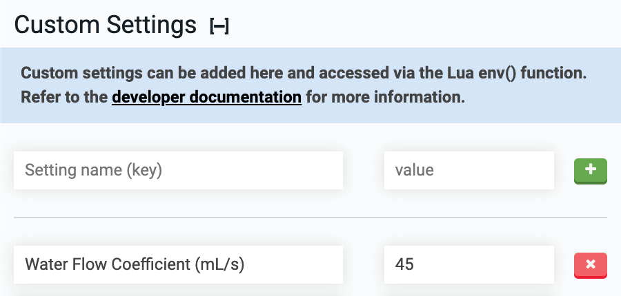

FarmBot supports custom **key/value** settings that can be accessed via the [Lua env() function](http://lua.farm.bot). Custom settings are useful for a wide variety of use cases such as storing 3rd party API keys or configuration values that you want to use in more than one sequence and/or Lua command.

# Add a custom setting

To add a custom setting, type in the setting name (key) and its value. Then press the <i class='fa fa-plus'></i> button to save the setting.

# Edit a custom setting

To edit a custom setting, change the key and/or value and then click outside of the text box. See the sync icon in the top bar of the app for indication that the updated setting has synced with the FarmBot.

# Delete a custom setting

To delete a custom setting, press the <i class='fa fa-times'></i> button.


