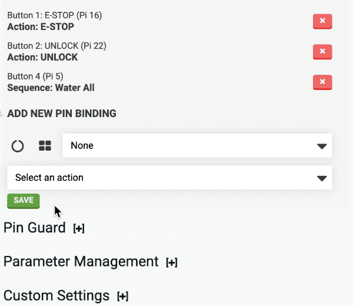



**Pin bindings** allow electrical signals from a button or sensor to trigger a FarmBot **action** or **sequence**. For example, a red button could be used to trigger the E-STOP action as recommended with FarmBot Genesis v1.4+ and Express v1.0+ kits. For practical examples, see our [use FarmBot's buttons](../../docs/how-to-guides/use-farmbots-buttons.md) how-to guide.

# Add a pin binding for a stock button

To add a pin binding for one of the stock buttons, click the  icon to open the Push Button diagram and select the button you wish to add a binding for. Then choose the **Action** or **Sequence** you would like FarmBot to take when the button is pressed. Click SAVE to save the pin binding.

# Add a pin binding for a custom GPIO pin

To add a pin binding for a custom GPIO pin, click the  icon to open the GPIO diagram and select the pin you wish to add a binding for. Then choose the **Action** or **Sequence** you would like FarmBot to take when this pin goes high. Click SAVE to save the pin binding.



# Delete a pin binding

To delete a pin binding, press the <i class='fa fa-times'></i> button.
