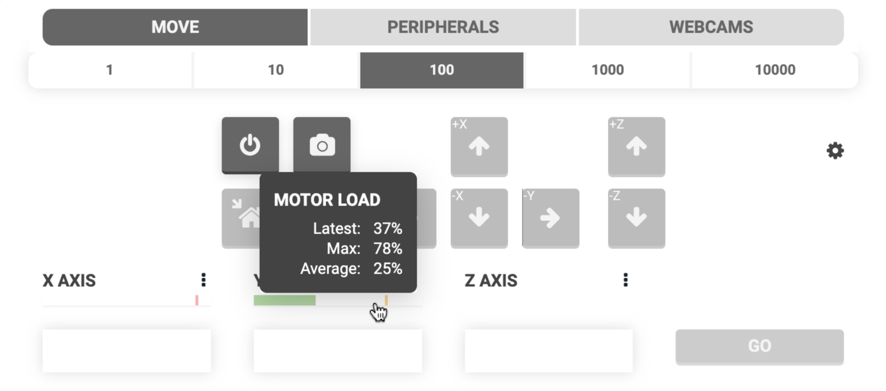



The **stall detection** feature for FarmBot Express bots utilizes the Trinamic TMC2130 stepper drivers’ capability of measuring back-current as a way of determining motor load, and thus when a stall has occurred. For more details, see the [stall detection hardware page](../../farmbot-os/arduino-firmware/stall-detection-hardware.md).

# Enable stall detection

Enable use of motor stall detection for detecting missed steps, finding axis length, and finding home.



# Max motor load

Maximum motor load (out of 100) as determined by the stepper driver before a motor is considered to have stalled. Should be set high enough to prevent false stall detections and low enough to ensure that when the bot does stall, it is correctly detected.

# Tuning stall detection

Every installation will have different characteristics that require the stall detection and motor settings to be **tuned** for optimal stall detection performance. The goals of tuning are to:

1. Reliably detect when the FarmBot has stalled due to running into an obstruction, finding the home position, or finding the axis length.
2. Avoid false stall detections during normal movements.

To achieve both of these goals, the realtime motor load must stay _below_ the **MAX MOTOR LOAD** during a normal movement and _exceed_ the **MAX MOTOR LOAD** when the motor has truly stalled. To view the latest, max, and average motor load readings in realtime, click the motor load indicator in the controls popup.

To view a plot of the motor load over time, click the (cog) icon in the controls popup and turn on the **MOTOR LOAD** plot. The horizontal dashed lines represent the **MAX MOTOR LOAD** for each axis, allowing you to visually see when the realtime motor load has exceeded the max threshold.

## Adjusting max motor load

If your FarmBot is falsely detecting stalls during normal movements, try _increasing_ **MAX MOTOR LOAD** in increments of 5. If your FarmBot is not detecting stalls when it should, try _decreasing_ **MAX MOTOR LOAD** in increments of 5. Make sure to test various movement conditions after making changes:

  * Movements in the positive and negative direction
  * Movements at various locations along an axis
  * Finding home and finding axis length
  * Holding the FarmBot by hand to create a real stall

## Adjusting speed and acceleration

If adjusting **MAX MOTOR LOAD** does not improve stall detection performance, try adjusting the motor speed and acceleration settings.

The motor load readings are very sensitive to the motor's speed, where the load will be significantly greater whenever the motor is moving slowly (less than about 80 mm/s). This will be especially true during the acceleration and decceleration phases of a movement.

Once the motor is moving more quickly (80 mm/s or faster) the stepper driver will detect a lower load. Reducing the time spent travelling slower than 80 mm/s can be achieved best by shortening the **ACCELERATE FOR** distance in increments of 5 and increasing the **MINIMUM SPEED** in increments of 5. It can also be affected by increasing the **MAXIMUM SPEED**, though to a lesser effect.



## Turning off stall detection

If you cannot find settings that give good results for all movment scenarios, you may disable stall detection. Keep in mind that you will need to manually set the home position any time the FarmBot stalls due to an obstruction or if the FarmBot ever loses power and reboots.
