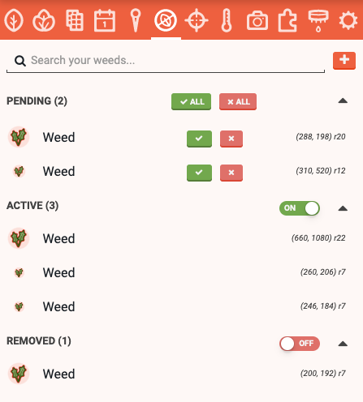
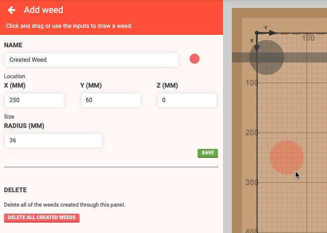
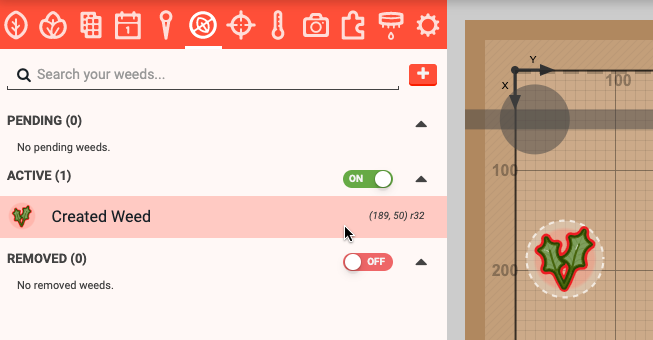
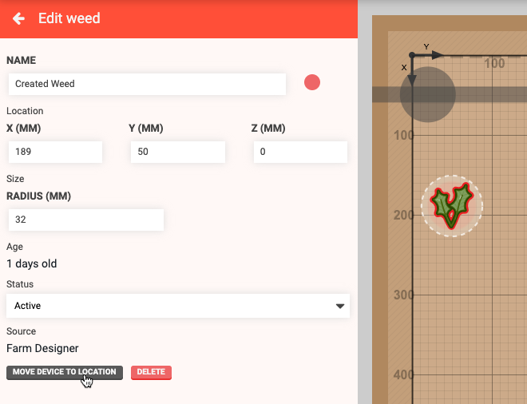
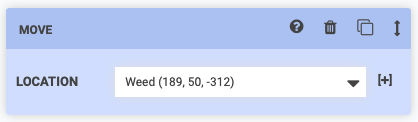

* toc
{:toc}

The **weeds panel** allows you to manage the weeds in your garden. Weeds are divided into three categories:

  * **PENDING** weeds have been [detected by FarmBot's camera](photos/weed-detection.md) and are awaiting manual triage. The <i class='fa fa-check'></i> and <i class='fa fa-check'></i> ALL buttons will move weeds to the **ACTIVE** category while the <i class='fa fa-times'></i> and <i class='fa fa-times'></i> ALL buttons will delete the weeds.
  * **ACTIVE** weeds are weeds currently active in the garden. These weeds were either identified by FarmBot's camera and then triaged into this category, or they were manually added with the <i class='fa fa-plus'></i> button.
  * **REMOVED** weeds are weeds that are no longer a concern. This category should include weeds that have been removed by FarmBot or by hand.

# Adding weeds
To manually add a weed, click the <i class='fa fa-plus'></i> button in the weeds panel. This will open the **add weed** panel where you can provide a **NAME**, **COLOR**, **X**, **Y**, and **Z** coordinates, and a **RADIUS** for the weed. You can also click and drag in the map to define the coordinates and radius. Click SAVE to save the weed.

# Editing weeds
To edit a weed, click it in the panel or in the map (when the weeds panel is opened). This will open the **edit weed** panel, allowing you to change anything about the weed. Changes will be saved when you press the <i class='fa fa-arrow-left'></i> button.

# Moving to a weed
There are two ways to move FarmBot to a weed. The first way is by clicking MOVE DEVICE TO LOCATION from the edit weed panel.

The second way is from sequences. Simply select the weed from the **LOCATION** dropdown in a Move command or location variable.

# Deleting weeds
To delete a weed, click on it to open up the edit weed panel. Then press the DELETE button.



# What's next?

 * [Points](points.md)
