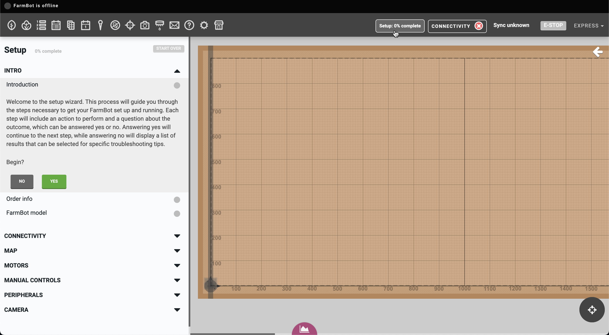
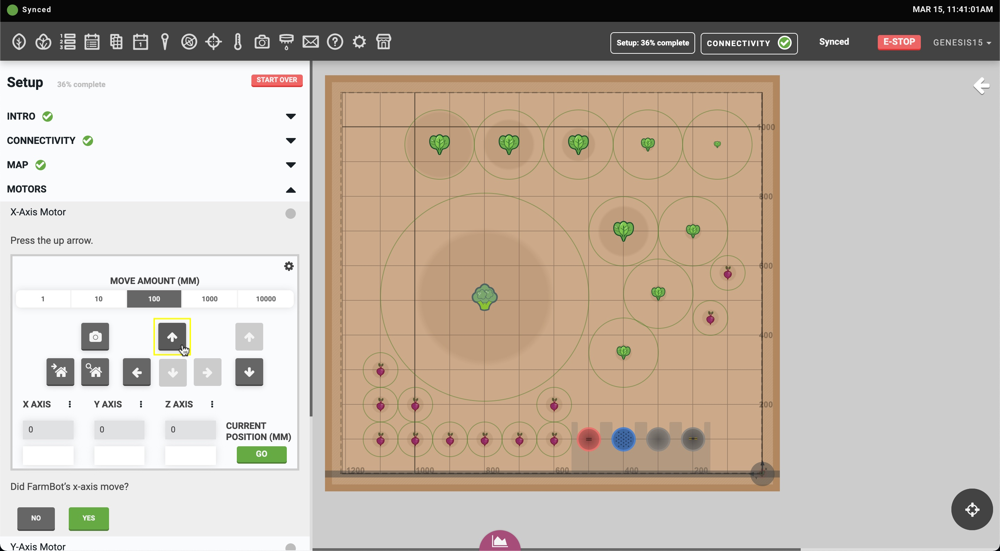
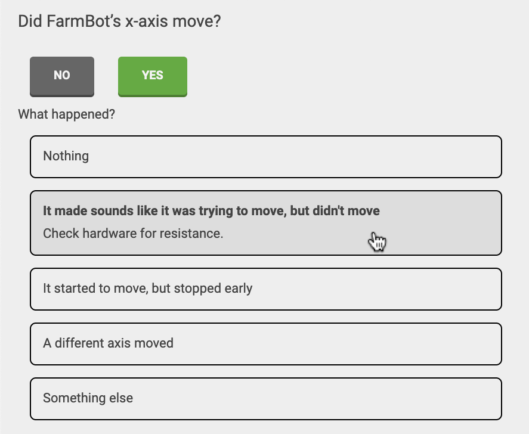
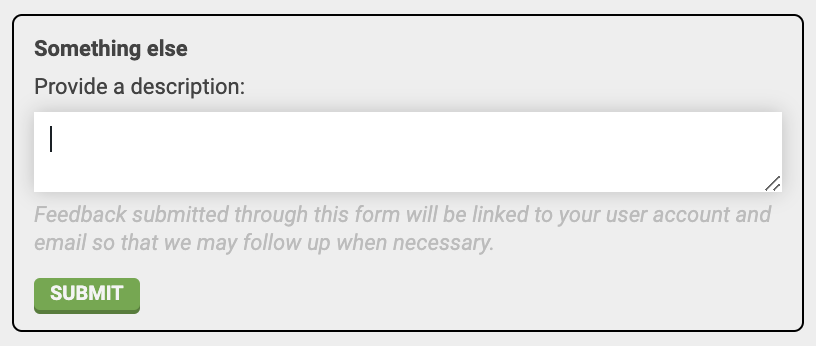
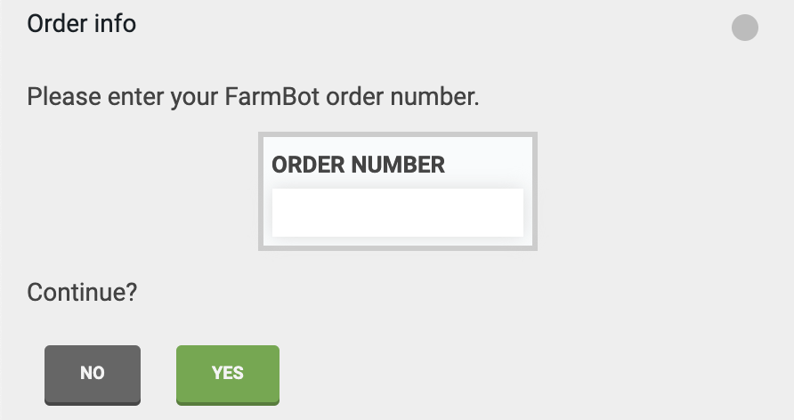
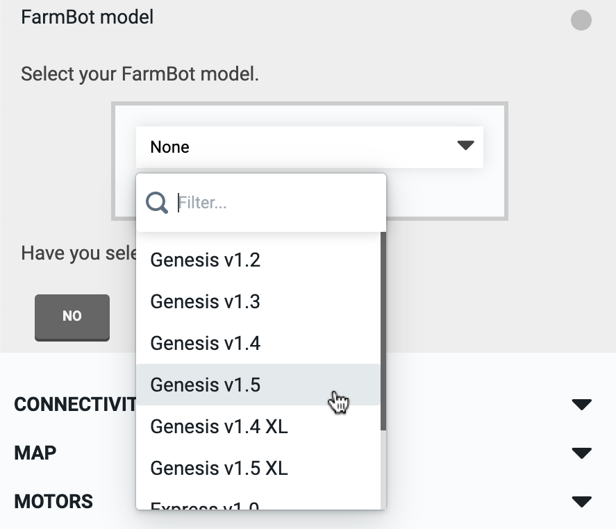

* toc
{:toc}

If you just finished your FarmBot hardware assembly, you're now ready to set up FarmBot's software. Let's get started! :rocket:

# Step 1: Create a web app account

1. Follow our instructions to [create a web app account](../app/intro.md#creating-an-account) at [my.farm.bot](https://my.farm.bot). Make sure you verify your account by clicking the verification link emailed to you upon sign up.

2. Once logged in, read the cards in the [message center](../app/message-center.md) to become acquainted with the app. Dismiss cards you are finished with using the <i class='fa fa-times'></i> button in the top right of each card.

# Step 2: Complete setup

Click the Setup: 0% complete button in the main navbar to open the **setup panel**. Complete all of the setup steps in the order that they are presented in.



## Providing feedback

If you get stuck on any setup step, you may be prompted to make hardware adjustments, go back to another setup step, or contact support. When contacting support, please be as descriptive as possible with the issue you are experiencing so that we are best prepared to help you.



## Order info

We request that all users enter their original FarmBot **ORDER NUMBER** as part of the setup process. This will register your purchase with your web app account so that you may receive faster support should you run into any issues.



## FarmBot model

Selecting your **FarmBot model** will add a set of starter resources (peripherals, sequences, etc) and apply a set of settings (map size, firmware version, etc) appropriate to your FarmBot model. This will allow you to get started working with your FarmBot more quickly.



## Connecting your FarmBot

1. [Install FarmBot OS](../farmbot-os/intro.md#installation) onto the microSD card and power on the device.

2. [Configure FarmBot](../farmbot-os/intro/configurator.md) to connect to your home WiFi network and your web app account.

3. Log in to the web app and verify that FarmBot has connected.

## Match the virtual FarmBot to real-life

1. If needed, use the **MAP ORIGIN** and **ROTATE MAP** settings so that the farm designer matches your real-life perspective.

2. Using the [manual controls](../app/controls.md), try moving FarmBot along each axis in both directions. If needed, use the **INVERT JOG BUTTONS** and **SWAP JOG BUTTONS** settings (in the move widget's <i class='fa fa-cog'></i> menu) so that the <i class='fa fa-arrow-left'></i> <i class='fa fa-arrow-right'></i> <i class='fa fa-arrow-up'></i> <i class='fa fa-arrow-down'></i> buttons send FarmBot moving in the direction that the arrow indicates, according to your real-life perspective.



## Set up FarmBot's axes

1. Using the [manual controls](../app/controls.md), send FarmBot to all corners of your raised bed to ensure it can successfully move throughout the entire working area in both directions along each axis.

2. Double check belt tension and make adjustments if needed. You also may need to "break in" the cable carriers as they may be stiff and resistant to smooth movements at first.

3. Sand down any bumps along the raised bed (Express), or at the joint between track extrusions (Genesis) to facilitate smooth movements. Genesis kits may need to have their [eccentric spacers adjusted](https://genesis.farm.bot/docs/eccentric-spacer-adjustment), or the track alignment improved.

4. If necessary, make small adjustments from the default values for the **MAX SPEED**, **MIN SPEED**, **ACCELERATE FOR**, and **MOTOR CURRENT** settings found in the [Motors](../app/settings/motors.md) section of the settings panel.

5. Once FarmBot can smoothly move throughout the bed, finish the rest of [axis setup](how-to-guides/axis-setup.md).



# Step 3: Add tools, seed containers, slots, peripherals, and sensors



1. Add [tools and seed containers](../app/tools.md) and then load them into [slots](../app/tools.md#tools-and-seed-containers) so that FarmBot knows where everything is located in the garden bed. Remember: the virtual configuration must always match the real-life configuration.

2. Add [peripherals](../app/controls/peripherals.md) and [sensors](../app/sensors.md), and then use the manual controls to test them.

# Step 4: Design your garden

[Add plants](../app/plants.md) to the [farm designer](../app/farm-designer.md). Remember to choose crops that will grow well in your area at this time of year, and that will be [compatible with FarmBot](http://seeds.farm.bot). Large, indeterminate crops such as Squash or Runner Beans should be placed at the front and back edges of the bed and trained outward so they do not interfere with FarmBot's movements along the x-axis.



# Step 5: Build and test sequences

Create [sequences](../app/sequences.md) and try them out with the RUN button. Start with short, simple sequences and combine them later with the EXECUTE SEQUENCE command to do longer, more complex routines. You might first try mounting or dismounting a tool, picking up seeds, or watering. This is where things get really fun!



# Step 6: Create regimens

Create [regimens](../app/regimens.md) to take care of your plants throughout their entire life. This will make it easy to re-plant the same crops season after season.

# Step 7: Schedule events

Use [events](../app/events.md) to schedule your sequences and regimens to run automatically. Your garden is now on auto-pilot!

# Step 8: Monitor your garden

Add a [webcam feed](../app/controls/webcam-feeds.md) to monitor your garden remotely.
