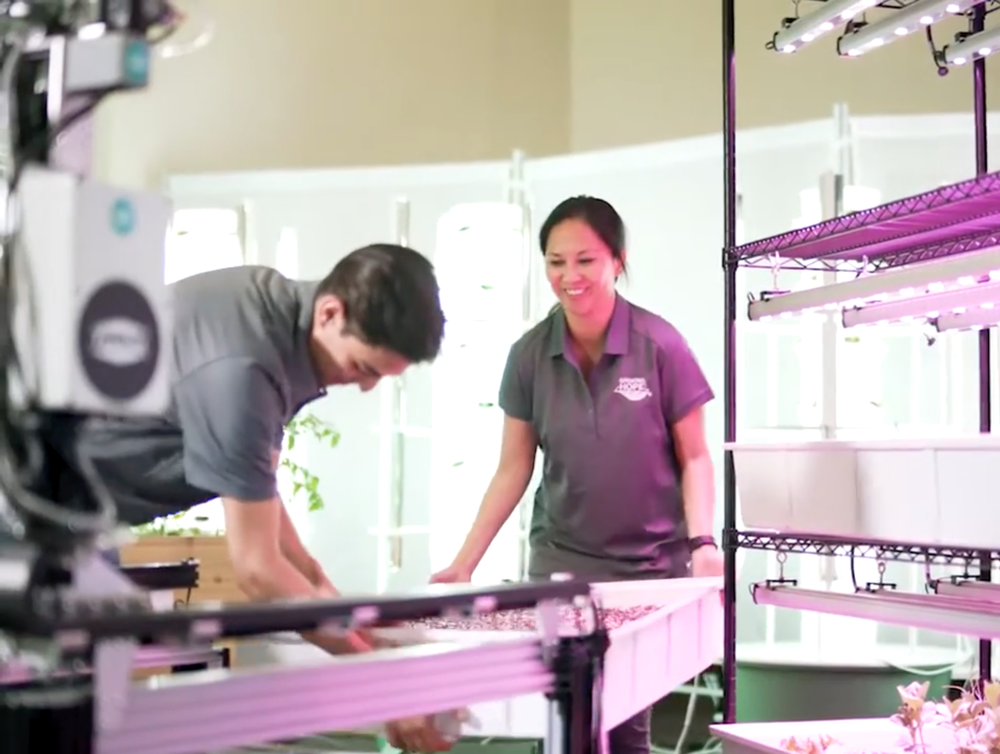

A single FarmBot can be shared with many users or user groups. Depending on needs, there are two ways to share access to the FarmBot, each suitable in different scenarios.

# Creating multiple web app accounts

If your users are sharing the same physical FarmBot but need to have their own account resources (sequences, plants, events, etc), create a web app account for each user or group of users. Then provision each user or group their own microSD card with FarmBot OS flashed onto it and configured to their web app account.

When a user or group is going to use the FarmBot, they can power down the machine, insert their microSD card, power it back on, and control the FarmBot with their web app account. For smaller FarmBots, users may need to [swap in a growing tray with their garden in it](https://www.youtube.com/watch?v=8q1syAAzhfA). For larger FarmBots, they may only be allocated a certain portion of the growing area to use.



# Sharing web app credentials

If all of your users need to have full access to the same account resources (sequences, plants, events, etc), securely share your web app credentials or use a shared computer terminal to access the web app.

This method should only be used when the total number of users is relatively small (less than 10) and when every person who is given the credentials can be trusted to have full control over the FarmBot and the web app account's resources (creating, editing, and deleting sequences, plants, events, sensors, gardens, etc).



Sharing web app credentials is only recommended for small groups of users that share a high level of trust and who all need to have access to the same account resources. For example: a team of four working on a FarmBot research project together.

## Read-only mode

To prevent accidental changes from being made to the account (for example, before a live demo), enable [**USER INTERFACE READ ONLY MODE**](https://my.farm.bot/app/designer/settings?highlight=user_interface_read_only_mode) from the settings panel. This will prevent users of the web app from saving changes to account data. However, it does not prevent FarmBot OS from changing settings. It also does not prevent someone from turning this setting off and then making changes.