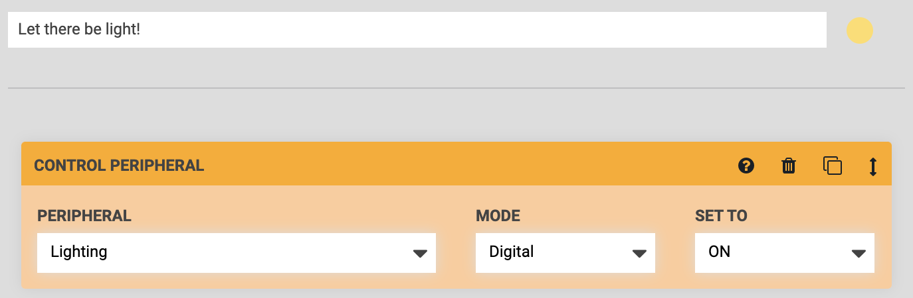
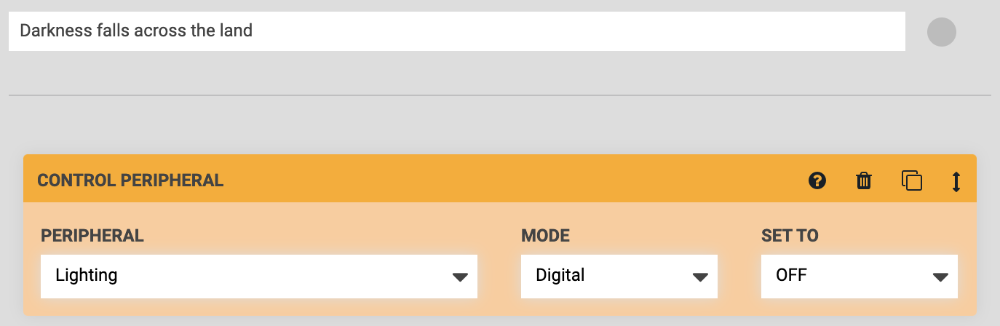
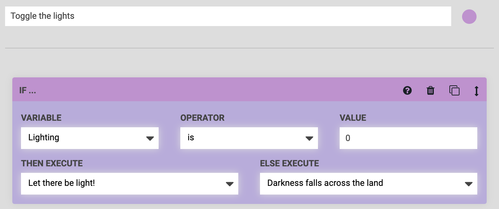
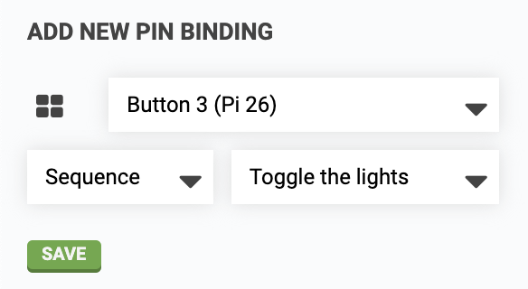
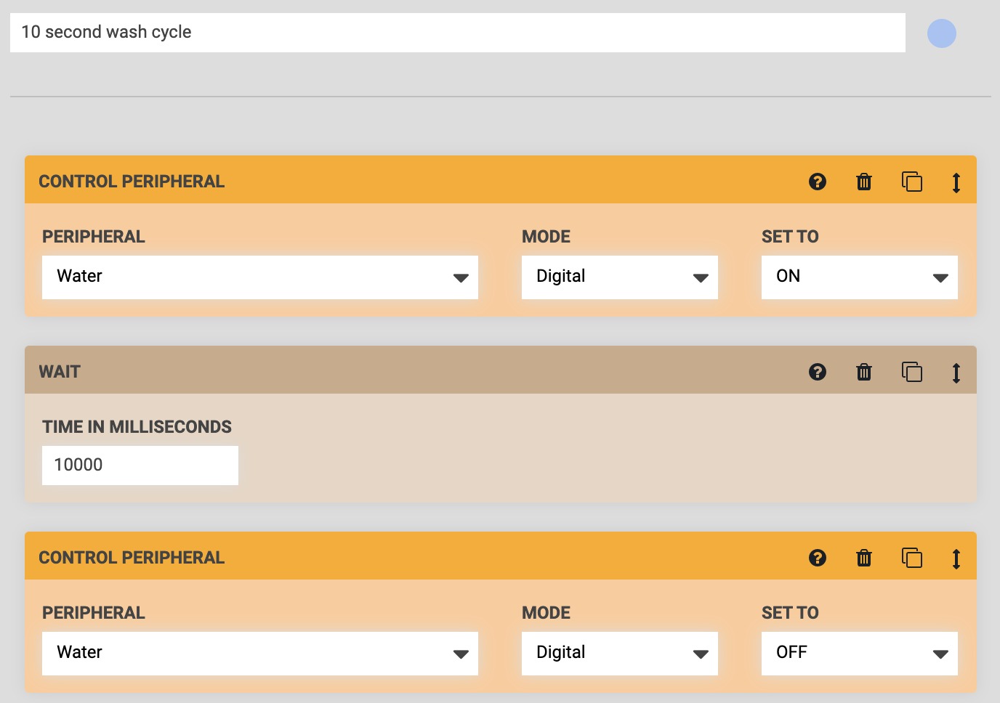
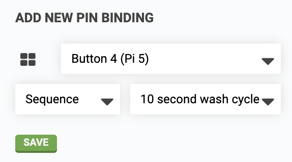
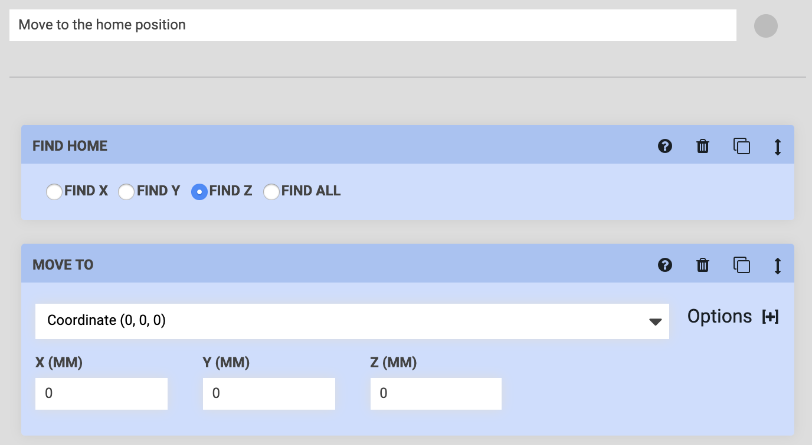
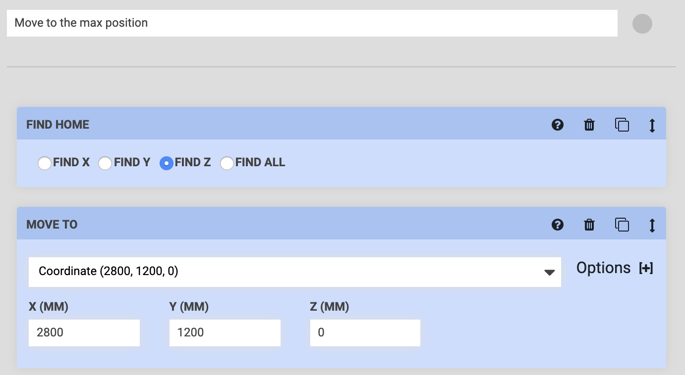
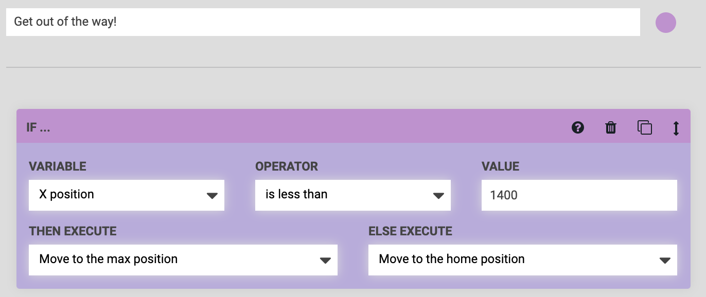
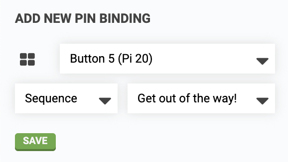

* toc
{:toc}

FarmBot Genesis v1.4+ kits include five **push buttons** on top of the electronics box. Two of these buttons are reserved for triggering E-STOP and UNLOCK actions while the other three buttons are user customizable. In this guide we'll show you how you can configure your buttons to:

[:flashlight: Toggle lights for nighttime harvesting](#example-1-toggle-lights-for-nighttime-harvesting)

[:sweat_drops: Wash your bounty and your hands](#example-2-wash-your-bounty-and-your-hands)

[:arrow_double_up: Get FarmBot out of the way](#example-3-get-farmbot-out-of-the-way)

# Example 1: Toggle lights for nighttime harvesting

A common need for FarmBot owners is to turn lights on for nighttime harvesting. Rather than having to use your phone to log into the app and toggle FarmBot's lights on and off, you can configure one of the push buttons to act as a switch.

## Step 1: Create sequences to turn the lights on and off

Create two sequences, one to turn the lights ON, and one to turn the lights OFF. Each sequence only needs to have one step in it, a CONTROL PERIPHERAL command for the `Lighting` peripheral.

## Step 2: Create a sequence to toggle the lights

Make a third sequence with an IF STATEMENT command that allows FarmBot to determine which of the previous two sequences should be executed when the button is pressed, based on the current state of the lighting peripheral.

If the lighting is currently off (a value of `0`), and the button is pressed, FarmBot should execute the sequence that turns the lighting on. Else, it should turn the lighting off.

## Step 3: Create the pin binding

Create a **[pin binding](../../app/settings/pin-bindings.md)** that binds an available button to your sequence that toggles the lights. Press SAVE and then try everything out by pressing the button on your FarmBot!

# Example 2: Wash your bounty and your hands

If you've just pulled some fresh carrots out of the ground you may want to wash them off (and your hands) before returning to the kitchen. Luckily, FarmBot can help you out.

## Step 1: Create a water dosing sequence

Create a sequence with the following commands:

**Step 1:** CONTROL PERIPHERAL to turn the water ON

**Step 2:** WAIT for the amount of time you'll need to wash your produce and hands. We recommend choosing a short amount of time, such as 10 seconds. If you need more water after the first dose, you can always press the button again for another dose.

**Step 3:** CONTROL PERIPHERAL to turn the water OFF

## Step 2: Create the pin binding

Create a **[pin binding](../../app/settings/pin-bindings.md)** that binds an available button to your sequence that doses water. Press SAVE and then try everything out by pressing the button on your FarmBot!

# Example 3: Get FarmBot out of the way

Whether you're adding transplants to your garden, harvesting, or repairing your greenhouse, sometimes you just need FarmBot to get out of the way. This example will show you how one button can be configured to always get FarmBot to safely move somewhere else.

## Step 1: Create sequences to move to the home and max positions

Create two sequences, one to MOVE TO the home (0, 0, 0) position and one to MOVE TO the max X/Y position. In this example our max position is (2800, 1200, 0), but yours will be different.

Both sequences should start with a FIND HOME command set to **FIND Z**. This will raise the Z-axis before the X and Y axes begin moving so FarmBot does not run into any plants.

## Step 2: Create a sequence to move to either the home or the max position

Make a third sequence with an IF STATEMENT command that allows FarmBot to determine which of the previous two sequences should be executed when the button is pressed, based on the current location of FarmBot.

If FarmBot's current `X position` is in the first half of the bed (a value less than `1400`), and the button is pressed, FarmBot should execute the sequence that moves it to the max position. Else, it should move to the home position.

## Step 3: Create the pin binding

Create a **[pin binding](../../app/settings/pin-bindings.md)** that binds an available button to your sequence that determines where FarmBot should move to. Press SAVE and then try everything out by pressing the button on your FarmBot!

