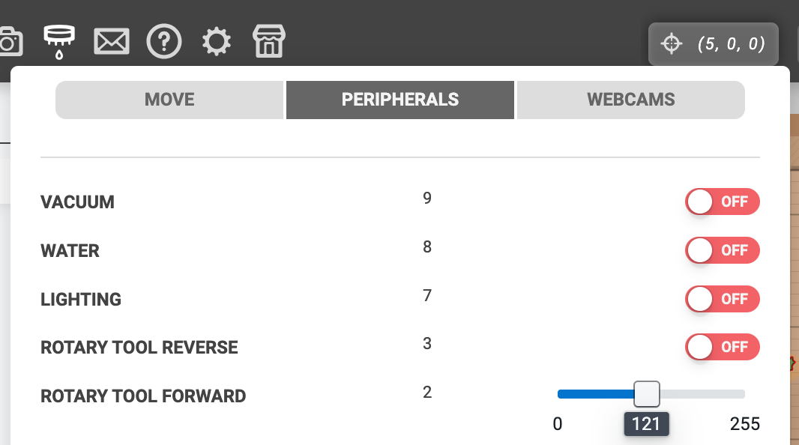
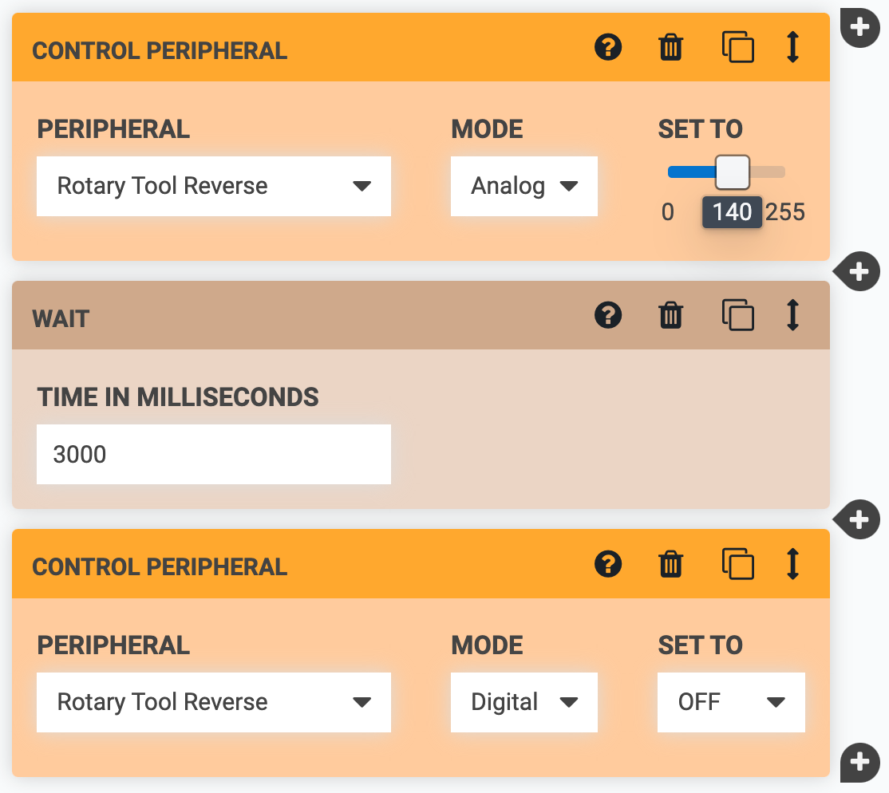
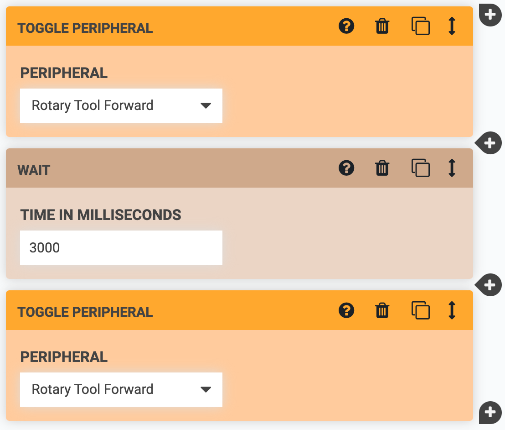
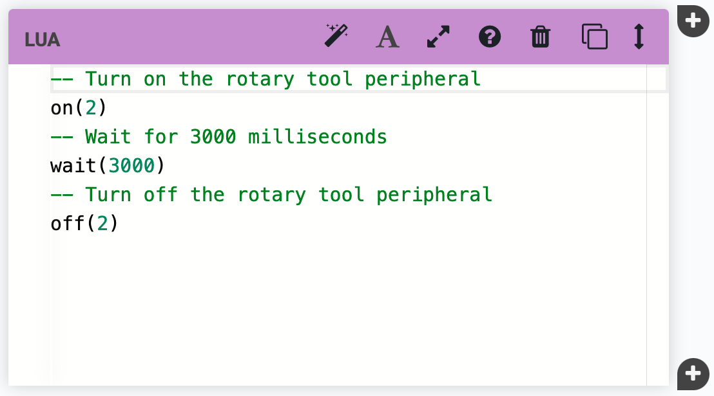

FarmBot Genesis v1.6+ kits include a **[rotary tool](https://genesis.farm.bot/docs/rotary-tool)** featuring a 24 volt DC motor, interchangeable implements, and an adjustable motor angle allowing FarmBot to perform light duty weed whacking, soil surface milling, and drilling operations.



# Controlling the rotary tool

The rotary tool's motor can be activated using a peripheral pin:

- Pin 2 is used for forward operation
- Pin 3 is used for reverse operation

These pins can be used in either `Analog` or `Digital` modes, where a digital ON will result in full-speed operation while an analog value between 0 and 255 will result in a proportional speed from 0 to 100%.

You can set Pin 2 or Pin 3's mode and value in several ways:

## Manual control

To manually control the rotary tool, open up the [peripherals tab](../../app/controls/peripherals.md) of the controls popup. From there, you can configure Pins 2 and 3 to be in `Analog` or `Digital` mode and manually control them using the toggle switches or sliders.



## Sequence commands

You can also control the rotary tool programatically using the following sequence commands:

- CONTROL PERIPHERAL
- TOGGLE PERIPHERAL (only toggles between Digital ON and OFF)
- LUA using custom code. See our [developer documentation](http://lua.farm.bot/) for additional details.


