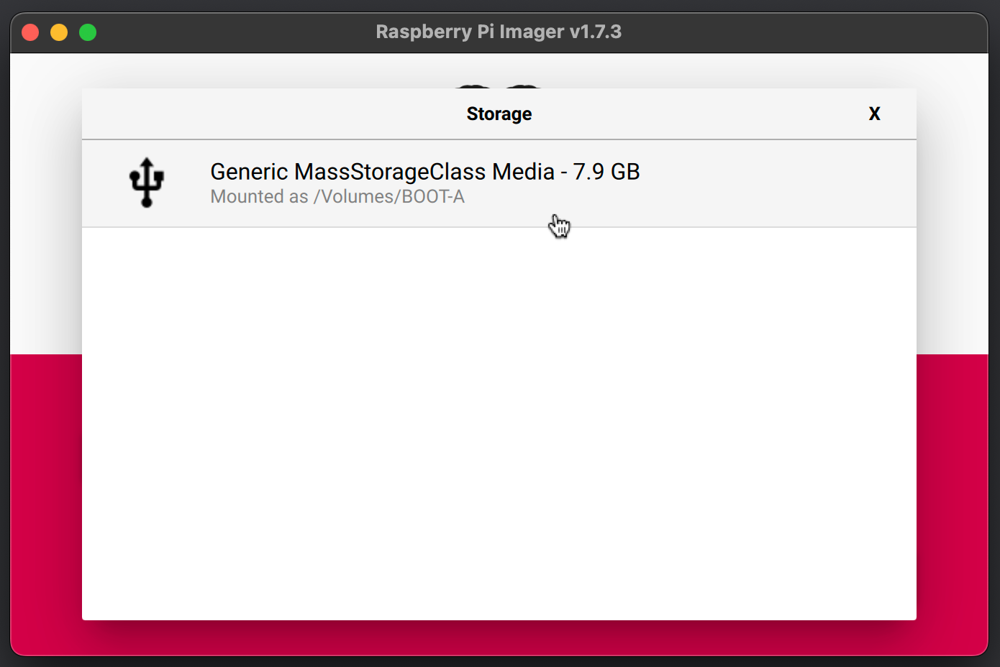

The Raspberry Pi runs a custom operating system named **FarmBot OS**, allowing FarmBot to:

  * Communicate with the web application over WiFi or ethernet so that it can synchronize (download) sequences, regimens, farm designs, events, and more; upload logs and sensor data; and accept real-time commands.
  * Communicate with the Farmduino to send G and F commands and receive sensor and encoder data.
  * Take photos with a USB or Raspberry Pi camera, and upload the photos to the web application.
  * Get configured over WiFi, mitigating the need to plug in a mouse, keyboard, or screen.

# Step 1: Download FarmBot OS

Using a desktop computer or laptop, go to [os.farm.bot](http://os.farm.bot) to download the latest FarmBot OS `.img` file according to your **FarmBot kit** and it's **internal computer**.

# Step 2. Write FarmBot OS onto the microSD card

To write FarmBot OS onto the microSD card, you must use a special **`.img` writing tool**. We recommend downloading and installing **[Raspberry Pi Imager](https://www.raspberrypi.com/software/)** for this purpose.



Once you have Raspberry Pi Imager installed, connect the microSD card to your computer using a **card reader**. You may need to use the **microSD card to SD card adapter** included with your kit.

Open up the Raspberry Pi Imager program and click `CHOOSE OS`. Then scroll to the bottom of the popup and select **Use custom** _Select a custom .img file from your computer._ Then select the FarmBot OS `.img` file you downloaded in Step 1.

Click the `CHOOSE STORAGE` button and then select the microSD card (it should show up as a `7.9 GB` option).



Click `WRITE`. Your computer may ask you for permision to perform this action. Once permission is granted, Raspberry Pi Imager will write FarmBot OS to the microSD card and then verify the installation. The process will take approximately 1 minute.

After completing, you may remove the microSD card from your computer and close Raspberry Pi Imager.

# Step 3. Insert the microSD card into the Raspberry Pi

Insert the **microSD card** into the **Raspberry Pi**. The card slot location will differ depending on the FarmBot kit you have.

## Genesis kits

For Genesis kits, the card slot is located on the back side of the Raspberry Pi, on the right-hand edge. You do not need to remove the Raspberry Pi from the electronics box to insert the card; we have left enough access room.

## Express kits

For Express kits, the card slot is located on the front side of the Raspberry Pi, on the left-hand edge.

# Step 4. Plug in the power source

Plug your FarmBot's power supply into a wall outlet. You should now see a solid red  LED and a steadily flashing green  LED on the Raspberry Pi, indicating that the Pi has adequate power and is busy booting up. Refer to the [status LEDs](intro/status-leds.md) page for more information, especially if your LEDs are not lit up as described above.

# What's next?

 * [Configurator](intro/configurator.md)
 * [Status LEDs](intro/status-leds.md)
 * [Data Usage](intro/data-usage.md)
 * [Auto Updates](intro/auto-updates.md)
