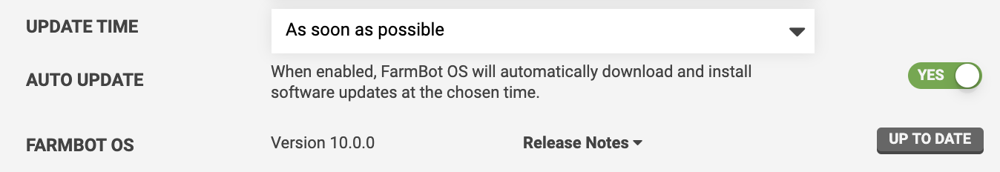
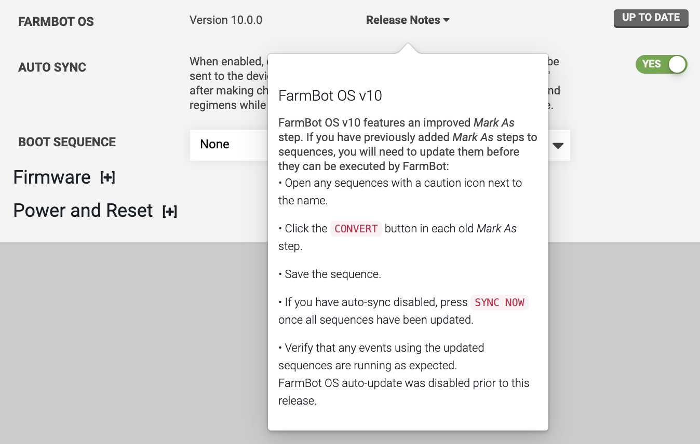

FarmBot OS is regularly improved to include new features, security enhancements, and bug fixes. It is recommended that you keep your FarmBot updated with the latest version of FarmBot OS at all times so that you can enjoy the best that FarmBot has to offer.

By default, all FarmBots are configured to update automatically at 3AM local time, meaning you don't have to worry about manually staying up-to-date. You can change the **UPDATE TIME** and also turn off **AUTO UPDATE** from the device settings panel, though this is not recommended.

# The update process
Updates will happen **over-the-air**, meaning FarmBot will download the latest version of the software when it becomes available, apply it, and reboot as necessary. Under normal circumstances there will be no need for reconfiguration or any manual effort required by the user; FarmBot should come back online, re-sync, and resume any scheduled events automatically.

An update will usually take between 15 seconds and 5 minutes to download, depending on network quality and connection speed. The update process will then take 1 to 5 minutes before FarmBot is back online and ready to start work again.

If you're experiencing update issues, remove the microSD card from your FarmBot and [manually flash](../intro.md) the latest `.img` file.

# Release notes
Major releases of FarmBot OS may have **breaking changes** that allow the greater platform to move forward at the cost of older features no longer working. Breaking changes are usually **internal** and have no effect on everyday users. However, action is occasionally required on the user's end. For example, with the release of FarmBot OS v10, users were required to manually update some sequences using an old version of the MARK AS command.

To view a summarized change of what's new in FarmBot OS, click the **Release Notes** popup.

