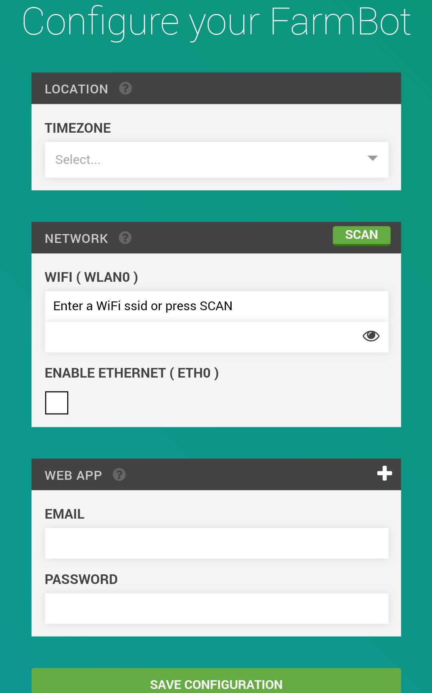

* toc
{:toc}

FarmBot Configurator is a piece of software built into FarmBot OS that makes it easy to connect your FarmBot's Raspberry Pi to a WiFi network and to your FarmBot web app account. You will not ever need to connect a keyboard and screen to the device or SSH into the device over an ethernet connection.



# Instructions
1. When the device boots up, it automatically starts up FarmBot Configurator.
2. FarmBot Configurator checks for configuration data. Initially there will not be any, so the device will not be able to connect to anything.
3. In this case, FarmBot Configurator will tell the device to create its own WiFi network. It will have an SSID similar to **farmbot-xxxx**.
4. Using your phone or laptop, connect to the `farmbot-xxxx` WiFi network and open up a web browser.
5. Navigate to http://192.168.24.1/, the FarmBot Configurator page.





6. From here, follow the on-screen form to enter:
 * Your local timezone.
 * The name of the WiFi network (SSID) you would like your FarmBot to normally connect to, and that network's password.
 * Your username and password for the FarmBot Web App.
7. Now press **Save Configuration**. FarmBot OS will now attempt to connect to the WiFi network and FarmBot Web App account provided. This will close the connection from your device to FarmBot OS, so the configuration screen will disappear.
8. If there is a problem with the configuration, such as a password is wrong, then the utility will go back to Step 3 and you will see the `farmbot-xxxx` WiFi network again.



