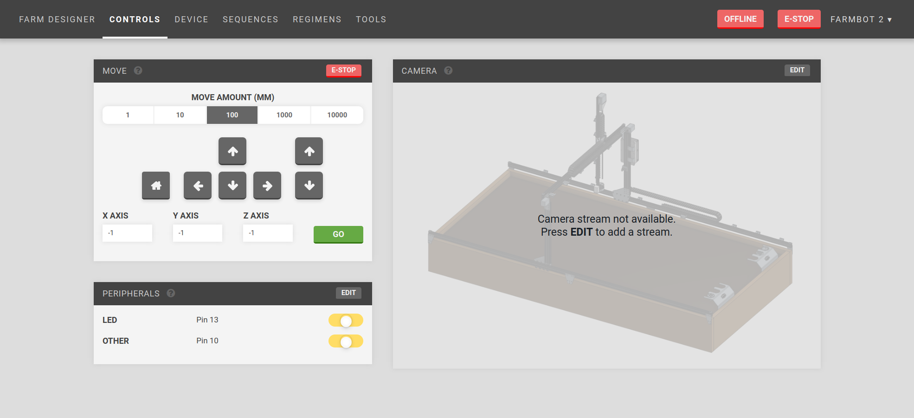
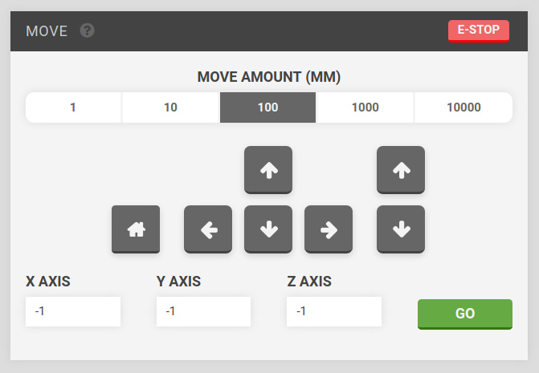
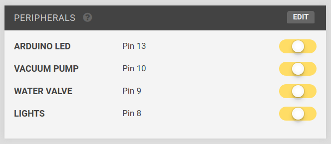
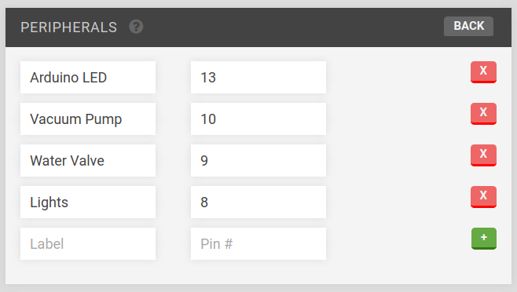
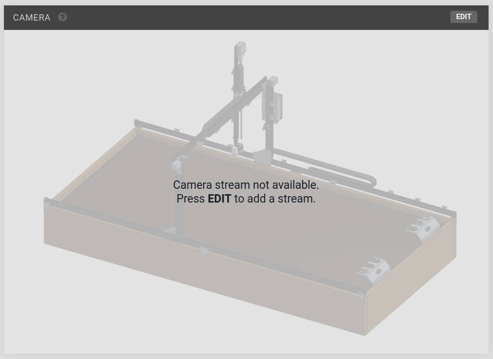
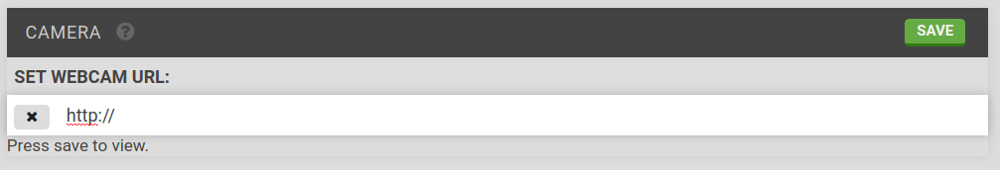

* toc
{:toc}

You generally will not need to manually control FarmBot, since it acts automatically from instructions provided by Farm Events. But in case you want to show off to your friends, you can do that from this page!

## Widgets on this page:
 * [Move](#section-move)
 * [Peripherals](#section-peripherals)
 * [Camera](#section-camera)

  
  
  
  

<figcaption class="caption">Click a widget in the image to learn more!</figcaption>

# Move

  * The current position of your FarmBot is shown in the input fields labeled X-AXIS, Y-AXIS, and Z-AXIS. This information is updated in real-time.
  * You can move the device a *relative distance* in any direction by using the arrow buttons. The default move amount is 100mm, though you can also select 1, 10, and 1000mm amounts. You will not be able to move to negative coordinates unless you have enabled them from the **Hardware** configuration widget on the **Device** page.
  * You can move the device to an *absolute position* by typing in new coordinates to the input fields labeled X-AXIS, Y-AXIS, and Z-AXIS and pressing **GO**.
  * If you ever need to immediately halt your FarmBot, press the **E-STOP** button.

# Peripherals
You can manually operate FarmBot's peripherals using the toggle switches in the **Peripherals** widget.

Press the toggle switch to turn a peripheral ON or OFF.

## Edit
To change the peripherals, press the `EDIT` button.

Enter a new peripheral by filling out `Label` and `Pin #` and pressing the `+` button. When finished editing, press the `save` button.

# Camera

The __Camera__ widget can be used for a network stream setup using a webcam. You could use the video stream for a view of the entire bot to view movements while controlling it remotely, or you could set up a webcam at a different angle for viewing plants, etc..

You will need to set up a network webcam, and provide the network stream's IP address to the widget.

## Edit
To set the webcam URL, press the `EDIT` button, enter a URL (with `http://`) and press `SAVE`.

