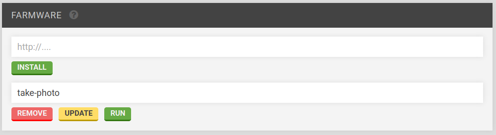

* toc
{:toc}

Widgets on this page:
 * [Device](#device)
 * [Hardware](#hardware)
 * [Farmware](#farmware)
 * [Weed Detector](#weed-detector)

  
  
  
  
  

<figcaption class="caption">Click a widget in the image to learn more!</figcaption>

# Device

 * Give your device a name
 * View the controller version and update it
 * View the firmware version and update it
 * Restart the controller
 * Factory reset FarmBot OS

# Hardware

 * Steps per mm
 * Max speed
 * Acceleration period
 * Timeout
 * Length
 * Calibration
 * Invert endpoints
 * Invert motors
 * Allow negatives
 * Enable encoders

# Farmware

Run a Farmware by selecting it from the list and pressing `RUN`. For more information, see [Farmware](../Additional-Information/farmware-dev.md).

# Weed Detector

Select hue, saturation, and value ranges to cover the colors you want to detect using the sliders. The color boxes will give an indication of the range selected.

Change the blur, morph and iteration processing parameters if desired.

Press `TEST` to detect weeds in FarmBot camera's current view. The weeds will appear in the [Farm Designer](farm-designer.md). Press `CLEAR WEEDS` to delete them from the map.

Weed removal is performed by creating a weed removal sequence using the weeding tool and applying it to the weeds in the Farm Designer.
