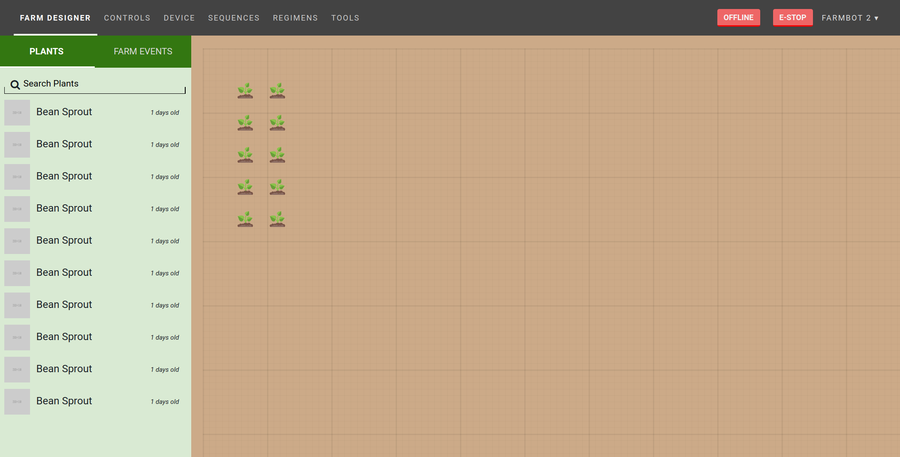
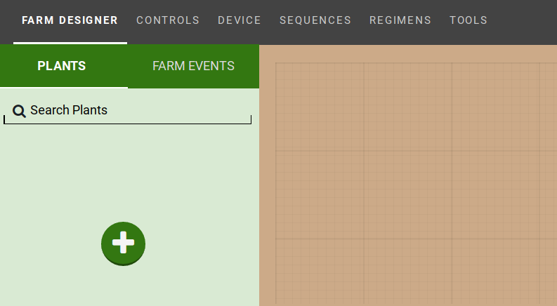
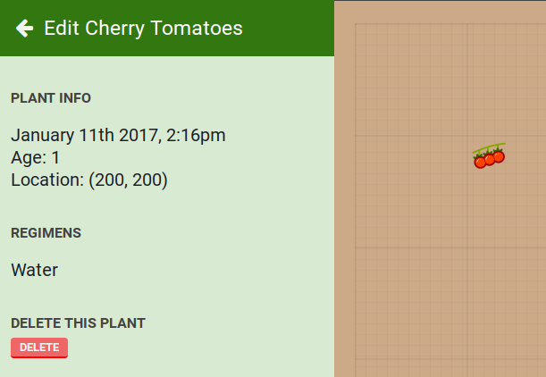
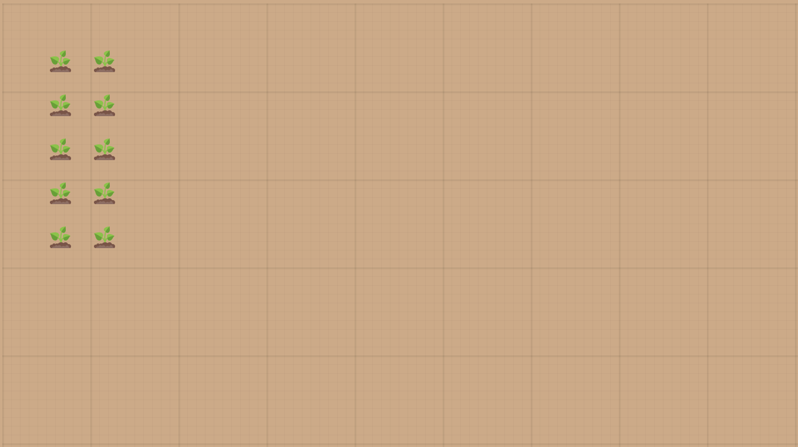

* toc
{:toc}

View and layout your garden in a virtual representation of your FarmBot's bed on this page.

  
  
  

<figcaption class="caption">Click a section in the image to learn more about it!</figcaption>

# Add Plants

Add plants for your FarmBot to grow by pressing the `+` button and searching for a crop.

Find the crop that you'd like in your garden and click it to bring up the crop information.

Drag the crop image into the [map](#map) to place the crop in your garden.

You now have a plant!

# Remove a plant

If you'd like to delete a plant, click on it to bring up the plant information and press the `EDIT` button.

Press the `DELETE` button to remove the plant.

# Map

You can view all of your plants in the map, a virtual representation of the FarmBot bed. You can drag plants around to rearrange them.

# What's next?

 * [Farm Events](farm-events.md)
