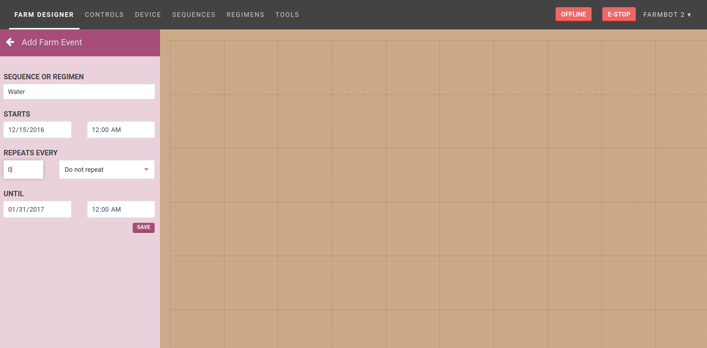

* toc
{:toc}

## Event scheduling
It would not be convenient for you to manually initiate your sequences every time you want them to execute. This is where event scheduling comes in to help.

If you've ever used a calendar application before, you'll feel right at home with this. Simply choose the sequence you would like to execute, and schedule it to run on a one-off or repeating basis.

# What's next?

 * [Controls](controls.md)
