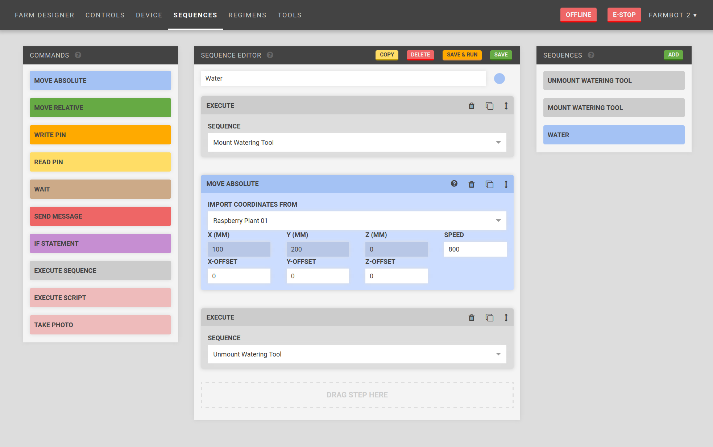

## Sequence building
The web app is a platform designed to give you unlimited control over how you use your FarmBot and therefore how you grow your food. Because nobody wants to sit on their computer all day controlling their FarmBot manually, we have designed several features to help you automate your farming operation.

The sequence builder allows you to combine the most basic operations of FarmBot into more complex actions composed of many different steps. When a sequence is initiated, FarmBot will execute all of the steps in the sequence one after the other until it is done.

### Example watering sequence
1. **Move Absolute to {plant 12 coordinates}** - Moves the device to plant 12's X and Y position within the field
2. **Write Pin 10 with a value of 1** - Opens the solenoid valve for the water
3. **Wait 4000** - Wait for 4 seconds
4. **Write Pin 10 with a value of 0** - Closes the solenoid valve for the water.
5. **Move Absolute to {home}** - Moves the device to 0, 0, 0

The web app ships with several pre-made sequences like the one above. You can use, modify, or delete these sequences; and also make your own from scratch for completing any task you can imagine.

### Supported operations
These are the basic operations that FarmBot can execute.
* **Move Absolute** - Moves the device to an absolute coordinate position at any speed. This is useful for moving to tool, plant, and home locations.
* **Move Relative** - Moves the device a specific distance in any direction at any speed, relative from the last position. This is useful for movements after a absolute movement to a dynamically loaded location. Eg: Moving in a square relative to a plant after the device moved absolutely to the plant.
* **Write Pin** - Writes a value to any pin on the Arduino. This is used for operating virtually all tools.
* **Read Pin** - Reads the value from any pin on the Arduino. This is used for tool verification and with sensors.
* **Wait** - Causes a delay before executing the next operation in the sequence. This could be used to water for a certain amount of time.
* **If Statement** - Executes another sequence if a condition is true. This is useful for error detection and smarter, condition based farming.
* **Send Message** - Sends a message to the web app. This is useful for error and success notifications and debugging.
* **Take Picture** - Takes a picture with a USB webcam or the Raspberry Pi camera (Coming soon) and sends it to the web app.

### Building a sequence
1. From the **Sequences** widget, click **Add**
2. In the **Sequence Editor** widget, enter a name for your sequence and assign it a color
2. Drag and drop blocks from the **Commands** widget into the **Sequence Editor** widget
3. For each operation, enter in your desired parameter values. Some parameters such as *speed* can use default values for your device and do not need to be entered in every time.
4. Reorder, copy, and delete operations as needed
5. Click **Save**

{%
include callout.html
type="info"
title="Sequenception"
content="You can use existing sequences as steps in a new, larger sequence. This technique allows you to re-use smaller sequences in different combinations to create far more complex sequences that are easier to modify, manage, and mashup.

For example, you could make an **Inject Seed** sequence, a **Measure Moisture** sequence, and a **Water** sequence, and combine them all into one mega sequence named **Start Plant**. You can then use the individual sequences in other ways without having to recreate them each time."
%}

# What's next?

 * [Regimens](regimens.md)
