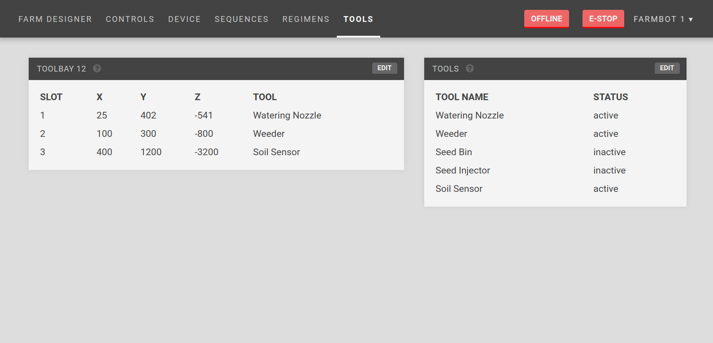
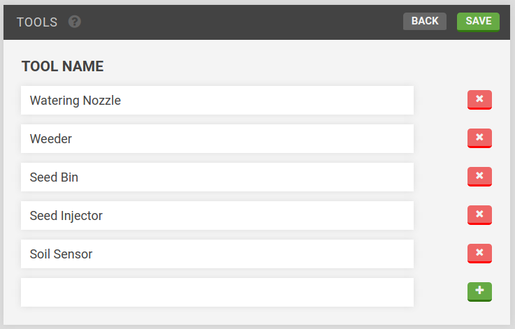
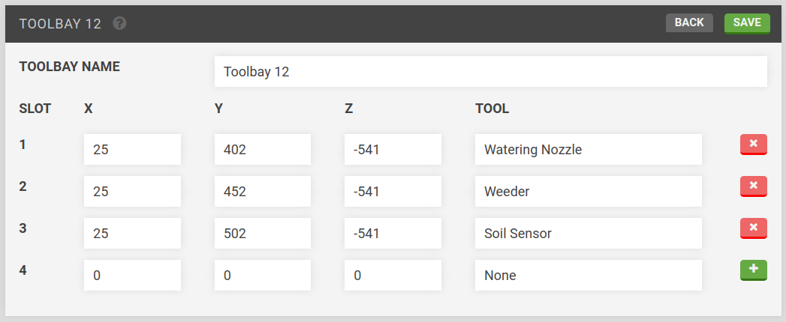

* toc
{:toc}

You will need to specify the location of the tools in the tool bay in order for FarmBot to use them with its Universal Tool Mount.

  
  
  

<figcaption class="caption">Click a widget in the image to learn more!</figcaption>

# Tools

Press `EDIT` to add your tools. Fill in the tool name and press the `+` button to add the tool.

# Toolbay

Press `EDIT` to add your tools to the toolbay. Fill out the X, Y, and Z coordinates of the tool, select a tool that you added in the [tools](#tools) widget, and press the `+` button to add the tool to the toolbay.

__Tip__: Use the [Move](../Web-App/controls.md#move) widget on the controls page to determine the location of your tool in the toolbay. The coordinates should correspond to where the UTM is making contact while directly above the tool in the toolbay.

Press `SAVE` when done to save your tool locations.
