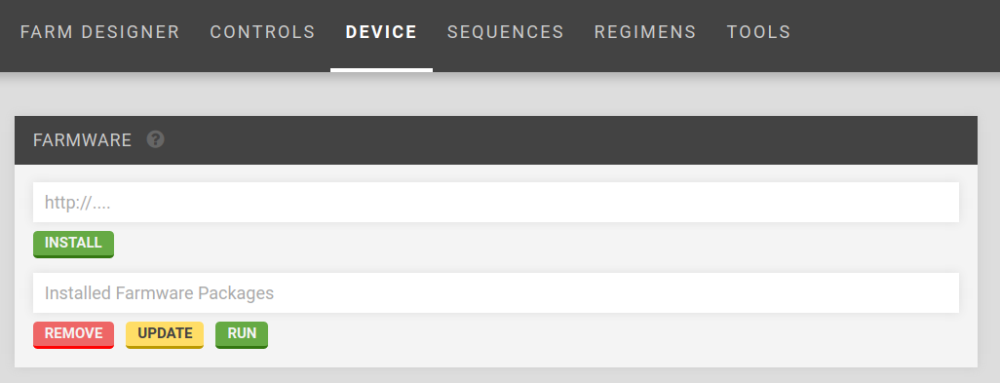

* toc
{:toc}




# First-Party Farmware

Some Farmware has been created by FarmBot.io and comes pre-installed:

* __Take Photo__ - take a photo and upload it to the web app
* __Plant Detection__ _(coming soon)_ - detect weeds

# Installing Farmware

To install new Farmware, use the __Farmware__ widget, currently located on the __Device__ page of the FarmBot Web App. ([Link to web app device page](http://my.farmbot.io/app/device))



Installation is performed by entering the URL of the _manifest.json_ file for the Farmware.

For example, entering `https://raw.githubusercontent.com/FarmBot-Labs/farmware_manifests/master/packages/take-photo/manifest.json` and clicking install would install the `Take Photo` Farmware, whose source code is located at the GitHub project [here](https://github.com/FarmBot-Labs/Take-Photo). See [Farmware manifest](#section-farmware-manifest) for more information.

# Developing Farmware

Farmwares can connect with FarmBot in the following ways:

## API

_Use: long term information storage_

Farmwares can access the FarmBot Web App API by using the token stored in the `API_TOKEN` environment variable. The API is used to access the database (plants, points, etc.).


__Python example using 'requests' and 'json':__

```python
import os
import requests
import json

headers = {'Authorization': 'Bearer ' + os.environ['API_TOKEN'], 'content-type': "application/json"}
response = requests.get('https://my.farmbot.io/api/plants', headers=headers)
plants = response.json()
```

## Environment Variables

_Use: credentials_

Environment variables are used to get credentials (token) and to interface with the FarmBot Web App. Set via [Celery Script](#section-celery-script).


__Python example:__

```python
import os

API_TOKEN = os.environ['API_TOKEN']
WRITE_PATH = os.environ['WRITE_PATH']
IMAGES = os.environ['IMAGES']
BEGIN_CS = os.environ['BEGIN_CS']
```

## Redis

_Use: bot status_

Information about the device status is accessed via Redis. See [redis.io](https://redis.io/).


__Python example using 'redis':__

```python
import redis

r = redis.Redis()
device_current_location = r.lrange('BOT_STATUS.location', 0, -1)
```


__Information available through redis:__

```text
BOT_STATUS
             configuration
                                      distance_mm_x       3000
                                      distance_mm_y       1500
                                      distance_mm_z       800
                                      fw_auto_update      false
                                      os_auto_update      false
                                      steps_per_mm_x      5
                                      steps_per_mm_y      5
                                      steps_per_mm_z      25
             informational_settings
                                      commit              4148a81
                                      compat_version      0
                                      controller_version  3.0.7
                                      locked              false
                                      private_ip          192.168.1.101
                                      sync_status         synced
                                      target              rpi3
             location
                                      x                   110
                                      y                   220
                                      z                   -100
```

## Celery Script

_Use: real-time web app communication and bot actions_

Celery Script is JSON sent to FarmBot OS to perform actions such as device movements and setting environment variables.

Send Celery Script [available actions](https://github.com/FarmBot/farmbot-js/blob/master/dist/corpus.d.ts) by printing to `STDOUT` prefixed with the `BEGIN_CS` environment variable.


__Python example using 'json':__

```python
import json

add_point = {
  "kind": "add_point",
  "args": {
    "location": {
      "kind": "coordinate",
      "args": {
        "y": 100,
        "x": 200,
        "z": 0
      },
      "radius": 50,
      "body": []
    }
  }
}
print(os.environ['BEGIN_CS'] + json.dumps(add_point))
```

# Currently supported languages and packages
 * __Python__: opencv, numpy, redis-py, requests

# Farmware manifest

To [install a Farmware](#section-installing-farmware), you need to create a `manifest.json` file and host it.


__Farmware Manifest Example:__

```json

 "package": "Take Photo",
 "language": "python",
 "author": "Farmbot.io",
 "description": "Take a photo with a USB camera using Python OpenCV.",
 "version": "0.0.1",
 "min_os_version_major": 3,
 "url": "https://raw.githubusercontent.com/FarmBot-Labs/farmware_manifests/master/packages/take-photo/manifest.json",
 "zip": "https://github.com/FarmBot-Labs/Take-Photo/archive/master.zip",
 "executable": "python",
 "args": ["Take-Photo-master/take_photo.py"]
```

`zip` points to the hosted source code zip file. Github makes this easy: just add `/archive/master.zip` to the end of the GitHub repository URL, and insert `<repository name>-master/` to the beginning of the script filename to run, as seen in the manifest example above.
