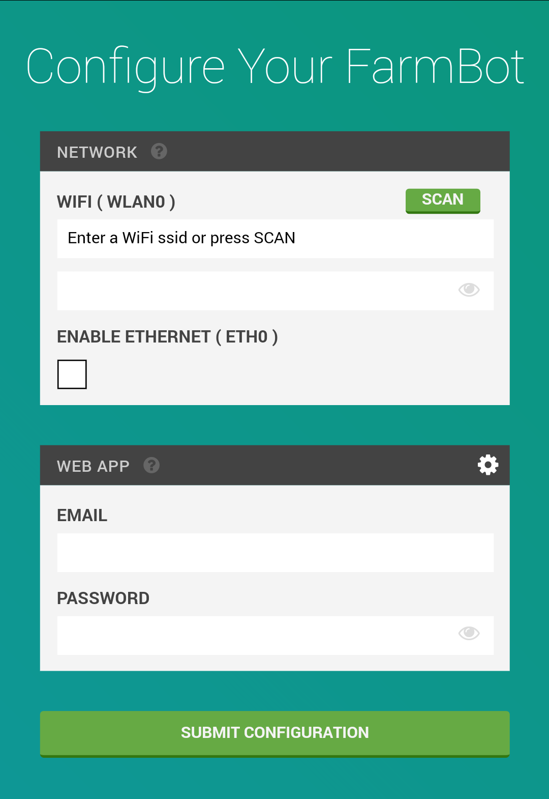

* toc
{:toc}

FarmBot Configurator is a piece of software built into FarmBot OS that makes it easy to connect your FarmBot's Raspberry Pi to a WiFi network and to your FarmBot web app account. You will not ever need to connect a keyboard and screen to the device or SSH into the device over an ethernet connection.



# Instructions
When the device boots up, it automatically starts up FarmBot Configurator.
FarmBot Configurator checks for configuration data. Initially, there will not be any configuration data, so the device will not be able to connect to your home WiFi network or your FarmBot Web App account.
In this case, FarmBot Configurator will create its own WiFi network with an SSID similar to `farmbot-xxxx`.

1. Check your WiFi browser for an SSID network named: farmbot-xxxx (x representing numeric and letter symbols).
2. Using your phone or laptop, connect to the `farmbot-xxxx` WiFi network and open up a web browser.
3. Navigate to [farmbot.io/setup](http://farmbot.io/setup), the FarmBot Configurator page.



4. From here, follow the on-screen form to enter:
 * The name of the WiFi network (SSID) you would like your FarmBot to normally connect to, and that network's password.
 * Your username and password for the FarmBot Web App.
5. Now press Submit Configuration. FarmBot OS will now attempt to connect to the WiFi network and FarmBot Web App account provided. This will close the connection from your device to FarmBot OS, so the configuration screen will disappear.

If there is a problem with the configuration, such as a password is wrong, then FarmBot Configurator will restart and you will see the `farmbot-xxxx` WiFi network again. Return to Step 1.



