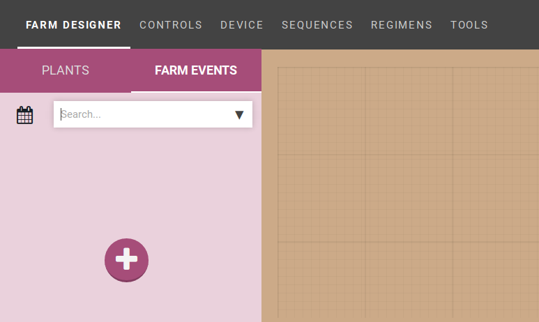
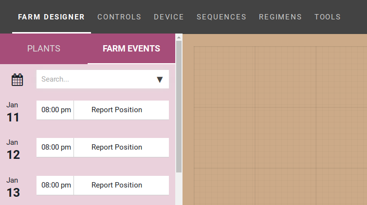

# Event scheduling

It would not be convenient for you to manually initiate your sequences every time you want them to execute. This is where event scheduling comes in to help.

If you've ever used a calendar application before, you'll feel right at home with this. Simply choose the sequence you would like to execute, and schedule it to run on a one-off or repeating basis.

# Create a Farm Event

Press the + button to create a new Farm Event.

The **Add Farm Event** screen will appear.

Select:
* a sequence or regimen to run
* a start time and date
* a repeat interval (if desired)
* a repeat end time and date (if repeating)

Press the SAVE button to add the Farm Event. The Farm Event will now show up in the agenda.

Be sure to press the SYNC NOW button at the top of the page to sync the newly created Farm Events with the device so that they can be executed!

# Edit Farm Event

Let's say we have created a `Water` Farm Event that we'd like to make some changes to.

Press the edit icon to the right of the Farm Event name shown in the figure below.

Make the desired changes and press SAVE.

The Farm Event will update in the agenda.

	<h3><i title="Warning" class="fa fa-exclamation-circle"></i>Don't forget to SYNC!
	</h3>
	

Before your FarmBot can start executing the Farm Events you have created, you will need to share the data with the device. Press the SYNC NOW button in the upper right of the web app. If the sync was successful, the button will display SYNCED.

	

# What's next?

 * [Controls](controls.md)
